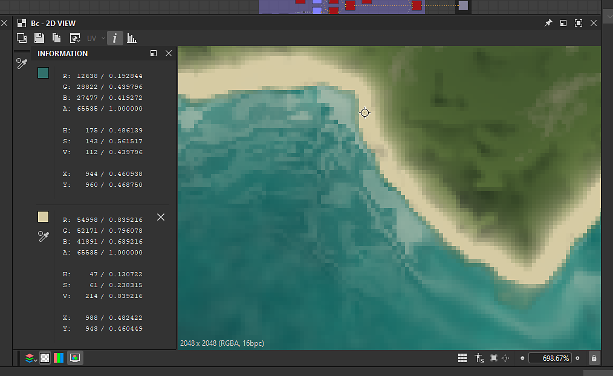

# Herramienta Muestra de color

{zoomable="yes"}

La herramienta Sampler de color te permite <b>realizar el seguimiento del valor de un píxel específico</b> en la [vista 2D](../../../interface/2d-view/2d-view.md) mientras modificas parámetros o modificas nodos.

Coloca una chincheta en la ventana gráfica y toma muestras del color y la posición del píxel en esa ubicación.

## Uso de la herramienta

Siga estos pasos para acceder a la herramienta y utilizarla:

1. Haga clic en el botón  <b>Información</b> en la barra de herramientas de la vista 2D para abrir el conjunto de herramientas y el conjunto de herramientas de información
1. Haga clic en el botón  <b>Herramienta Sampler de color</b> en la barra de herramientas Información
1. En la ventana gráfica, haz clic en el píxel específico que deseas muestrear para colocar un  <b>pin</b>
1. Examine los valores muestreados en la sección dedicada del conjunto acoplado de información
1. Cuando haya terminado con la herramienta, haga clic en el botón  <b>Eliminar</b> para quitar la chincheta de la ventana gráfica.\
   También puede eliminar la chincheta haciendo clic en RMB y seleccionando la acción &#39;Eliminar&#39; en el menú contextual.

Aquí hay una demostración de la herramienta en acción:

{zoomable="yes"}

*Haga clic para ampliar*

+++Copiar los valores RGBA muestreados
Puede copiar los valores muestreados haciendo clic en RMB en la chincheta y seleccionando la acción &#39;Copiar valores RGBA&#39; en el menú contextual.

Los valores copiados se pueden <b>pegar en parámetros usando una miniatura de color</b>.

Las miniaturas de color del panel Información también se pueden arrastrar y soltar directamente en las miniaturas de color de esos parámetros.

{zoomable="yes"}

*Haga clic para ampliar*

+++

## Información de muestra

<table>
<tr style="border: 0;">
<td width="100.00%" style="border: 0;" valign="top">

La información se agrupa en tres tipos y dos formatos.

* <b>Valores muestreados</b> almacenados en cada uno de los canales RGBA de la imagen:\
  Variable\* / Punto flotante
* <b>Color muestreado</b> en la representación de HSV:\
  Entero de 8 bits / Punto flotante
* <b>Posición</b> del píxel en número de píxeles y espacio de imagen normalizado:\
  Entero/punto flotante

</td>
<td width="33.33%" style="border: 0;" valign="top">

{zoomable="yes"}

</td>
</tr>
</table>

El valor depende de la profundidad de bits utilizada por la imagen. En un gráfico de Substance, la profundidad de bits está controlada por el <b>Formato de salida</b> [parámetro base](../../../compositing-graphs/graph-parameters/graph-parameters.md).

Las profundidades de bits disponibles son:

* <b>Entero de 8 bits:</b> 256 valores enteros de 0 a 255.
* <b>Entero de 16 bits:</b> 65.536 valores enteros de 0 a 65.535.
* <b>Baja precisión HDR (16 bits)</b>: Valor de coma flotante codificado con 16 bits.
* <b>Alta precisión HDR (32 bits)</b>: Valor de coma flotante codificado con 32 bits. Esta es la precisión más alta disponible en Designer.
