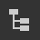
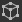

# Vista 3D

La vista 3D le ayuda a ver y comprender sus materiales con mallas personalizadas y materiales PBR procesados. Al igual que con todas las ventanas de Substance 3D Designer, funciona junto con otras ventanas mediante opciones de menú contextual y operaciones de arrastrar y soltar.

La vista 3D también proporciona dos métodos principales para procesar materiales en escenas 3D:
* Visualización rápida y en tiempo real con los procesadores **Rasterizer** y **OpenGL**
* Representaciones con trazo de rayo de alta calidad con el procesador **Trazador de ruta de GPU**

Más información aquí: [Procesadores 3D](3d-renderers/3d-renderers.md)

+++ El conjunto acoplado de vista 3D

+++

## Interacciones de ventana

En la sección siguiente se explica cómo realizar acciones comunes en pocas palabras, junto con un archivo gif animado para ilustrar el proceso.

### Navegación

La cámara y el entorno de la vista 3D se pueden manipular de tres maneras:

* <b>Órbita:</b> LMB+Arrastrar
* <b>Panorámica</b>: MMB+Arrastrar/Ctrl+RMB+Arrastrar
* <b>Zoom</b>: Desplazamiento con MouseWheel / RMB + Arrastrar
* <b>Rotar entorno:</b> ⇧+RMB+Arrastrar
* <b>Enfoque en una malla seleccionada:</b> F (se centra en toda la escena si no hay selección)
* <b>Luz de punto de órbita 1:</b> Ctrl + ⇧ + LMB + Arrastrar
* <b>Acercar o alejar la luz puntual 1 del origen:</b> Ctrl + ⇧ + RMB + Arrastrar
* <b>Restablecer posición de la órbita de la cámara:</b> R
* <b>Restablecer posición y propiedades de la órbita de la cámara:</b> ⇧+R

Uso de una almohadilla táctil (solo macOS)

* <b>Órbita:</b> Barrido con dos dedos
* <b>Panorámica:</b> ⇧+Deslizar con dos dedos
* <b>Zoom: </b>Pellizcar con dos dedos / ⌘+Deslizar con dos dedos
* <b>Rotar entorno:</b> ⇧+Deslizar con dos dedos

>[!NOTE]
>
> Dirección del zoom
> 
> Cada uno de los métodos de zoom se invierte con el otro:
> 
> * La rueda del ratón *acerca la escena*
> * Arrastra y arrastra *empuja* la escena
> 
> La dirección del zoom se puede invertir en [Preferencias](../../interface/preferences-window/preferences-window.md).

### Seleccionar y enfocar

Puede interactuar con las mallas directamente en la ventana gráfica:

<b>Mantén presionado ⇧ y haz clic en LMB en una malla para seleccionar una malla.</b> Las mallas seleccionadas tienen un contorno azul.

<b>Presione F para centrarse en una malla seleccionada</b>. Al enfocar una malla, la cámara se mueve para enmarcarla y orbitar a su alrededor.

<b>Haz clic en RMB mientras se selecciona una malla</b> para acceder a sus [acciones de material](#material-actions) en un menú contextual.

<b>Presione Escape para deseleccionar.</b> No es necesario que el cursor esté en la malla.

{zoomable="yes"}

*Seleccionar, enfocar y deseleccionar*

{zoomable="yes"}

*Seleccionar, menú contextual*

>[!NOTE]
>
> Estas acciones no están disponibles para el procesador [OpenGL](../../interface/3d-view/3d-renderers/3d-renderers.md) obsoleto.

### Cambio de la iluminación ambiental (IBL)

Designer funciona con la iluminación basada en imágenes (IBL) de forma predeterminada. Se utiliza un mapa de bits de alto rango dinámico para representar la iluminación del entorno.

Puede rotar este entorno alrededor de su objeto 3D o puede cargar entornos de luz HDR personalizados o preestablecidos. Tenga en cuenta que las imágenes HDR deben utilizar una proyección equirrectangular y tener una precisión de punto flotante de 32 bits.

⇧+RMB+Arrastrar <b>rota el entorno</b> en la vista 3D.

Para establecer una rotación precisa, usa <b>Entorno > Editar</b> en la barra de herramientas superior de la vista 3D y cambia el regulador <b>Ángulo de rotación</b> en la ventana de propiedades.

Para usar un entorno de luz HDR preestablecido, haz clic en la sección <b> entornos HDRI</b> de la categoría <b>Vista 3D</b> en la [biblioteca](../../interface/the-library/the-library.md) y, a continuación, arrastra y suelta cualquiera de los iconos en la vista 3D.

Para utilizar su propio entorno de luz HDR personalizado, importe una imagen HDR arrastrando y soltando el archivo en un paquete en la ventana del explorador (<b>Vincular</b> el archivo cuando se le solicite). A continuación, arrastre y suelte el recurso y elija <b>Panorama de latitud y longitud</b> como destino.

### Luces puntuales

Ve a <b>Luces > Editar propiedades</b> para cambiar las luces puntuales de tu escena.

La luz puntual 1 se puede mover alrededor del origen de la escena manteniendo pulsada la tecla LMB o RMB y arrastrando en la ventanilla en el modo Iluminación. 

En modo de cámara  , también puedes cambiar temporalmente al modo de iluminación manteniendo pulsadas las teclas Ctrl+ ⇧ en combinación con los botones del ratón.

## Ver datos en vista 3D

### Gráficos de Substance

Puede ver materiales enteros como un material completo en la vista 3D. Esta es la forma más común de trabajar y hará coincidir los [atributos de uso en los nodos de salida](../../compositing-graphs/nodes-reference-for-com/atomic-nodes/output/output.md) con las ranuras de textura relevantes del material de la vista 3D. Esto significa que los resultados deben configurarse correctamente (el uso de plantillas garantiza que esto sea así) y que el sombreador de material/ventana seleccionada admite

Para ver todas las salidas de un gráfico, haga clic en *RMB* en un área vacía de la [vista de gráfico](../../interface/the-graph-view/the-graph-view.md) y seleccione la opción **Ver salidas en vista 3D** en el menú contextual.

También puedes ver los resultados de un gráfico sin tener que abrirlo, haciendo clic en RMB en un recurso de gráfico en el dock de [Explorer](../the-explorer-window/the-explorer-window.md) y eligiendo la opción **Ver resultados en vista 3D** en el menú contextual.

Como alternativa al menú contextual del gráfico, puede obtener el mismo resultado arrastrando el gráfico desde el conjunto acoplado de [Explorer](../the-explorer-window/the-explorer-window.md) a la vista 3D.

Al *cargar un gráfico*, sus resultados se aplican automáticamente en la vista 3D de forma predeterminada. Puede deshabilitar este comportamiento en [Preferencias](../../interface/preferences-window/preferences-window.md). Vaya a **Editar > Preferencias > Gráfico > Común** y desmarque la opción **Ver resultados en vista 3D al abrir un gráfico**.

>[!NOTE]
>
> **Varias Ranuras De Material**
> 
> Si utiliza mallas personalizadas con más de un material, se le pedirá que elija a qué ranura de material asignar el material. Con cualquiera de los métodos anteriores, haga clic en una ranura para confirmar su elección. Para obtener más información sobre los materiales y su asignación, lea la sección detallada a continuación.

### Salida de nodo/gráfico individual

Puedes ver una sola salida en cualquier canal de material disponible en la [vista 3D](https://substance3d.adobe.com/). Esto se utiliza con menos frecuencia, pero es útil para previsualizar pruebas rápidas o nodos individuales sin salida.

Puedes ver cualquier nodo, no solo los nodos de salida, haciendo clic con el botón derecho en él en [Vista de gráfico](../../interface/the-graph-view/the-graph-view.md) y eligiendo <b>Ver en vista 3D</b>. Se le mostrará una lista con los canales disponibles para asignar el nodo. Haga clic en cualquiera para confirmar.

También puedes usar *RMB* para arrastrar y soltar cualquier nodo de la vista de gráfico a la vista 3D. Se le mostrará una lista con los canales disponibles para asignar el nodo. Haga clic en cualquiera para confirmar.

Puede ver cualquier resultado de gráfico individual expandiendo el recurso de gráfico en el conjunto acoplado [Explorer](../the-explorer-window/the-explorer-window.md) y usando *LMB* para arrastrar ese resultado a la vista 3D. Se le mostrará una lista con los canales disponibles para asignar el nodo. Haga clic en cualquiera para confirmar.

## Visualización de escenas 3D (personalizadas)

Designer ofrece una docena de mallas preestablecidas. Estas mallas tienen coordenadas UV uniformes y utilizables y sirven para la mayoría de los escenarios de texturas de mosaicos. También es posible importar y ver sus propias mallas 3D.\
Elija cualquiera de las mallas predeterminadas en el menú desplegable <b>Escena</b> de la barra superior.

Para escenas 3D personalizadas, vaya a la sección [Trabajar con escenas 3D](../../working-with-3d-scenes/working-with-3d-scenes.md).

## Cambiar propiedades del sombreado

Hay varios [sombreadores](../../glossary/glossary.md) diferentes disponibles de forma predeterminada en Designer, y cada sombreador tiene opciones que van más allá de los canales de textura. Se pueden configurar individualmente.

Tenga en cuenta que los sombreadores son diferentes en los [procesadores 3D](../../interface/3d-view/3d-renderers/3d-renderers.md) de Designer y que solo se conservarán los ajustes marcados con una etiqueta &quot;Común&quot; al cambiar de procesador.

Para cambiar el sombreado actual, vaya a <b> A continuación, abra el menú &#39;</b>Materiales&#39; en el submenú del material que desea editar.

Por ejemplo, para ajustar la propiedad &quot;Escala de Height&quot; del material &quot;Predeterminado&quot; en la escena &quot;Plano (alta resolución)&quot;, vaya a &quot;Materiales > Predeterminado > Editar propiedades&quot;. A continuación, busque la propiedad &quot;escala de Height&quot; en el conjunto acoplado Propiedades.

Los sombreadores se pueden restablecer mediante las acciones &quot;Restablecer material&quot; o &quot;Restablecer el estado de la escena&quot; del submenú. Si estaba viendo salidas de gráficos de Substance en la vista 3D, tendrá que volver a aplicarlas.

>[!NOTE]
>
> Acerca de teselación
> 
> La propiedad &quot;Factor de teselación&quot; varía según el procesador 3D seleccionado:
> 
> * <b>Rasterizador/Trazador de ruta de GPU:</b> Situado en la configuración del procesador (Procesador > Editar configuración), afecta a *toda la escena*.
> * <b>OpenGL:</b> Situado en las propiedades del material, afecta al material.

## Exportar escena

Obtenga información sobre la exportación de escenas 3D en [esta página](../../working-with-3d-scenes/exporting-scenes/exporting-scenes.md).

### Exportar malla teselada (solo procesador OpenGL)

Puede exportar la malla desde la <b>vista 3D</b> a un archivo con los formatos <b>OBJ</b>, <b>FBX</b> o <b>PLY</b>. Si el desplazamiento *teselación* está habilitado, la subdivisión de la geometría se copia en la malla exportada.

Sin embargo, los vértices normales de la malla original pueden no coincidir con su nueva forma desplazada, lo que significa que la malla desplazada puede no representarse correctamente. Puede administrar esto de dos maneras:

* Utilice la malla *mapa normal* que proporcionará las normales correctas
* *Recalcute las normales de malla* al exportar utilizando el mapa normal de malla, lo que significa que estas normales se copian en la malla exportada y el mapa normal ya no es necesario

Para exportar la malla Vista 3D, vaya a <b>Escena > Exportar malla teselada...</b>, establece tu elección con respecto a la recomposición de normales, luego selecciona una ubicación, nombre y formato de archivo para la malla exportada.

>[!NOTE]
>
> Esta característica está *no disponible* en **macOS**.

>[!IMPORTANT]
>
> Algunas advertencias
> 
> Si la malla original tiene varios materiales o conjuntos UV, estos se *combinarán en uno*.
> 
> La duración del proceso de exportación y el tamaño del archivo resultante dependen del número de triángulos de malla y del *factor de teselación*. Los valores altos del factor de teselación pueden provocar inestabilidad en función del grupo de memoria integrado de la GPU.
> 
> Dicho esto, el recuento de vértices de la malla teselada debe estar en el *mismo rango* que el recuento de píxeles del mapa *height*.
> 
> Tener una malla más densa que el mapa de height puede hacer que la malla sea ligeramente más suave al usar la teselación de <b>Phong</b>; sin embargo, debes intentar obtener la malla exportada de manera confiable con los detalles necesarios del mapa de height en primer lugar, y luego refinar la malla exportada en otro software si es necesario.

>[!WARNING]
>
> **TDR (solo Windows)**
> 
> Esta característica requiere que <b>Detección y recuperación de tiempo de espera (TDR)</b> coincida con los valores recomendados en [esta página](https://experienceleague.adobe.com/en/docs/substance-3d-painter/using/technical-support/technical-issues/gpu-issues/gpu-drivers-crash-with-long-computations-tdr-crash) de nuestra documentación, como se indica en [Requisitos técnicos](../../getting-started/system-requirements/system-requirements.md) de Designer.

## Barra de menús

La barra de menús proporciona 7 menús con opciones relacionadas con la vista 3D. a continuación se muestra una descripción general de todas las opciones disponibles.

+++Escena
El menú <b>Escena</b> trata de la geometría (recurso 3D) mostrada y de los estados de vista 3D. Los recursos 3D solo comparten la malla, los estados de escena son luces, cámara y ajustes relacionados, y también pueden contener la malla a lo largo.

<b>Editar: </b>Carga opciones de escena en el panel [Propiedades](../../interface/properties/properties.md). Permite alternar la visibilidad de la malla 3D.

<b>Primitivos estándar:</b> Muestra cualquiera de las mallas 3D simples siguientes en la vista 3D.

* Cubo

* Cilindro

* Caja hueca

* Cuadro interior

* Plano

* Plano (alta resolución)

* Esfera

<b>Valores simples extendidos:</b> Muestra cualquiera de las mallas 3D siguientes en la vista 3D.

* Tela

* Bola de felpudo

* Cubo redondeado

* Cilindro redondeado

* Mosaicos de esfera 2

* Toro

<b>Mostrar UV en vista 2D:</b> Habilita la visualización de las UV de la malla seleccionada actualmente como superposición en la [vista 2D](../2d-view/2d-view.md).

<b>Crear recurso 3D a partir de la escena actual...:</b> Crea un nuevo [recurso de escena 3D](../../resources/3d-scene-resource/3d-scene-resource.md) en un paquete a partir de la escena actual.

<b>Cargar archivo de estado...: </b>Carga un [archivo de estado de escena](../../working-with-3d-scenes/working-with-3d-scenes.md) guardado externamente (\*.sbsscn). No reemplaza la malla 3D, solo carga la configuración del procesador 3D, la cámara y las luces.

<b>Cargar archivo de estado con malla...:</b> Carga un [archivo de estado de escena](../../working-with-3d-scenes/working-with-3d-scenes.md) guardado externamente (\*.sbsscn). Carga la configuración del procesador 3D, la cámara y las luces, junto con sus referencias de la escena 3D. .

<b>Guardar archivo de estado...: </b>Guarda el estado actual de la vista 3D en un [archivo de estado de escena](../../working-with-3d-scenes/working-with-3d-scenes.md) (\*.sbsscn).

<b>Guardar el estado actual como predeterminado: </b>Establezca el estado actual de la vista 3D como [archivo de estado de escena](../../working-with-3d-scenes/working-with-3d-scenes.md) que se usará de forma predeterminada al crear nuevas vistas 3D. Este archivo se carga cada vez que se restablece o se inicializa la vista 3D y se puede establecer en [Configuración del proyecto](../../interface/preferences-window/project-settings/project-settings.md).

<b>Exportar escena:</b> *(Solo procesadores de rasterizado/Trazador de ruta de GPU)* Exporta la escena actual como una [escena alisada](../../working-with-3d-scenes/exporting-scenes/exporting-scenes.md), donde solo se escribe la escena resultante y se pierden todas las referencias a la escena original. El contenido de la escena exportada depende de las funciones admitidas por el formato de exportación seleccionado.\
Formatos disponibles: STL, FBX, GLB, GLTF, PLY, USDC, USD, USDA, USDZ, OBJ.

<b>Exportar escena con capas:</b> *(Solo procesadores rasterizer/Trazador de ruta de GPU)*Exporta la escena actual como una [escena con capas](../../working-with-3d-scenes/exporting-scenes/exporting-scenes.md), en la que todas las ediciones realizadas en la escena original se guardan en archivos independientes en un flujo de trabajo no destructivo. Solo está disponible para formatos de archivo USD.\
Los formatos disponibles son: USDC, USD, USDA.

<b>Exportar geometría teselada:</b> *(Solo procesador OpenGL)* Exporta la escena actual con teselación como geometría RAW, consulte la sección Exportar escena.

<b>Restablecer escena: </b>Restablece la vista 3D a su valor predeterminado.

Algunas actualizaciones de software pueden cambiar la forma en que se guardan o cargan los archivos de estado de escena.

Si la escena *no se ha restaurado correctamente* del archivo, se recomienda establecer manualmente el estado deseado de la escena y *volver a exportar* el archivo de estado de escena.

+++

+++Materiales
El menú <b>Materiales</b> cambia según la malla 3D cargada y el procesador utilizado.

El menú &quot;Materiales&quot; muestra una lista de todos los materiales asignados a una malla en la escena. Cada material que aparece en el menú &quot;Materiales&quot; tiene un submenú de acciones de material:

<b>Editar</b>: edita la configuración del material actual en la ventana Propiedades.

<b>Lista de sombreadores</b>: todos los [sombreadores](../../glossary/glossary.md) disponibles para el [procesador 3D](../../interface/3d-view/3d-renderers/3d-renderers.md) actual.

<b>Cargar definición...: </b>(solo procesador OpenGL) Permite cargar su propio sombreador [GLSLFX personalizado.](../../interface/3d-view/glslfx-shaders/glslfx-shaders.md) El sombreado se añade a la lista anterior.

<b>Restablecer parámetros comunes:</b> Restablece todos los parámetros comunes entre los sombreadores. Por ejemplo, al cambiar entre los procesadores Rasterizador/Trazador de ruta de GPU y OpenGL, se transfieren varios valores de parámetro de [Adobe Standard Material](https://experienceleague.adobe.com/en/docs/substance-3d/general-knowledge/asm/adobe-standard-material).

<b>Cambiar nombre:</b> Cambie la etiqueta de este material.

<b>Restablecer material:</b> Restablece todos los parámetros de sombreado a sus valores predeterminados. Si las texturas están conectadas a cualquiera de las muestras del sombreador, se desconectan.

<b>Restablecer el material al estado de escena: </b>*(solo procesadores de rasterizado/Trazador de ruta de GPU)* Restablece todas las propiedades de [materiales modificados](../../working-with-3d-scenes/overriding-scene-mat/overriding-scene-materials.md) a sus valores originales de la escena, incluidas las texturas originales si las hubiera.

<b>Agregar: </b>Agrega un nuevo material a la lista. No se usa de forma predeterminada y puede estar [conectado a un material de escena](../../working-with-3d-scenes/overriding-scene-mat/overriding-scene-materials.md) mediante el [explorador de escenas](../../interface/3d-view/scene-browser/scene-browser.md).

+++

+++Luces
El menú <b>Luces</b> solo se ocupa de luces puntuales y de ambiente antiguas. Estas luces no son compatibles con la PBR y no proporcionan los mismos resultados de alta calidad que el procesamiento basado en imágenes HDR.

<b>Editar:</b> edita la configuración individual de la luz ambiente y las dos luces puntuales.

<b>Restablecer luces:</b> restablece las propiedades de luz al estado predeterminado.

+++

+++Cámara
El menú <b>Cámara</b> te permite cambiar la configuración de la cámara, ir a ángulos predefinidos y cargar ángulos de cámara almacenados dentro de un archivo de malla 3D personalizado.

<b>Editar propiedades:</b> abre la configuración predeterminada de la cámara en el conjunto acoplado Propiedades.

<b>Enfoque: </b>(F) Centra la cámara predeterminada en la malla seleccionada actualmente. Es decir, enmarca la malla y alinea el pivote de cámara con ella. Si no hay una selección activa, se utiliza el cuadro delimitador global de la escena.

<b>Cámaras de escena:</b> Si las escenas incluyen una o más cámaras, se muestran aquí y su configuración se utiliza como ajustes preestablecidos que se aplicarán a la cámara predeterminada de la escena.

<b>Puntos de vista:</b> Punto de vista preconfigurado para la cámara predeterminada. Solo afectan a la transformación de la cámara (posición y rotación).

* Predeterminado: Un plano en gran angular desde la parte delantera izquierda de los objetos.

* Atrás

* Inferior

* Frontal

* Izquierda

* Derecha

* Superior

<b>Guardar procesamiento...:</b> (Alt+S) Guarda la imagen actualmente procesada en el disco, con la resolución especificada en las propiedades del procesador o en las propiedades de la cámara predeterminada si se configuró una resolución de reemplazo.

<b>Copiar procesamiento en el portapapeles:</b> (Alt+C) Copia la imagen actualmente procesada en el portapapeles, para pegarla en un editor de imágenes externo.

<b>Restablecer posición:</b> (R) Restablece la posición de la cámara.

<b>Restablecer seleccionados:</b> (Mayús+R) Restablece la posición y las propiedades de la cámara.

+++

+++Entorno
El menú <b>Entorno</b> te permite modificar la configuración relacionada con el entorno HDRI utilizado para iluminar materiales correctos de PBR.

<b>Editar propiedades:</b> Proporciona acceso a la configuración del entorno HDR, que se utiliza para la iluminación en PBR. Específicamente, puede cambiar la visibilidad, cambiar la exposición con una previsualización y establecer la rotación con un regulador preciso.

<b>Restablecer entorno:</b> Restablece todas las propiedades del entorno a sus valores predeterminados.

+++

+++Visualizar
El menú de visualización permite alternar entre los modos de visualización, los ayudantes y la información de la escena procesada:

<b>Eje:</b> Cambia la visualización del eje 3D en la ventana gráfica.

<b>Cuadrícula:</b> Alterna la visualización del amigo del mundo.

<b>Resolución:</b> Cambia la visualización de un contador de resolución pequeño.

<b>Estadísticas de escena:</b> Cambia la visualización de las estadísticas de escena, como el recuento de polímeros, el recuento de materiales, el recuento de mallas estáticas, etc.

<b>Tiempo de procesamiento:</b> Tiempo necesario para calcular una muestra de la imagen completa.

<b>Muestras:</b> Cantidad de muestras de píxeles calculadas para la acumulación de suavizado (rasterizador) o trazado de rutas (trazador de rutas de GPU).

<b>Sacrificio posterior:</b> Al deshabilitar esta opción, puede ver una cara de malla de *ambos lados*. La opción funciona en combinación con la Malla metálica

<b>Cuadro delimitador:</b> alterna la visualización del cuadro delimitador de la malla.

<b>Malla metálica:</b> cambia la visualización de la malla metálica de malla.

<b>Luz:</b> cambia la visualización de las líneas auxiliares para las luces puntuales.

<b>Espacio de tangente de vértices:</b> muestra los vectores de tangentes, binormales y normales para todos los vértices como gizmos de color

Algunas de estas opciones están disponibles como botones deslizantes en la barra de herramientas Escena.

+++

+++Renderizador
El menú <b>Procesador</b> te permite cambiar de procesador 3D y acceder a las propiedades del procesador 3D actual mediante la acción <b>Editar propiedades</b>.

Los procesadores disponibles y su configuración se documentan en [esta página dedicada](../../interface/3d-view/3d-renderers/3d-renderers.md).

+++

## Barra de herramientas Escena

La barra de herramientas **Scene**, que está ubicada en el borde izquierdo de la vista 3D de forma predeterminada, ofrece controles para ver la escena e interactuar con ella.

También te permite acceder a la ventana emergente de [Desplazamiento](displacement/displacement.md) y al dock de [Explorador de escenas](scene-browser/scene-browser.md).

>[!NOTE]
>
> La barra de herramientas se puede *cambiar de posición* alrededor del conjunto acoplado de la **vista 3D** mediante el *controlador* situado más a la izquierda y representado por tres líneas paralelas.

### Opciones de visualización

#### Superior

 

 <b>Explorador de escenas</b>

Muestra una jerarquía de todos los elementos de una escena 3D.

>[!INFO]
>
>El explorador de escenas y sus funciones se tratan detalladamente en [la página dedicada](../../interface/3d-view/scene-browser/scene-browser.md).

 <b>Seleccionar</b>

Permite la selección directa de mallas en la escena.

<code>LMB</code> Seleccione una malla en la escena.

Selecciona mallas individuales de la escena. Las mallas seleccionadas tienen un contorno azul en la ventana gráfica y se resaltan en el [Explorador de escenas](../../interface/3d-view/scene-browser/scene-browser.md).

Un menú contextual está disponible para las mallas seleccionadas y se puede mostrar al hacer clic en <code>RMB</code>.

Las mallas también se pueden seleccionar en los modos Cámara o Luz, pulsando <code>Mayús+LMB</code>.

 

 <b>Cámara</b>

Permite controlar directamente la cámara en la escena.

<code>LMB</code> Orbitar la cámara alrededor de su objetivo. <code>RMB</code> Acerque o aleje la cámara de su objetivo.

 

 <b>Mostrar entorno</b>

Este botón alterna la visualización del entorno de la escena. La misma configuración se encuentra en el conjunto acoplado Propiedades después de ir a <b>Entorno > Editar</b> en la barra de menú de la vista 3D.

 

 <b>Luz</b>

Permite el control directo de la luz puntual 1 en la escena.

<code>LMB</code> Orbita la cámara alrededor del origen de la escena. <code>RMB</code> Acerque o aleje la luz del origen de la escena.

 

 <b>Configuración del procesador</b>

Muestra la configuración del procesador actual en el conjunto acoplado [Properties](../properties/properties.md).

 

 <b>Habilitar trazador de rutas</b>

Cambia la selección del procesador [Trazador de ruta de GPU](3d-renderers/3d-renderers.md#gpu-pathtracer).

 

 <b>Habilitar sombras</b>

Cambia la representación de las sombras en tiempo real en el procesador [Rasterizer](3d-renderers/3d-renderers.md#rasterizer).

 

 <b>Habilitar plano de tierra</b>

Cambia la representación del plano de tierra en los procesadores [Rasterizer](3d-renderers/3d-renderers.md#rasterizer) y [Trazador de ruta de GPU](3d-renderers/3d-renderers.md#gpu-pathtracer).

 

 <b>Desplazamiento</b>

Muestra la ventana emergente de [Desplazamiento](displacement/displacement.md).

 

#### Inferior

 

 <b>Cuadrícula</b>

Alterna la visualización de la cuadrícula de mundo.

 

 <b>Estadísticas de escena</b>

Alterna la visualización de estadísticas de escena, como el recuento de polímeros, el recuento de materiales, el recuento de mallas estáticas, etc.

 

 <b>Eje</b>

Cambia la visualización del eje 3D en la ventana gráfica.

 

#### Solo procesador OpenGL

 

 <b>Sacrificio posterior</b>

Al deshabilitar esta opción, puede ver una cara de malla de *ambos lados*. La opción funciona en combinación con la Malla metálica.

 

 <b>Cuadro delimitador</b>

Alterna la visualización del cuadro delimitador de la malla.

 

 <b>Espacio de tangente de vértice</b>

Muestra los vectores tangente, binormal y normal para todos los vértices como gizmos de color.

 

 <b>Malla metálica</b>

Cambia la visualización de la malla como una malla metálica.

## Barra de herramientas Mostrar

La barra de herramientas <b>Display</b>, que se encuentra en la *parte inferior* del panel <b>Vista 3D</b> de forma predeterminada, te permite controlar cómo se muestra la imagen representada en la ventana gráfica.

>[!NOTE]
>
> La barra de herramientas se puede *cambiar de posición* alrededor del conjunto acoplado de la **vista 3D** mediante el *controlador* situado más a la izquierda y representado por tres líneas paralelas.

### AOV de renderizado 3D

<table style="margin-top: 32px; margin-bottom: 32px">
    <tr style="border: 0; vertical-align: top">
        <td style="border: 0">
            
Puede mostrar diferentes <a href="../../glossary/glossary.md#aov">AOV</a> mediante el botón  <b>AOV de representación 3D</b>.

            
Los AOV permiten inspeccionar la información de mallas y materiales de forma aislada para realizar un trabajo específico y una depuración.

            
Algunos AOV incluyen <i>valores HDR</i> que se fijan en 1 (blanco puro) o 0 (negro puro) en la ventana gráfica. Para inspeccionar el rango completo de valores, puede exportar un renderizado 3D del AOV a un formato de archivo de imagen que admita valores HDR, como <code>.exr</code>. Utilice la opción de menú <code>Camera > Save render...</code> para exportar el AOV actual.

            
<i>Nota:</i> los AOV solo están disponibles cuando se usan el rasterizador y los <a href="./3d-renderers/3d-renderers.md">procesadores 3D</a> de Trazador de ruta de GPU.

        </td>
        <td style="width: 33%; border: 0">
            
        </td>
    </tr>
</table>

### Canales de color

Puede mostrar un solo canal de la imagen mediante el botón  <b>Canales de color</b>. Se abre un cuadro combinado que permite seleccionar los canales <b>Rojo</b>, <b>Verde</b> y <b>Azul</b> que se deben mostrar. El aspecto normal de la imagen con todos los canales se restaura seleccionando la opción <b>RGB</b>.

El *icono* del botón <b>Canales de color</b> *cambia* dependiendo de los canales de visualización actuales.

### Espacio de color

Para obtener la representación más precisa del color, las imágenes se muestran de forma predeterminada en un *espacio de color* que coincide con el utilizado por el *monitor*.

Los controles disponibles dependerán del modo de administración de color establecido en [Configuración del proyecto](../../interface/preferences-window/project-settings/project-settings.md). Obtenga más información sobre estos controles en la sección [Administración de color](../../color-management/color-management.md) de esta página.
