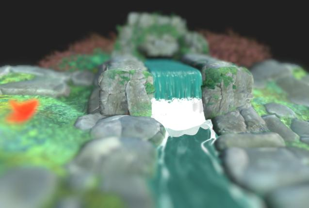
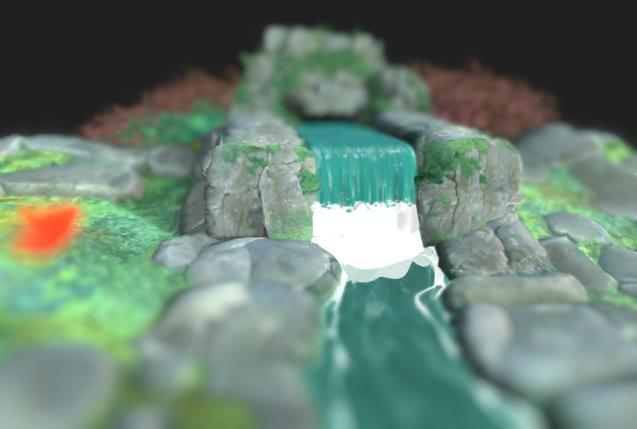
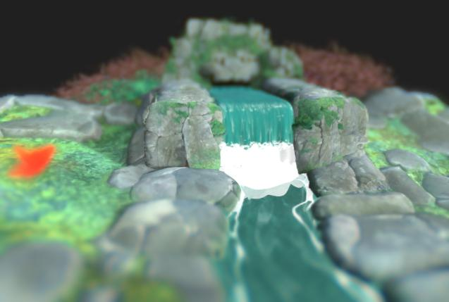

# Efectos de posprocesamiento

{zoomable="yes"}

En las propiedades de la cámara, puede activar efectos de posprocesamiento para mejorar los renderizados o comprobar propiedades específicas del material.

Estos efectos se desarrollan internamente y solo están disponibles para los procesadores Rasterizer y de Trazador de ruta de GPU [renderers](../../../../interface/3d-view/3d-renderers/3d-renderers.md).

Cualquier efecto de publicación habilitado al guardar [recursos de escena 3D](../../../../resources/3d-scene-resource/3d-scene-resource.md) o [archivos de estado de escena](../../../../working-with-3d-scenes/working-with-3d-scenes.md) se guardará como parte del estado de escena.

<table>
<tr style="border: 0;">
<td style="border: 0;" valign="top">

## Asignación de tonos

</td>
<td style="border: 0;" valign="top">

### Resplandor

</td>
<td style="border: 0;" valign="top">

### Profundidad de campo

</td>
<td style="border: 0;" valign="top">

</td>
</tr>
</table>

## Asignación de tonos

Reasigna los colores del procesamiento según algoritmos específicos o tablas de búsqueda (LUT).

Esto permite mejorar la coherencia de color entre aplicaciones. Por ejemplo, el mapeador de tonos AgX también está disponible en Blender.

+++Reinhard

<table>
  <tr>
    <td>
      
       <i>Antes</i>
    </td>
    <td>
      
       <i>Después De</i>
    </td>
  </tr>
</table>

+++

+++Atan

<table>
  <tr>
    <td>
      
       <i>Antes</i>
    </td>
    <td>
      
       <i>Después De</i>
    </td>
  </tr>
</table>

+++

+++Exp

<table>
  <tr>
    <td>
      
       <i>Antes</i>
    </td>
    <td>
      
       <i>Después De</i>
    </td>
  </tr>
</table>

+++

+++Registro

<table>
  <tr>
    <td>
      
       <i>Antes</i>
    </td>
    <td>
      
       <i>Después De</i>
    </td>
  </tr>
</table>

+++

+++Aces

<table>
  <tr>
    <td>
      
       <i>Antes</i>
    </td>
    <td>
      
       <i>Después De</i>
    </td>
  </tr>
</table>

+++

+++Hejl

<table>
  <tr>
    <td>
      
       <i>Antes</i>
    </td>
    <td>
      
       <i>Después De</i>
    </td>
  </tr>
</table>

+++

+++Neutro

<table>
  <tr>
    <td>
      
       <i>Antes</i>
    </td>
    <td>
      
       <i>Después De</i>
    </td>
  </tr>
</table>

+++

+++Agx

<table>
  <tr>
    <td>
      
       <i>Antes</i>
    </td>
    <td>
      
       <i>Después De</i>
    </td>
  </tr>
</table>

+++

+++Neutral Pbr

<table>
  <tr>
    <td>
      
       <i>Antes</i>
    </td>
    <td>
      
       <i>Después De</i>
    </td>
  </tr>
</table>

+++

## Resplandor

Simula el efecto en la cámara de halos de luz que sangran hacia fuera desde áreas muy brillantes a áreas que reciben menos luz.

El efecto se ve influenciado por la iluminación de la escena, la exposición de la cámara y los materiales emisores.

+++Umbral
El valor de luminancia por encima del cual la floración debe ser visible.

*Izquierda: 1.0 / Derecha: 4.0*

<table>
  <tr>
    <td>
      
       <i>Antes</i>
    </td>
    <td>
      
       <i>Después De</i>
    </td>
  </tr>
</table>

+++

+++Difuminación
La rampa de atenuación de la floración, donde un valor más bajo da como resultado un radio de floración más corto.

*Izquierda: 1.0 / Derecha: 0,6*

<table>
  <tr>
    <td>
      
       <i>Antes</i>
    </td>
    <td>
      
       <i>Después De</i>
    </td>
  </tr>
</table>

+++

+++Nivel
La intensidad de la floración. Un valor más alto da como resultado unos halos de luz más brillantes y pronunciados.

*Izquierda: 8.0 / Derecha: 2.0*

<table>
  <tr>
    <td>
      
       <i>Antes</i>
    </td>
    <td>
      
       <i>Después De</i>
    </td>
  </tr>
</table>

+++

+++Cambio de color
Desplaza el tono de las áreas afectadas por la floración hacia colores más cálidos.

*Izquierda: 0,0 / Derecha: 0,8*

<table>
  <tr>
    <td>
      
       <i>Antes</i>
    </td>
    <td>
      
       <i>Después De</i>
    </td>
  </tr>
</table>

+++

## Profundidad de campo

Simula el fenómeno óptico causado por los objetivos de la cámara en el que los objetos más cercanos y más lejanos a la distancia de enfoque se desenfocan.

El efecto se ve afectado por los parámetros &quot;F-Stop&quot; y &quot;Distancia de enfoque&quot; de la cámara.

>[!TIP]
>
> Para ajustar rápidamente el enfoque de la cámara, coloque el cursor en la ubicación de la escena que desea enfocar y presione Ctrl+LMB (Windows) o Cmd+LMB (macOS) para establecer automáticamente la distancia de enfoque a esa ubicación.

+++Radio máximo
Radio máximo del efecto de desenfoque.

*Izquierda: 32.0 / Derecha: 4.0*

<table>
  <tr>
    <td>
      
       <i>Antes</i>
    </td>
    <td>
      
       <i>Después De</i>
    </td>
  </tr>
</table>

+++

+++Intensidad de la composición
Magnitud del efecto de desenfoque desde la distancia de enfoque hacia fuera.

*Izquierda: 0.2 / Derecha: 0,05*

<table>
  <tr>
    <td>
      
       <i>Antes</i>
    </td>
    <td>
      
       <i>Después De</i>
    </td>
  </tr>
</table>

+++

+++Aberración longitudinal
Intensidad de la aberración que se produce lejos de la distancia de enfoque.

La aberración simula el modo en que las diferentes longitudes de onda de la luz tienen distancias focales ligeramente diferentes, lo que da lugar a que los colores parezcan estar desplazados y tengan diferencias sutiles en el enfoque.

*Izquierda: 0,0 / Recto: 1.0*

<table>
  <tr>
    <td>
      
       <i>Antes</i>
    </td>
    <td>
      
       <i>Después De</i>
    </td>
  </tr>
</table>

+++

+++Aberración acromática
Especifica si la aberración debe ser acromática, lo que significa que algunos o todos los colores tienen la misma distancia focal.

Esto hace que el efecto de desenfoque parezca estar distribuido de forma más equitativa.

*Izquierda: Verdadero / Derecho: False*

<table>
  <tr>
    <td>
      
       <i>Antes</i>
    </td>
    <td>
      
       <i>Después De</i>
    </td>
  </tr>
</table>

+++

+++Ojo de gato
Activa el efecto del ojo del gato en la escena, lo que simula cómo la luz que entra en un ángulo oblicuo no entra en un disco, sino en un óvalo irregular, lo que provoca distorsión.

Este efecto es más pronunciado en aperturas más altas, es decir, valores de punto F más bajos.

*Izquierda: Verdadero / Derecho: False*

<table>
  <tr>
    <td>
      
       <i>Antes</i>
    </td>
    <td>
      
       <i>Después De</i>
    </td>
  </tr>
</table>

+++
