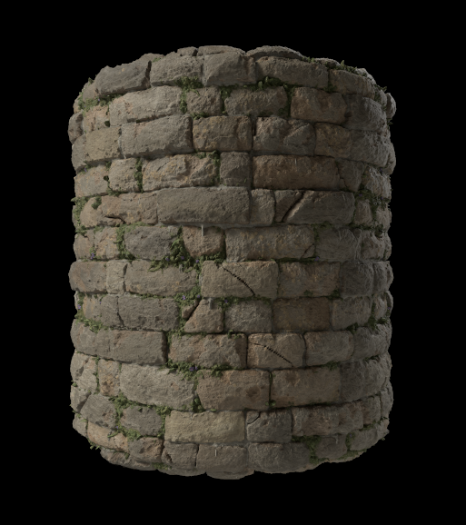
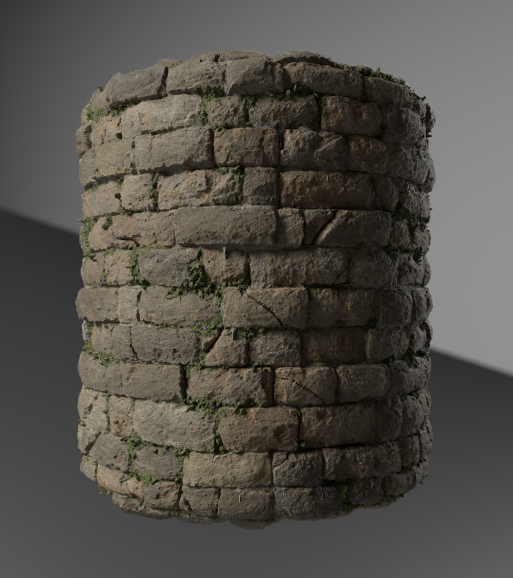
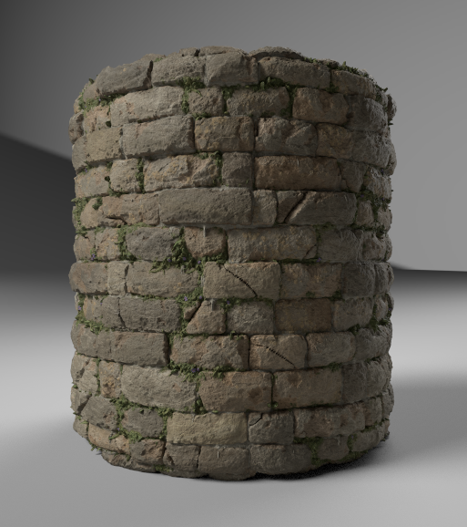

# Iray

Esta página presenta el renderizador Iray disponible en el panel de vista 3D de [Substance 3D Designer](https://www.adobe.com/es/products/substance3d-designer.html), que ofrece un trazado de ruta interactivo para el renderizado fotorrealista con CPU y/o aceleración de GPU (solo GPU Nvidia).

>[!WARNING]
> 
> El procesador de Iray y todas las funciones relacionadas se eliminaron de Designer en la versión 16.0.0.
> 
> Más información aquí: [Gráfico MDL y final de la vida útil de Iray](../../../technical-issues/mdl-graph-iray-eol/mdl-graph-iray-eol.md)

<table>
<tr style="border: 0;">
<td style="border: 0;" valign="top">

## Información general

<b>Iray</b> es una tecnología de representación basada en física intuitiva y altamente *interactiva* que genera *imágenes fotorrealistas* simulando el comportamiento físico de la luz y los materiales. Obtén más información en la página web de [Nvidia Iray](https://www.nvidia.com/en-us/design-visualization/iray/).

</td>
<td style="border: 0;" valign="top">

</td>
</tr>

<tr style="border: 0;">
<td style="border: 0;" valign="top">

Como la vista 3D usa el *procesador progresivo* de Iray, se genera una imagen tan pronto como se haya realizado al menos una muestra en cada píxel. La imagen se *actualiza automáticamente* a medida que se realizan iteraciones de muestreo, lo que hace que una imagen inicial aproximada se vuelva *más limpia en cada iteración*.

El procesador está disponible en el panel [Vista 3D](../../../interface/3d-view/3d-view.md): abre el menú <b>Procesador</b> y selecciona la opción <b>Iray</b> para cambiar el procesador utilizado en ese panel de vista 3D a Iray.\
Al cambiar al procesador de Iray *, se cambian las opciones disponibles* en algunos de los menús de la vista 3D. Estos cambios se explican en la sección <b>Vista 3D</b> que aparece a continuación.

De forma predeterminada, el procesamiento progresivo se inicia en cuanto se selecciona el procesador de Iray. El proceso de procesamiento se ejecutará hasta que se cumpla *una* de estas condiciones:

* Se realizó el *número máximo de muestras*
* Se alcanzó el *límite de tiempo de procesamiento*

Consulte la sección <b>Procesador</b> de esta página para obtener más información sobre el ajuste de estas condiciones.

</td>
<td style="border: 0;" valign="top">

*Material: [Muralla medieval de castillo](https://oggyart.artstation.com/projects/Xnzx0a)* *por [Mark Foreman](https://www.artstation.com/oggyart)* *disponible en nuestra [biblioteca](https://substance3d.adobe.com/assets)**de Substance 3D*

</td>
</tr>
</table>

>[!WARNING]
>
> Solo se puede ejecutar *una instancia de representación de Iray* en cualquier momento.\
> Esto significa que cuando un panel de vista 3D utiliza este procesador, el menú **Procesador** está *deshabilitado* en otros paneles de vista 3D y estos se asignan de forma predeterminada al procesador **OpenGL**.

## Opciones de vista 3D

### Escena

Seleccione la opción <b>Editar</b> en el menú <b>Escena</b> para encontrar propiedades de escena específicas de Iray en el panel <b>Propiedades</b>.

* <b>Está habilitado:</b> Cuando se establece en *False*, el objeto está oculto y *ya no contribuye* a la escena

Mostrar componente

* <b>Está visible</b>: Cuando se establece en *False*, el objeto está oculto, pero *sigue contribuyendo* a la escena, es decir, refleja la luz, absorbe la luz y proyecta sombras

Componente de visualización de malla

* Subdivisión
  * <b>Método</b>: Método utilizado para subdividir la malla en una geometría más fina
    * *Ninguno*: No se aplica ninguna subdivisión
    * *Paramétrico*: Subdivide la malla en `4^x` triángulos donde `x` es el valor especificado por este parámetro
    * *Longitud*: Subdivide la malla hasta que todos los bordes tengan una longitud (en espacio de objeto) inferior al valor especificado por el parámetro Longitud mínima .
  * <b>Longitud mínima</b>: Subdivide la malla hasta que todos los bordes tengan una longitud por debajo de este valor especificado en el espacio del objeto (solo se aplica al método *Length*)
  * <b>Número</b>: Número de iteraciones de subdivisión que se deben aplicar a la malla (solo se aplica al método *Parametric*)

>[!WARNING]
>
> La subdivisión de la malla *aumenta su tiempo de procesamiento de forma exponencial* antes y durante el procesamiento. Sugerimos ser *conservador* con los valores de entrada.\
> Tenga cuidado al usar los valores *high* **Number** para el método paramétrico, y los valores *low* **Minimum length** para el método Length.

### Materiales

Dado que Iray se basa en el [modelo de sombreado MDL](https://www.nvidia.com/en-us/design-visualization/technologies/material-definition-language/) desarrollado por NVIDIA, los materiales disponibles para los materiales de las escenas se reemplazan por la biblioteca MDL cargada por Designer. Esta biblioteca se crea utilizando las siguientes fuentes:

* Los archivos MDL incluidos en la instalación de Designer
* Los archivos MDL encontrados en los [directorios enumerados por el usuario](../../../interface/preferences-window/project-settings/project-settings.md) en los [archivos de proyecto](../../../pipeline-and-project-con/project-configuration-fil/project-configuration-files-sbsprj.md) cargados
* La biblioteca [NVIDIA vMaterials](https://developer.nvidia.com/vmaterials) si está instalada

>[!NOTE]
>
> Para obtener un análisis más profundo del modelo de sombreado MDL, consulta el [Manual MDL](http://mdlhandbook.com/), escrito y mantenido por NVIDIA.

<table>
<tr style="border: 0;">
<td style="border: 0;" valign="top">

La lista acumulativa de materiales MDL cargados está disponible en el menú <b>Materiales</b>, en cualquiera de los submenús de materiales de la lista, como se muestra en la imagen de la derecha.

Además, si se carga un [gráfico MDL](../../../mdl-graphs/creating-an-mdl-graph/creating-an-mdl-graph.md) en Designer, se puede aplicar a cualquier material de Scene. En ese momento, se añade a la lista de materiales disponibles de MDL.

Otras opciones destacadas en este menú son:

* Seleccione la opción <b>Editar</b> para tener acceso a las *entradas expuestas* de MDL en el panel <b>Propiedades</b> y retoque el material según sea necesario
* <b>Cargar...La opción </b> le permite *cargar manualmente cualquier archivo MDL* para agregarlo a la lista acumulativa y aplicarlo en la escena
* <b>Exportar ajuste preestablecido...La opción </b> abre el cuadro de diálogo <b>Exportar ajuste preestablecido de material MDL</b>, que le permite exportar un archivo MDL de ajuste preestablecido utilizando la configuración actual aplicada en la vista 3D

</td>
<td style="border: 0;" valign="top">

</td>
</tr>
</table>

>[!NOTE]
>
> Al cargar un **gráfico MDL**, el procesador de vista 3D se *cambia automáticamente a **Iray*** para cargarlo y aplicarlo.

### Cámara

La principal diferencia entre OpenGL e Iray en cuanto a la configuración de la cámara es cómo se administra la *profundidad de campo*. De hecho, dado que Iray es un procesador con precisión física, la profundidad de campo se produce &quot;naturalmente&quot;, dependiendo de la *apertura* de la cámara.

Los siguientes parámetros están disponibles en las propiedades de la cámara cuando se selecciona el procesador de Iray:

* <b>Distancia de enfoque</b>: la distancia desde la cámara del punto focal, es decir, donde la imagen está más nítida
* <b>Diámetro de apertura</b>: el valor que impulsa la apertura de la cámara. Cuanto más bajo sea el valor, más nítidos serán los elementos de la imagen antes y después del punto focal; en términos más sencillos, este valor controla la intensidad del efecto de profundidad de campo

### Entorno

Abra el menú <b>Entorno</b> y seleccione la opción <b>Editar</b> para mostrar las propiedades del entorno en el panel <b>Propiedades</b>.

Están disponibles las siguientes propiedades:

Cúpula

* <b>Tipo domo</b>: establece los objetos que encierran la escena, en los que se proyecta la textura del entorno
  * *Esfera infinita*: entorno esférico infinito
  * *Tierra*: ambiente esférico infinito, pero con un plano de tierra texturizado
  * *Esfera*: cúpula de radio personalizado en forma de esfera de tamaño finito
  * *Esfera con tierra*: domo en forma de esfera de tamaño finito con radio personalizado donde la parte inferior del entorno se proyecta sobre el plano que divide las partes superior e inferior de la esfera
  * *Cuadro con tierra*: cúpula con forma de caja de tamaño finito de anchura, height y longitud personalizados donde la parte inferior del entorno se proyecta sobre el plano que divide las partes superior e inferior de la caja
* <b>Ángulo de rotación</b>: controla el ángulo de rotación de la cúpula alrededor del *eje Y*
* <b>Radio</b>: el radio de la esfera (solo se aplica a las *Esfera* y *Esfera con suelo* tipos de domo)
* <b>Ancho</b>: la anchura del cuadro (solo se aplica al *cuadro con el tipo domo ground*)
* <b>Height</b>: el height de la caja (solo se aplica a la *caja con suelo* tipo domo)
* <b>Longitud</b>: la longitud de la caja (solo se aplica a la *caja con el tipo domo Ground*)
* <b>Visualizar</b>: permite una superposición de falso color de la geometría de entorno de tamaño finito. Esto se puede usar para alinear la geometría con la proyección del mapa del entorno capturado (solo se aplica a los tipos de domo *Esfera*, *Esfera con suelo* y *Cuadro con suelo*)

>[!NOTE]
>
> Para las cúpulas de tamaño finito, toda la geometría de escena debe estar *incluida* dentro de la cúpula.

Cúpula de tierra\
Los siguientes parámetros se aplican a los tipos de domo *Tierra*, *Esfera con suelo* y *Cuadro con suelo*:

* **Tierra**: habilita el plano de tierra
* **Posición**: la posición del origen de la cúpula finita (también se aplica al tipo de cúpula *Esfera*)
* **Reflectividad**: la opacidad y el matiz del reflejo del suelo, donde negro significa que el reflejo no es visible
* **Brillo**: el brillo del reflejo del suelo
* **Intensidad de la sombra**: la opacidad de la sombra proyectada en el suelo
* **Escala de textura**: controla el tamaño de la proyección de la textura del entorno en el suelo (también se aplica al tipo domo *Esfera*)

El impacto de algunos de estos ajustes se muestra a continuación:

+++Entorno de visualización

<table>
  <tr>
    <td>
      
       <i>Antes</i>
    </td>
    <td>
      
       <i>Después De</i>
    </td>
  </tr>
</table>

+++

+++Habilitar plano de suelo

<table>
  <tr>
    <td>
      
       <i>Antes</i>
    </td>
    <td>
      
       <i>Después De</i>
    </td>
  </tr>
</table>

+++

+++Rotar entorno

+++

+++Ajustar el plano de tierra

+++

+++Ajustar esfera infinita
")

+++

+++Ajustar cuadro envolvente
")

+++

### Visualizar

Estas opciones muestran una *superposición de texto* sobre la imagen representada, con información útil sobre el procesamiento.

* <b>Tiempo transcurrido</b>: La duración del procesamiento en segundos. Este temporizador y el proceso de procesamiento se detendrán cuando se cumpla una de las condiciones finales
* <b>Iteraciones</b>: Número de iteraciones de muestreo realizadas. Este contador y el proceso de procesamiento se detendrán cuando se cumpla una de las condiciones finales
* <b>Método de procesamiento</b>: La ruta de representación utilizada. Para la mayoría de los fines en una máquina local, se utiliza Photoreal
* <b>Resolución</b>: La resolución de procesamiento efectiva. Si la opción Usar resolución de ventana de las propiedades de la cámara se establece en False, la proporción de la imagen se ajusta automáticamente para que coincida con la proporción de resolución
* <b>Estadísticas de escena</b>: Una lista de estadísticas relacionadas con la escena procesada, que incluye el recuento de triángulos y el recuento de materiales, entre otros datos

{width="512px"}

### Renderizador

Abra el menú <b>Procesador</b> y seleccione la opción <b>Editar</b> para mostrar las propiedades del procesador en el panel <b>Propiedades</b>.

Procesamiento progresivo

* <b>Muestras mínimas</b>: El número mínimo de muestras por píxel que calcular antes de considerar los criterios para detener el procesamiento progresivo
* <b>Máximo de muestras</b>: Si se ha procesado este número de muestras por píxel, detenga el procesamiento progresivo automáticamente
* <b>Tiempo máximo (segundos)</b>: Tiempo en segundos después del cual el procesamiento progresivo debe finalizar automáticamente
* <b>Muestra cáustica habilitada</b>: Aumente el muestreador predeterminado con un muestreador cáustico dedicado. Los cáusticos son el resultado de la luz que pasa a través de un objeto no opaco, por lo que solo es necesario si se aplica un material [MDL](../../../mdl-graphs/creating-an-mdl-graph/creating-an-mdl-graph.md) que admita la translucidez en cualquier objeto de la escena
* <b>Filtro de Firefly habilitado</b>: active el filtro luciérnaga, que utiliza un algoritmo predefinido para eliminar luciérnagas en la imagen calculada a medida que avanza el procesamiento. Los Firefly son artefactos visuales en los que *píxeles aislados* de una imagen son *notablemente más brillantes* que sus vecinos, y son el resultado de muestras de rayos insuficientes para determinar con precisión la distribución de la luz
* Denoiser posterior\
  El procesador Iray usa el [denoiser acelerado por IA NVIDIA Optix](https://developer.nvidia.com/optix-denoiser) para eliminar el ruido de alta calidad iterativo de la imagen mientras se procesa.

  * <b>Habilitado</b>: permite activar un *algoritmo de eliminación de ruido* predefinido en una iteración de procesamiento establecida, y estar activo hasta el *final* del procesamiento
  * <b>Iniciar iteración</b>: Si el eliminador de ruido está activado, esta opción define la iteración en la que se inicia el proceso de eliminación de ruido. Esto puede evitar que la sobrecarga de rendimiento del denoiser afecte a la interactividad, por ejemplo, al mover la cámara. Además, las primeras iteraciones no suelen ser adecuadas como entrada para el denoiser debido a una convergencia insuficiente, lo que conduce a resultados insatisfactorios.

El impacto de algunos de estos ajustes se muestra en las comparaciones de imágenes a continuación:

+++Muestras cáusticas

<table>
  <tr>
    <td>
      
       <i>Antes</i>
    </td>
    <td>
      
       <i>Después De</i>
    </td>
  </tr>
</table>

+++

+++Firefly, filtro

<table>
  <tr>
    <td>
      
       <i>Antes</i>
    </td>
    <td>
      
       <i>Después De</i>
    </td>
  </tr>
</table>

+++

+++Post-denoiser

<table>
  <tr>
    <td>
      
       <i>Antes</i>
    </td>
    <td>
      
       <i>Después De</i>
    </td>
  </tr>
</table>

+++

*Material: MDL* de vidrio grueso *disponible en las definiciones principales de MDL* *de NVIDIA*

## Aceleración de hardware

El procesador de Iray ofrece aceleración de hardware exclusivamente en GPU NVIDIA, lo que ofrece las siguientes ventajas:

* Aumento significativo de la velocidad de procesamiento
* [Eliminación de ruido acelerada por IA Optix](https://developer.nvidia.com/optix-denoiser) (consulte &quot;Post-denoiser&quot; en la sección <b>Renderer</b> de esta página)

Puede seleccionar el hardware que Iray debe usar para el procesamiento en la sección <b>Vista 3D</b> de la ventana [Preferencias](../../../interface/preferences-window/preferences-window.md), como se muestra en la imagen de la derecha.

Cuando se detecta una GPU compatible, se muestra en esta sección, se *selecciona automáticamente* de forma predeterminada y la CPU no está seleccionada. Cualquier cambio manual anula este comportamiento automático para que los cambios personalizados se guarden para futuras sesiones.

>[!NOTE]
>
> Si se detecta y se muestra una GPU compatible, se recomienda *dejar la CPU sin seleccionar*, ya que el uso de la CPU para el procesamiento de Iray tiene un *impacto significativo* en el rendimiento y la capacidad de respuesta generales de la aplicación.

>[!WARNING]
>
> La aceleración de hardware de GPU utiliza la tecnología [NVIDIA CUDA](https://developer.nvidia.com/cuda-zone). Asegúrate de que tu *controlador de gráficos está actualizado* para obtener la mejor compatibilidad y fiabilidad. Encuentra el controlador más reciente para tu GPU NVIDIA [aquí](https://www.nvidia.com/Download/index.aspx?lang=en-us).\
> Para configuraciones de varias GPU, se recomienda *deshabilitar SLI* y seleccionar solo una GPU para obtener la mejor confiabilidad.

