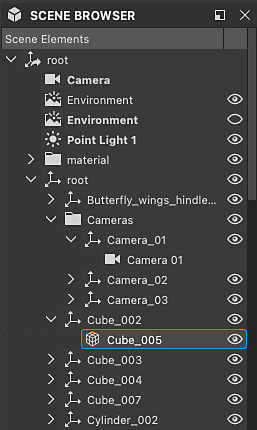

# Explorador de escena

El explorador de escenas de la vista 3D enumera todos los elementos de la escena y su jerarquía.

Ofrece controles para seleccionar objetos, cambiar su visibilidad y seleccionar qué material debe [reemplazar un material de escena](../../../working-with-3d-scenes/overriding-scene-mat/overriding-scene-materials.md).

Dado que Designer utiliza [USD](https://openusd.org/release/index.html) para describir y administrar sus escenas, su terminología y conceptos se encuentran en ese árbol de escenas.

Se muestra al hacer clic en su botón de alternancia dedicado  en la [barra de herramientas de escena de vista 3D](../../../interface/3d-view/3d-view.md).

{zoomable="yes"}

<table>
<tr style="border: 0;">
<td style="border: 0;" valign="top">

## Árbol de escenas

</td>
<td style="border: 0;" valign="top">

### Alternancia de objetos en la escena

</td>
<td style="border: 0;" valign="top">

### Materiales conectados

</td>
</tr>
</table>

## Árbol de escenas

<table>
<tr style="border: 0;">
<td width="100.00%" style="border: 0;" valign="top">

El explorador de escenas muestra una lista de objetos organizados en un árbol jerárquico.

Los objetos se asocian a otros objetos, hasta la raíz de la escena. Un objeto principal tiene un botón de flecha que se utiliza para expandir o contraer la lista de sus elementos secundarios.

</td>
<td width="33.33%" style="border: 0;" valign="top">

{zoomable="yes"}

</td>
</tr>
</table>

Deje el cursor en cualquier elemento del árbol durante un par de segundos para mostrar información sobre herramientas con la siguiente información:

* <b>Ruta:</b> Ruta de acceso completa del objeto en la escena.
* <b>TypeName:</b> El tipo USD del objeto.
* <b>Documentación:</b> Información detallada sobre el objeto como elemento de escena USD.

Las mallas tienen información adicional: Recuento de vértices, recuento de caras y recuento de UV.

### Objetos añadidos por Designer

<table>
<tr style="border: 0;">
<td width="100.00%" style="border: 0;" valign="top">

Designer añade algunos objetos a cualquier escena cargada. Los objetos agregados por Designer se etiquetan en <b>bold</b>.

Cuando se utiliza &#39;Editar ...&#39; acción en los menús Luces, Cámara y Entorno, estos son los objetos que se están editando, independientemente de que haya otras luces, cámaras o entornos en la escena.

Estos objetos se incluyen en la escena cuando [se exportan](../../../working-with-3d-scenes/exporting-scenes/exporting-scenes.md).

</td>
<td width="33.33%" style="border: 0;" valign="top">

{zoomable="yes"}

</td>
</tr>
</table>

* <b>Cámara:</b> La cámara predeterminada de la escena. Esta es la única cámara con la que puedes interactuar en Designer. Cualquier cámara incluida en una escena cargada se añade como ajuste preestablecido para la cámara predeterminada.
* <b>Entorno:</b> El entorno predeterminado de la escena. Cualquier textura aplicada al entorno de la escena se aplicará únicamente a dicho entorno. Del mismo modo, la rotación del entorno solo afecta a dicho entorno.\
  Cuando una escena cargada incluye una o más luces de entorno ([DomeLight](https://openusd.org/release/user_guides/schemas/usdLux/DomeLight.html) en USD), el entorno predeterminado se deshabilita automáticamente para no interferir con la iluminación del entorno de la escena.
* <b>Luz puntual #:</b> Si alguna de las luces puntuales de Designer está habilitada en Luces > Editar propiedades, cada luz puntual se agrega a la escena.

## Alternancia de objetos en la escena

### Todos los tipos

Cualquier objeto se puede activar y desactivar en la escena. Cuando está desactivado, un objeto ya no contribuye a la escena: no proyecta sombras, no emite ni refleja la luz.

El estado de un objeto principal se transfiere a sus elementos secundarios, por lo que al deshabilitar un objeto principal también se deshabilitan sus elementos secundarios.

La visibilidad de un objeto se puede alternar haciendo clic en su botón de ojo  o desde su menú contextual. El menú ofrece algunas acciones más para administrar la visibilidad de los objetos de escena:

* <b>Ocultar:</b> Deshabilita el objeto seleccionado.
* <b>Mostrar:</b> Habilite el objeto seleccionado.

Algunas acciones afectan específicamente a la visibilidad de las mallas:

* <b>Mostrar solo:</b> Deshabilita todas las mallas excepto la seleccionada y sus secundarias.
* <b>Mostrar todo:</b> Habilitar todas las mallas.

Los objetos principales tienen estas acciones adicionales:

* <b>Ocultar elementos secundarios:</b> Deshabilite recursivamente todos los elementos secundarios del objeto seleccionado.
* <b>Mostrar elementos secundarios:</b> Habilite todos los elementos secundarios del objeto seleccionado de forma recursiva.
* <b>Expandir todos los elementos secundarios:</b> Expanda recursivamente todas las listas de elementos secundarios bajo el objeto seleccionado.
* <b>Contraer todos los elementos secundarios:</b> Contraer todas las listas de elementos secundarios del objeto seleccionado, de forma recursiva.

{zoomable="yes"}

### Entornos

La visibilidad de cualquier luz ambiental (DomeLight) se puede activar y desactivar de la misma manera que otros objetos.

Cuando una luz ambiental está desactivada, su contribución de iluminación a la escena también se desactiva.

Si hay más de una luz de entorno habilitada, sus contribuciones de iluminación se *agregan acumulativamente*.

{zoomable="yes"}

### Luces

Lo mismo ocurre con las luces de la escena: cada uno se puede alternar individualmente.

{zoomable="yes"}

## Materiales conectados

El explorador de escenas también le permite conectar cualquier material modificado a otro material enumerado por Designer en el [menú Materiales](../../../interface/3d-view/3d-view.md) de la vista 3D.

<table>
<tr style="border: 0;">
<td style="border: 0;" valign="top">

Los materiales enumerados por Designer son los objetos materiales del árbol de escenas utilizados en al menos una malla.

Al [reemplazar](../../../working-with-3d-scenes/overriding-scene-mat/overriding-scene-materials.md) cualquiera de estos materiales, Designer crea una copia con un sufijo numérico.

Un material modificado ofrece un elemento adicional en su menú contextual: el submenú &#39;[Material conectado](../../../working-with-3d-scenes/overriding-scene-mat/overriding-scene-materials.md)&#39; muestra todos los demás materiales disponibles que se pueden usar para reemplazar este material.

</td>
<td style="border: 0;" valign="top">

{zoomable="yes"}

</td>
</tr>
</table>
