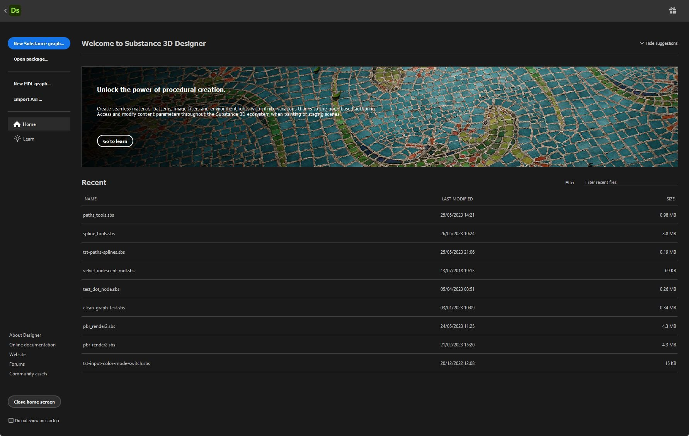
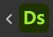
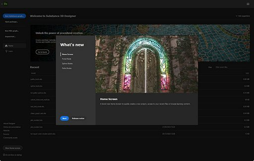
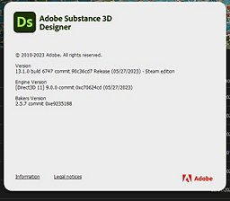

# Pantalla de inicio

La <b>pantalla Inicio<b> </b></b> le da la bienvenida al iniciar Substance 3D Designer. Le ayuda a comenzar con sus proyectos y acceder a vínculos útiles.

<table>
<tr style="border: 0;">
<td width="100.00%" style="border: 0;" valign="top">

Para cerrar la pantalla de inicio, usa el botón <b>Atrás</b> de la parte superior izquierda o el botón <b>Cerrar pantalla de inicio</b> de la parte inferior izquierda. Una casilla de verificación justo debajo le permite activar o desactivar la visualización automática de la pantalla de inicio después de iniciar Designer.

</td>
<td width="16.67%" style="border: 0;" valign="top">

</td>
</tr>
</table>

{width="512px"}

## Inicio

La sección  <b>Inicio</b> incluye un banner con una sugerencia resaltada para ir más allá con Designer.\
Este banner se puede contraer usando el botón  <b>Ocultar sugerencias</b> de la derecha.

A continuación, una lista de archivos recientes bajo el encabezado <b>Recientes</b> ofrece acceso rápido a los últimos proyectos cargados, desde los más recientes a los más antiguos.

Los archivos recientes se pueden filtrar usando el campo de entrada <b>Filtro</b> situado en la parte superior derecha de la lista. El filtrado coincide con cualquier cadena de caracteres presente en el nombre de archivo de un proyecto.

>[!TIP]
>
> Deje el cursor en una entrada durante unos segundos para mostrar la ruta completa del archivo.

{width="512px"}

## Aprendizaje

La sección  <b>Formación</b> ofrece recursos de aprendizaje útiles para ampliar tus conocimientos sobre Substance 3D Designer.

Estos recursos se enumeran como vínculos de tarjetas y se agrupan de la siguiente manera:

* Los <b>tutoriales prácticos</b> abarcan las funciones más recientes;
* <b>Más recursos</b> recopila recursos que puedes encontrar útiles para volver a usar con regularidad:
  * [Primeros pasos en Designer](https://substance3d.adobe.com/tutorials/courses/First-Steps-with-Substance-3D-Designer/youtube-VyFgpitTsYg) es nuestro tutorial de referencia para principiantes;
  * [Quicktips](https://substance3d.adobe.com/tutorials/courses/Designer-Quicktips/youtube-Q9mEcCWsOQc) es una lista de reproducción seleccionada de técnicas para crear materiales, patrones, filtros, etc.;
  * La [documentación en línea](../../home/home.md) le lleva a esta documentación.

{width="512px"}

## Novedades

El botón  <b>Novedades</b> de la parte superior derecha de la pantalla muestra una pantalla con las principales funciones añadidas en tu versión de Designer, así como un vínculo a las [notas de la versión](../../release-notes/release-notes.md) completas de esa versión.

## Iniciar proyecto

En la parte izquierda de la pantalla, puede encontrar una lista de métodos abreviados para crear un nuevo gráfico en un nuevo paquete:

* <b>Nuevo gráfico de Substance:</b> Abre la ventana [Nuevo gráfico de Substance](../../compositing-graphs/creating-compositing-gra/creating-a-substance-compositing-graph.md);
* <b>Abrir paquete:</b> Permite cargar un paquete existente;
* <b>Importar AxF:</b> Inicia un [flujo de trabajo de importación de AxF](../../resources/axf-appearance-exchange/axf-appearance-exchange-format.md).

{width="256px"}

## Vínculos

En la parte inferior izquierda de la pantalla, se muestran los siguientes enlaces útiles:

* <b>Acerca de Designer:</b> Muestra la pantalla Acerca de Designer (ver arriba);
* <b>Documentación en línea:</b> Abre una página web para [esta documentación](../../home/home.md);
* <b>Sitio web:</b> Abre una página web en la [página de producto](https://www.adobe.com/es/products/substance3d-designer.html) de Substance 3D Designer;
* <b>Foros:</b> Abre una página web en la [Comunidad de asistencia técnica](https://community.adobe.com/t5/substance-3d-designer/ct-p/ct-substance-3d-designer?page=1&sort=latest_replies&filter=all&lang=all&tabid=discussions) de Substance 3D Designer;
* <b>Activos de la comunidad:</b> Abre una página web en Substance 3D [Activos de la comunidad](https://substance3d.adobe.com/community-assets/).
