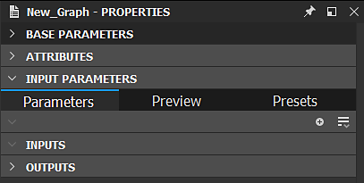

# Propiedades

Esta página presenta el panel <b>Propiedades </b>de Substance 3D Designer, su diseño y los diferentes despliegues y categorías y parámetros que puedes encontrar dentro. Se centra en las propiedades de [gráficos de Substance](../../compositing-graphs/substance-compositing-graphs.md). Los [gráficos de funciones](../../function-graphs/function-graphs.md) y los [gráficos FX-Map](../../function-graphs/fxmaps/fxmaps.md) tienen diseños más sencillos.

<table>
<tr style="border: 0;">
<td style="border: 0;" valign="top">

## Información general

El panel <b>Propiedades</b> es un panel sensible al contexto que cambia en función de su selección en [la vista de gráfico](../../interface/the-graph-view/the-graph-view.md) y la ventana de [Explorador](../the-explorer-window/the-explorer-window.md).

</td>
<td style="border: 0;" valign="top">

</td>
</tr>
</table>

Te permite cambiar las propiedades de los nodos y recursos seleccionados, junto con [la vista de gráficos](../../interface/the-graph-view/the-graph-view.md); probablemente sea tu segundo panel de IU más utilizado en Designer.

El panel Propiedades se divide en varios despliegues diferentes, dependiendo de su selección, por ejemplo:

* <b>Parámetros base</b> y <b>Entrada-</b> o <b>Parámetros específicos</b> para nodos
* <b>Atributos</b> y <b>Metadatos</b> para la mayoría de los nodos y paquetes

Una característica clave del ecosistema Substance, [Exponer parámetros](../../compositing-graphs/manage-parameters/exposing-a-parameter/exposing-a-parameter.md), se realiza a través del panel Propiedades.

>[!NOTE]
>
> La mayoría de los campos numéricos admiten *fórmulas matemáticas básicas* como entrada; por ejemplo, `17+3.5`, `7/3`, `(4+2)*3`. Presione *Intro* para validar la fórmula y el resultado se introducirá en el campo. Si la fórmula no es válida, el campo vuelve a su valor anterior.\
> Algunos campos numéricos de otras partes de la aplicación, como el cuadro de diálogo [Exponer parámetro](../../compositing-graphs/manage-parameters/exposing-a-parameter/exposing-a-parameter.md), también admiten esta función.

## Gráficos de nodos y Substance

Los nodos y [gráficos de Substance](../../compositing-graphs/substance-compositing-graphs.md) tienen un conjunto de categorías de propiedades ligeramente superpuestas, y su funcionalidad es similar.

Los <b>parámetros base</b> y los <b>atributos</b> son idénticos entre nodos y gráficos.

Los nodos ofrecen <b>Parámetros específicos</b> o <b> Parámetros de instancia</b> (dependiendo de si son [nodos atómicos](../../compositing-graphs/nodes-reference-for-com/atomic-nodes/atomic-nodes.md) o [Instancias](../../compositing-graphs/creating-compositing-gra/graph-instances-sub-gra/graph-instances-sub-graphs.md)), así como <b>Valores de entrada</b> para trabajar con [valores](../../compositing-graphs/values-compositing-graphs/values-in-substance-compositing-graphs.md).

Los nodos atómicos [Input](../../compositing-graphs/nodes-reference-for-com/atomic-nodes/input-color/input-color.md) y [Output](../../compositing-graphs/nodes-reference-for-com/atomic-nodes/output/output.md) son excepciones ya que presentan <b>Atributos de integración</b> y <b>Condiciones</b> para la visibilidad. También se puede acceder a estos dos conjuntos de propiedades de forma centralizada en las propiedades de Graph, en Entradas y salidas.

Los gráficos tienen algunas categorías adicionales. <b>Parámetros de entrada</b> enumera [parámetros expuestos](../../compositing-graphs/manage-parameters/exposing-a-parameter/exposing-a-parameter.md), <b>Entradas</b> y <b>Salidas</b> todas las propiedades de los nodos Entrada y Salida. [Puede encontrar todas las propiedades de Graph explicadas en detalle en una página dedicada.](../../compositing-graphs/graph-parameters/graph-parameters.md)

## Recursos y paquetes

El panel Propiedades también responde a los cambios de selección en el [Explorador](../the-explorer-window/the-explorer-window.md). Puede servir como otra forma de seleccionar un gráfico (en lugar de hacer doble clic en un área vacía), y también le permite cambiar las propiedades Package y [Resource](../../resources/resources.md).

Los paquetes tienen las secciones **Información**, **Atributos** y **Metadatos**. [Los metadatos del paquete se describen en una página dedicada.](../../package-metadata/package-metadata.md)

Los recursos tienen propiedades específicas de su tipo, [detalladas en páginas dedicadas](../../resources/resources.md).
