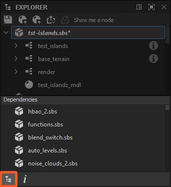

# Explorer

Esta página describe el conjunto acoplado del explorador en [Substance 3D Designer](https://www.adobe.com/es/products/substance3d-designer.html). Este dock le permite administrar paquetes y sus recursos.

<table>
<tr style="border: 0;">
<td style="border: 0;" valign="top">

## Información general

El conjunto acoplado del Explorador es donde se administran los archivos y recursos abiertos actualmente en Substance 3D Designer. Muestra una lista de todos los paquetes abiertos actualmente, cada uno de los cuales se expande en forma de jerarquía para mostrar [resources](../../resources/resources.md) dentro de él.

El Explorador es donde se inician y terminan los proyectos, ya que permite crear, guardar y exportar cualquier tipo de recurso.

</td>
<td style="border: 0;" valign="top">

</td>
</tr>
</table>

Puede realizar algunas acciones importantes a través del conjunto acoplado del Explorador:

* Crear nuevos paquetes y gráficos
* Cargar paquetes existentes
* Guardar y cerrar paquetes cargados
* [Importar y vincular recursos](../../resources/importing-linking-and-new/importing-linking-and-new-resources.md)
* [Exportación de resultados de gráficos a texturas](../../compositing-graphs/exporting-bitmaps/exporting-bitmaps.md)
* [Publish convierte un paquete en un recurso de Substance 3D (SBSAR)](../../compositing-graphs/publishing-asset-files/publishing-substance-3d-asset-files-sbsar.md)
* [Enviar paquetes a otras aplicaciones de Substance 3D](send-to-interoperability/send-to-interoperability.md)
* [Hornear mapas desde una malla](../../bakers/bakers.md)

## Barra de herramientas superior

Esta barra de herramientas le permite realizar rápidamente funciones relacionadas con el flujo de trabajo general. Todos los botones son *según el contexto*, lo que significa que se activan y cambian su comportamiento en función de su selección actual en el Explorador.

 <b>Guardar</b> paquete seleccionado.

 <b>Publish o [send](../../interface/the-explorer-window/send-to-interoperability/send-to-interoperability.md)</b> elementos seleccionados:

* [Publish envía cualquier paquete seleccionado a un recurso de Substance 3D (SBSAR)](../../compositing-graphs/publishing-asset-files/publishing-substance-3d-asset-files-sbsar.md);
* Envía el paquete seleccionado a [Substance 3D Sampler](https://www.adobe.com/products/substance3d-sampler.html), [Substance 3D Painter](https://www.adobe.com/products/substance3d-painter.html) o [Substance 3D Stager](https://www.adobe.com/products/substance3d-stager.html).

 <b>Publish o enviar como anterior:</b> Publish o enviar los elementos seleccionados con la misma configuración que antes. Esta opción solo está disponible en un paquete que ya se ha publicado *al menos una vez* en la *sesión actual*.

 <b>Quitar nodos no utilizados</b> en los gráficos seleccionados. La herramienta sigue estas reglas:

* La herramienta solo está disponible si los elementos seleccionados son del *mismo tipo*: solo gráficos, carpetas o paquetes;
* Cuando la selección incluye carpetas o paquetes, la herramienta limpia todos los gráficos de *recursivamente*;
* Si uno de los gráficos de destino es un [gráfico de Substance](../../compositing-graphs/substance-compositing-graphs.md), hay disponible una segunda opción que le permite limpiar todas las funciones de parámetros en los nodos de ese gráfico.

Obtenga más información sobre la herramienta en la sección &quot;Quitar nodos no utilizados&quot; de la página [Vista de gráficos](../../interface/the-graph-view/the-graph-view.md).

<table>
<tr style="border: 0;">
<td style="border: 0;" valign="top">

*Publish/Send*

</td>
<td style="border: 0;" valign="top">

*Quitar nodos no utilizados*

</td>
</tr>
</table>

## Menús contextuales

La mayor parte de la interacción con el Explorador se realiza a través de menús contextuales, que se muestran al hacer clic en RMB en un elemento de la vista de árbol del Explorador.

Las opciones disponibles varían en función de los elementos seleccionados y en los que se haya hecho clic:

+++Espacio vacío

El espacio vacío solo está disponible debajo de los paquetes abiertos actualmente. Hacer clic junto a los elementos existentes no se considera un espacio vacío.

<b>Nuevo paquete</b>: Crea un nuevo paquete vacío;

<b>Abrir paquete</b>: Abre un cuadro de diálogo para abrir un archivo SBS.

+++

+++Paquete

<b>El nuevo </b>te permite crear nuevos gráficos ([gráfico de Substance](../../compositing-graphs/substance-compositing-graphs.md), [mapa de bits](../../resources/bitmap-resource/bitmap-resource.md) y [gráficos vectoriales](../../resources/vector-graphics-svg-res/vector-graphics-svg-resource.md) recursos, así como *carpetas* para ordenar el contenido

<b>Importar</b> y <b>Vínculo </b>te permiten traer [recursos](../../resources/importing-linking-and-new/importing-linking-and-new-resources.md)

<b>Volver a cargar</b>, <b>Guardar, Guardar como</b> y<b> Guardar una copia como</b> le permite guardar en disco o recuperar del disco una versión del paquete guardada anteriormente.

<b>Archivo .sbsar de Publish</b> y <b>Volver a publicar el archivo .sbsar</b> te permiten [publicar](../../compositing-graphs/publishing-asset-files/publishing-substance-3d-asset-files-sbsar.md) tu gráfico de Substance no compilado y optimizado en un archivo SBSAR eficaz y portátil para usarlo en otras aplicaciones e integraciones de Substance. Publish como anterior repite la acción anterior de Publish con las mismas opciones, omitiendo el cuadro de diálogo de opciones para agilizar la iteración. La barra de herramientas contiene botones con la misma funcionalidad.

<b>La exportación con dependencias</b> es diferente de guardar y publicar. Toma sus archivos SBS, recopila todos los recursos y dependencias a los que se hace referencia y crea un paquete independiente. El cuadro de diálogo le permite elegir qué bibliotecas recopilar y si el archivo debe ser un archivo comprimido (7-zip). Esta es una buena opción para compartir un archivo SBS con otra persona, sin preocuparse por la falta de dependencias.

<b>Enviar a...</b> abre un submenú que te permite [enviar](send-to-interoperability/send-to-interoperability.md) tu paquete directamente a [Substance 3D Sampler](https://www.adobe.com/products/substance3d-sampler.html), [Substance 3D Painter](https://www.adobe.com/products/substance3d-painter.html), [Substance 3D Stager](https://www.adobe.com/products/substance3d-stager.html) o [Substance Player](https://helpx.adobe.com/substance-3d-player/home.html).

<b>Copiar</b> copia el paquete seleccionado.

<b>Pegar</b> pega los gráficos o recursos copiados *en* el paquete seleccionado.

<b>Cerrar paquetes</b> cierra todos los paquetes seleccionados

<b>Calcular salidas</b> obliga a Designer a calcular todas las salidas de todos los gráficos del paquete.

<b>Mostrar En Explorador...</b> abre la ubicación del paquete en la ventana del explorador de archivos de su sistema operativo

<b>Administrador de dependencias</b> abre la ventana Administrador de dependencias para el paquete seleccionado.

<b>Abrir dependencias</b> abre todas las dependencias en el Explorador (*[solo gráficos de Substance](../../compositing-graphs/substance-compositing-graphs.md)*).

+++

+++Gráfico de Substance

<b>Abrir:</b> (Retorno) Abre este gráfico en [la vista de gráfico](../../interface/the-graph-view/the-graph-view.md).

<b>Copiar:</b> *(Ctrl-C)* Copia el gráfico actual en el portapapeles.

<b>Quitar:</b> (Eliminar) Elimina el gráfico de este paquete.

<b>Cambiar nombre:</b> (F2) Cambiar el nombre de este gráfico.

<b>Ver salidas en vista 3D:</b> Envía las salidas de este gráfico a [la vista 3D](../../interface/3d-view/3d-view.md) para mostrarlas como un material.

<b>Calcular salidas:</b> Calcula las salidas de este gráfico y las guarda en la memoria.

<b>Exportar resultados...:</b> Abre el cuadro de diálogo para [exportar a mapas de bits.](../../compositing-graphs/exporting-bitmaps/exporting-bitmaps.md)

+++

+++Recurso de escena 3D

<b>Abrir:</b> (Retorno) Usa esta malla 3D en [el Vista 3D](../../interface/3d-view/3d-view.md), reemplazando el cubo o plano estándar.

<b>Copiar:</b> (Ctrl-C) Copia este recurso en el portapapeles.

<b>Pegar:</b> (Ctrl-V) Pega el recurso del portapapeles.

<b>Quitar:</b> (Supr) Elimina un recurso de este paquete.

<b>Cambiar nombre:</b> (F2) Cambie el nombre de este recurso.

<b>Recargar:</b> Fuerce la recarga de esta malla desde el disco.

<b>Mostrar en el explorador:</b> Abra una ventana del explorador de archivos del sistema en la ubicación del recurso en el disco.

<b>Reubicar:</b> Cambie este recurso para que esté vinculado a otro archivo.

<b>Hacer un bake información de modelo...:</b> Abre el cuadro de diálogo [Haciendo un bake.](../../bakers/bakers.md)

+++

+++Carpeta

<b>Nuevo:</b> Te permite crear en la carpeta nuevos gráficos ([gráfico de Substance](../../compositing-graphs/substance-compositing-graphs.md), [gráfico de funciones de Substance](../../function-graphs/function-graphs.md), [mapa de bits](../../resources/bitmap-resource/bitmap-resource.md) y [gráficos vectoriales](../../resources/vector-graphics-svg-res/vector-graphics-svg-resource.md) recursos, así como *carpetas* para ordenar el contenido.

<b>Importar</b> y <b>Vínculo: </b>Permiten que traigas [recursos](../../resources/importing-linking-and-new/importing-linking-and-new-resources.md) y los coloques en la carpeta.

<b>Copiar:</b> (Ctrl-C) Copia la carpeta y todo su contenido en el portapapeles.

<b>Pegar:</b> (Ctrl-V) Pega la carpeta y todo su contenido del portapapeles.

<b>Cambiar nombre:</b> (F2) Cambie el nombre de esta carpeta.

<b>Quitar:</b> *(Del)* Elimina la carpeta y todo su contenido de su paquete.

<b>Calcular resultados:</b> Calcula los resultados de todos los gráficos incluidos en la carpeta y los guarda en la memoria.

+++

## Barra de herramientas inferior

La barra de herramientas situada en la parte inferior del conjunto acoplado del Explorador proporciona información sobre un paquete o un recurso de paquete:

<b> dependencias:</b> Cuando se selecciona un paquete, sus dependencias del paquete se enumeran en un panel dedicado.

Información de <b>:</b> Proporciona metadatos relacionados con el paquete o recurso seleccionado actualmente:

* Paquete: la ruta completa del paquete
* [Recurso de mapa de bits](../../resources/bitmap-resource/bitmap-resource.md): la ruta de archivo completa del recurso, su [perfil ICC](../../color-management/color-management.md), tamaño de imagen y [método de importación](../../resources/importing-linking-and-new/importing-linking-and-new-resources.md) (es decir, *vinculado* o *importado*)

<table>
<tr style="border: 0;">
<td style="border: 0;" valign="top">

*Dependencias*

</td>
<td style="border: 0;" valign="top">

*Información*

</td>
</tr>
</table>
