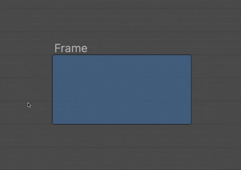
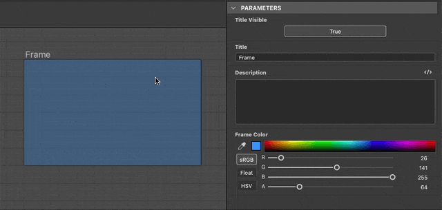
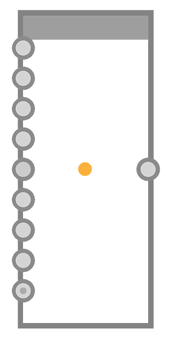

# Marco

<table>
<tr style="border: 0;">
<td width="25.00%" style="border: 0;" valign="top">


</td>
<td width="100.00%" style="border: 0;" valign="top">

Un fotograma facilita la legibilidad y el diseño de los gráficos, ya que agrupa visualmente los objetos de ese gráfico y le permite mover fácilmente todos esos objetos juntos.

Por ejemplo, los fotogramas se pueden nombrar y colorear para que la estructura del gráfico se muestre claramente al realizar una descripción general, lo que resulta de gran ayuda a medida que aumenta la complejidad de un gráfico.

También se pueden anotar y así funcionar como una herramienta de documentación para explicar por qué algunos nodos se configuraron de una manera específica.

</td>
</tr>
</table>

## Apariencia

En función de la posición del cursor del ratón o de si forma parte de una selección, un fotograma se presenta en diferentes estilos visuales para que sepa si puede interactuar con él y cómo.

+++Predeterminado
De forma predeterminada, el marco es un rectángulo con esquinas redondeadas rellenas con el color seleccionado en su propiedad <b>Color del marco</b>. Se aplica un tono más oscuro de ese color al contorno del marco.

El título establecido en la propiedad <b>Title</b> está en gris en la esquina superior izquierda del marco.

")


+++

+++Desplazamiento del encabezado
Al pasar el cursor por la parte superior del marco, se muestra una barra de encabezado.

El marco se puede mover arrastrando la barra de encabezado o el título.

")


+++

+++Seleccionado
Cuando se selecciona, el título y el contorno del marco se resaltan en blanco. El contorno se vuelve más grueso.

")


+++

## Creación de fotogramas

Los marcos se pueden añadir en cualquier tipo de gráfico, de cualquiera de las siguientes maneras:

+++Menú Nodo
Presione <b>Barra espaciadora</b> en la vista Gráfica para abrir el <b>menú Nodo</b> y seleccione el elemento &quot;Marco&quot; en la lista.

Escriba &#39;marco&#39; en el campo de búsqueda para ver el elemento y encontrarlo más rápidamente.

+++

+++Método abreviado
Si hay un método abreviado de teclado asignado al elemento &quot;Frame&quot; en [Preferencias](../../../../interface/preferences-window/preferences-window.md), presione ese método abreviado cuando la vista de gráficos esté seleccionada.

+++

+++Menú contextual
En la vista de gráficos, presione <b>RMB</b> en cualquier objeto o en espacio vacío y seleccione la opción <b>Agregar marco</b>.

+++

+++Barra de herramientas de gráficos
En la barra de herramientas Vista de gráficos, haz clic en el botón &quot;Marco&quot; en la <b>Paleta de nodos</b>.

+++

+++Biblioteca
En la biblioteca, seleccione la categoría <b>Elementos de gráfico</b> y, a continuación, arrastre y suelte el elemento &quot;Marco&quot; en la vista de gráfico.

+++

### Selecciones de encuadre

Si una selección está activa en un gráfico cuando se crea un marco, ese marco se ajustará automáticamente para incluir completamente los objetos seleccionados.

Teniendo esto en cuenta, la creación de fotogramas mediante un método abreviado de teclado hace que sea aún más rápido crear fotogramas en un gráfico.

{width="480px"}

>[!TIP]
>
> Cuando se crea un marco, su propiedad &quot;Title&quot; (Título) gana enfoque automáticamente para que pueda editar inmediatamente el título del marco.

## Manipulación de fotogramas

<table>
<tr style="border: 0;">
<td style="border: 0;" valign="top">

Los marcos se pueden <b>desplazar</b> arrastrando su título o barra de encabezado, y <b>cambiar de tamaño</b> arrastrando cualquiera de sus bordes o esquinas.

La ilustración resalta las zonas de interacción para la panorámica (azul) y el cambio de tamaño (amarillo).

</td>
<td style="border: 0;" valign="top">


</td>
</tr>
</table>

<table>
<tr style="border: 0;">
<td style="border: 0;" valign="top">

### Ajuste de cuadrícula

De forma predeterminada, un marco se ajusta a la cuadrícula media cuando se mueve o se cambia de tamaño.

Mantenga presionada la tecla <b>Ctrl</b> (Windows) / <b>Cmd</b> (macOS) para cambiar este ajuste a la cuadrícula pequeña y realizar ajustes más precisos.

</td>
<td style="border: 0;" valign="top">



</td>
</tr>
</table>

## Propiedades

Cuando se selecciona un marco, las siguientes propiedades están disponibles en el conjunto acoplado [Properties](../../../../interface/properties/properties.md):

+++Título
El <b>Título</b> que se encuentra en la parte superior izquierda del marco. Su visibilidad del título se puede activar o desactivar mediante la propiedad <b>Title Visible</b>.

El tamaño del título se puede bloquear con un tamaño de pantalla mínimo para que sea legible al alejarse del gráfico. Para ello, marca la opción &quot;Títulos de marco&quot; en el menú desplegable <b>Información</b> de la barra de herramientas [Vista de gráfico](../../../../interface/the-graph-view/the-graph-view.md).

{width="640px"}


+++

+++Descripción
<b>Description</b> es un fragmento de texto adicional opcional que se puede usar para anotar el contenido del marco.

Se puede dar formato al texto mediante etiquetas de HTML. Para alternar este formato, haz clic en el botón  <b>marcado de HTML</b>.

Obtenga más información en la sección Descripción que aparece a continuación.

{width="640px"}


+++

+++Color
El <b>color del marco</b> se usa para rellenar el marco en la vista de gráfico. Utilice el selector de color para seleccionar cualquier color.

El canal alfa del color controla la *opacidad* del fotograma, donde un valor de 0 significa que el fotograma es totalmente transparente.

{width="640px"}


+++

## Descripción

Un marco se puede anotar con un texto que se colocará dentro del marco. El texto se alinea a la izquierda y comienza en la esquina superior izquierda del marco. Utilice la propiedad [Description](#properties) del marco para editar ese texto.

<table>
<tr style="border: 0;">
<td style="border: 0;" valign="top">

### Estándar

El <b>Título</b> se muestra en negrita en la parte superior izquierda del marco. La visibilidad del título se puede activar o desactivar.

Su tamaño se puede bloquear con un tamaño de pantalla mínimo para que sea legible al alejar el zoom del gráfico. Para ello, marca la opción &quot;Títulos de marco&quot; en el menú desplegable <b>Información</b> de la barra de herramientas [Vista de gráfico](../../../../interface/the-graph-view/the-graph-view.md).

</td>
<td style="border: 0;" valign="top">

"){zoomable="yes"}

</td>
</tr>
</table>

<table>
<tr style="border: 0;">
<td style="border: 0;" valign="top">

### formato de HTML

Se puede dar formato al texto mediante etiquetas de HTML en la propiedad <b>Description</b> del marco. El formato debe habilitarse mediante el botón  <b>marcado de HTML</b> en esa misma propiedad.

</td>
<td style="border: 0;" valign="top">

"){zoomable="yes"}

</td>
</tr>
</table>

Puede copiar y pegar esta muestra en la propiedad Description del marco para probar esta función por sí mismo:

```
<h2>HTML formatting</h2>

<p>This is a description formatted using <b>HTML markup</b>.</p>

<p>Formattig text makes it more <i>pleasant</i>, <font color="#CC8822">impactful</font> and <code>clearly structured</code> for users.</p>

<p>  Images are also supported! <sup>How nice!</sup></p>
```


A continuación se muestra una lista de etiquetas útiles para dar formato al texto:

+++Etiquetas de formato de HTML

|  |  |
| --- | --- |
| Negrita | &lt;b>...&lt;/b> |
| Cursiva | &lt;i>...&lt;/i> |
| Color | &lt;font color=&quot;#4A567C&quot;>...&lt;/font> |
| Párrafo | &lt;p>...&lt;/p> |
| Salto de línea | &lt;br> |
| Títulos | &lt;h1>...&lt;/h1>, &lt;h2>...&lt;/h2>, etc. |
| Imagen | &lt;img src=&quot;{path\_to\_image}&quot;> |
| Superíndice | &lt;sub>...&lt;/sub> |
| Lista sin ordenar (viñetas) | &lt;ul> &lt;li>...&lt;/li> &lt;li>...&lt;/li> &lt;/ul> |
| Lista ordenada (números) | &lt;ol> &lt;li>...&lt;/li> &lt;li>...&lt;/li> &lt;/ol> |
| Código | &lt;code>...&lt;/code> |


+++

## Reglas de inclusión

Un objeto se considera incluido en un marco si cumple su regla de inclusión. Estas reglas varían según el objeto y el caso especial. Se enumeran a continuación.

El símbolo amarillo de cada ilustración representa el punto o área que debe estar completamente dentro de los límites de un marco para que un objeto se incluya en ese marco.

+++Nodos
Se usa el <b>punto central</b>.

Las insignias, los conectores y la información que se muestra debajo del nodo se omiten.

Los nodos pueden tener diferentes heightes, dependiendo de su número de conectores de entrada o salida.

A medida que los conectores se muestran, se ocultan, se agregan o se quitan, el height del nodo se ajusta desde su *centro*.

Por lo tanto, la ubicación del punto central de un nodo no debe cambiar hasta que se *mueva* deliberadamente.




Se usa el <b>punto de entrada</b><b></b> del nodo *host*.

El nodo host es el nodo en el que está acoplado un nodo.

Si hay varios nodos acoplados en una cadena, el nodo host del último nodo acoplado se utiliza para toda la cadena.

Las insignias, los conectores y la información que se muestra debajo del nodo se omiten.


+++

+++Nodos de puntos
Se usa el <b>punto central</b> del punto.

Se omiten los conectores, los iconos del portal y los nombres.


+++

+++Comentarios
Se usa el <b>punto central</b> del *cuadro delimitador* (contorno amarillo) del comentario.

Los comentarios de los padres no siguen las reglas de inclusión de los comentarios.

En su lugar, se usa el <b>punto central</b> del nodo *parent*.

Las insignias, los conectores y la información que se muestra debajo del nodo se omiten.


+++

+++Pins
Se usa la <b>sugerencia</b> del icono del pin.


+++

+++Marcos
Se usa el <b>cuadro delimitador</b> del marco anidado.

Esto significa que un marco anidado debe estar completamente dentro de los límites de otro marco para que se incluya en este último.

Se omite el título.


+++

## Ajustar tamaño al contenido


Al realizar ajustes en el gráfico, es posible que un marco ya no se ajuste correctamente a su contenido. En este caso, es posible ajustar automáticamente la posición y el tamaño del marco para que se ajuste a la extensión de su contenido, con un relleno de una celda de cuadrícula media.

Para ello, haz clic en <b>RMB</b> en el título o la barra de encabezado del marco (consulta [Aspecto](#appearance)) y selecciona la opción <b>Ajustar tamaño al contenido</b> en el menú contextual.

>[!NOTE]
>
> La opción está disponible si al menos *un objeto de gráfico* cumple las [reglas de inclusión](../../../../interface/the-graph-view/graph-items/frame/frame.md) del marco.

<table>
<tr style="border: 0;">
<td style="border: 0;" valign="top">

### Ajuste del texto de descripción

Si el marco tiene una descripción, se ajusta para utilizar cualquier espacio vacío junto a la descripción, si es posible.

Si ningún objeto incluido puede caber en ese espacio, el height del marco se ajusta aún más para acomodar la descripción.

</td>
<td style="border: 0;" valign="top">

")

</td>
</tr>
</table>

+++Ejemplo
"){width="640px"}


+++

## Expandir automáticamente


A medida que crece el gráfico, puede ser necesario reorganizar el contenido de los marcos. Es posible que los nodos cambien para dejar espacio para las adiciones o que el contenido deba espaciarse más para facilitar la lectura.

Para facilitar estos ajustes, es posible expandir automáticamente un marco al mover [objetos incluidos](#inclusion-rules): mantén <b>Shift</b> pulsado en cualquier momento mientras mueves un objeto para que los bordes del marco se ajusten automáticamente y mantener ese objeto dentro de sus límites.

Esto también se aplica a las selecciones que pueden incluir varios objetos. En ese caso, el fotograma host de cada objeto se ajustará simultáneamente.

Si un objeto no está completamente delimitado por los límites del marco pero sigue cumpliendo su [regla de inclusión](#inclusion-rules), el marco se ajusta para incluirlo completamente con un relleno adicional de una celda de cuadrícula media tan pronto como se presione la tecla <b>Mayús</b>.

>[!NOTE]
>
> Si bien la tecla <b>Mayús</b> se puede presionar o soltar en cualquier momento durante el movimiento para activar o cancelar el ajuste automático del fotograma, *debe* mantenerse presionada al completar el movimiento para aplicar el ajuste de manera efectiva.

+++Ejemplo
"){width="640px"}


+++
