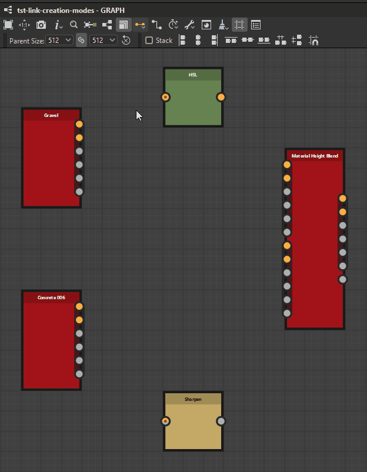

# Modos de creación de vínculos

En [gráficos de Substance](../../../compositing-graphs/substance-compositing-graphs.md), puede conectar nodos mediante uno de los 3 <b>modos de creación de vínculos</b>:

<table>
<tr style="border: 0;">
<td style="border: 0;" valign="top">

{zoomable="yes"}

*Haga clic para ampliar*

<b> estándar</b> (1)

No se aplican condiciones.

</td>
<td style="border: 0;" valign="top">

{zoomable="yes"}

*Haga clic para ampliar*

 <b>Material</b> (2)

Las entradas y salidas se emparejan en función de sus usos.

Si sólo uno de los dos tiene un uso, la conexión se realiza como en el modo Estándar.

</td>
<td style="border: 0;" valign="top">

{zoomable="yes"}

*Haga clic para ampliar*

 <b>Material compacto</b> (3)

Igual que Material.

Las entradas y salidas que pertenecen al mismo *grupo* están contraídas.

</td>
</tr>
</table>

Puedes cambiar de modo en cualquier momento en la barra de herramientas gráfica haciendo clic en el botón  <b>Modo de creación de vínculos</b> o con los métodos abreviados de teclado indicados anteriormente.

En los modos <b>Material</b> y <b>Material compacto</b>, las conexiones entre entradas y salidas con *usos no coincidentes* están prohibidas.

## Los modos

|  | 

 Estándar | 

 Compacto | 

 Material compacto |
| --- | --- | --- | --- |
| <b>Entradas</b> | Todas las entradas son visibles | Todas las entradas son visibles | Solo 1 entrada por grupo |
| <b>Salidas</b> | Todas las salidas son visibles | Todas las salidas son visibles | Solo 1 salida por grupo |
| <b>Vínculos</b> | Todos los vínculos son visibles | Todos los vínculos son visibles | Solo 1 enlace por grupo (verde) |
| <b>Conexiones</b> | Se conectan vínculos uno por uno | Puede conectar vínculos como un grupo de materiales de varios vínculos basado en usos coincidentes.   Cuando un uso está presente en un extremo, la conexión es estándar. | Los vínculos se conectan como un grupo de materiales de un solo vínculo. |

## Asignación de grupos

<table>
<tr style="border: 0;">
<td width="100.00%" style="border: 0;" valign="top">

Debe asignar grupos a los nodos <b>Input</b> y <b>Output</b> del gráfico para usar los modos <b>Material</b> y <b>Compact material</b>.

Para asignar un grupo en los parámetros <b>Attributes</b> del nodo, rellene el nombre del grupo en la propiedad <b>Group</b>. Un grupo puede ser cualquier valor de cadena y los vínculos se agruparán si comparten el nombre de grupo *exacto igual*, con distinción entre mayúsculas y minúsculas.

Las entradas y salidas agrupadas de un gráfico se indican visualmente al estar *encerrado en una cápsula oscura* en instancias de nodo que hacen referencia a ese gráfico.

</td>
<td width="25.00%" style="border: 0;" valign="top">

{zoomable="yes"}

</td>
</tr>
</table>

<table>
<tr style="border: 0;">
<td width="25.00%" style="border: 0;" valign="top">

</td>
<td width="100.00%" style="border: 0;" valign="top">

{zoomable="yes"}

*Haga clic para ampliar*

</td>
<td width="25.00%" style="border: 0;" valign="top">

</td>
</tr>
</table>

## Vincular coincidencia con uso

Una vez agrupados los vínculos, las entradas individuales deben coincidir con las salidas. Esto se hace mediante el atributo <b>Usage</b> de los nodos <b>Input</b> y <b>Output</b>. Si el uso entre la entrada y la salida *coincide con*, se creará un vínculo. Si no se encuentra ningún uso coincidente, no se crea ningún vínculo.

<table>
<tr style="border: 0;">
<td width="25.00%" style="border: 0;" valign="top">

</td>
<td width="100.00%" style="border: 0;" valign="top">

{zoomable="yes"}

*Haga clic para ampliar*

</td>
<td width="25.00%" style="border: 0;" valign="top">

</td>
</tr>
</table>
