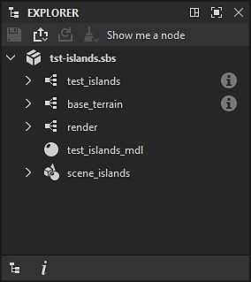
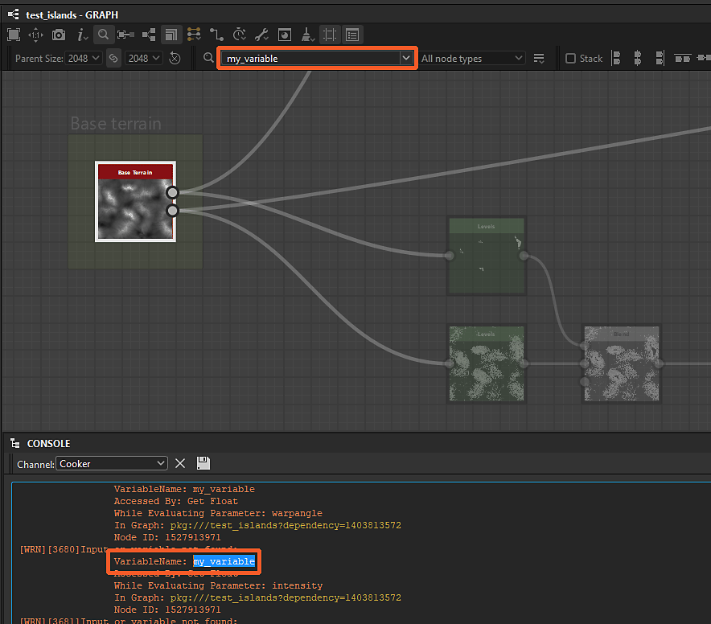
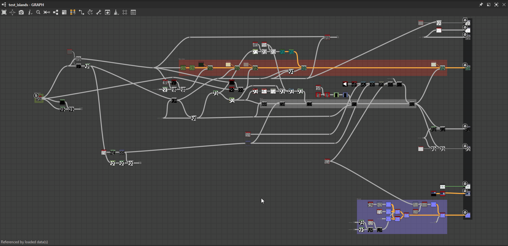
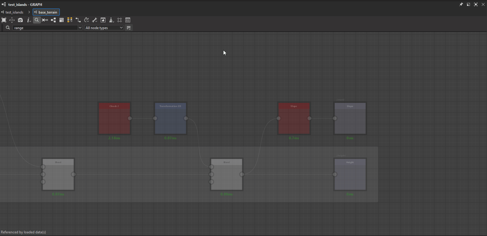
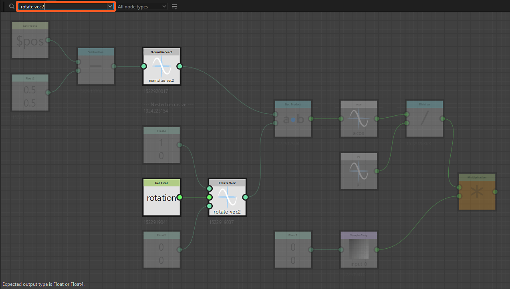

# Buscador de nodos

{zoomable="yes"}

La herramienta Buscador de nodos le permite realizar una <b>búsqueda de nodos y variables</b> mediante una consulta de texto. Todos los nodos que no coinciden con la consulta aparecen atenuados para que los resultados sobresalgan.

La consulta puede coincidir con cualquiera de estos criterios:

* Un <b>identificador de un gráfico</b> al que hace referencia un nodo de instancia
* Un <b>identificador de un parámetro o variable expuesto</b> usado en una función de parámetro de nodo
* <b>UID</b> de un nodo (identificador único)
* <b>etiqueta</b> de un nodo

La búsqueda puede atravesar [instancias de gráficos](../../../compositing-graphs/creating-compositing-gra/graph-instances-sub-gra/graph-instances-sub-graphs.md) de forma recursiva para que se puedan encontrar nodos y variables en [subgráficos](../../../compositing-graphs/creating-compositing-gra/graph-instances-sub-gra/graph-instances-sub-graphs.md). Si no está seguro del término exacto que necesita buscar, existe una opción de búsqueda difusa para aplicar una tolerancia a la consulta.

## Interfaz

Se puede acceder al Buscador de nodos de dos maneras:

En la vista de gráficos, presione <b>Ctrl+F</b> (Windows) / <b>Cmd+F</b> (macOS) para mostrar la barra de herramientas Buscador de nodos y establecer automáticamente el foco en el campo de consulta. Esto le permite realizar una búsqueda rápidamente.

En la barra de herramientas Vista de gráficos, haga clic en el botón <b>Buscador de nodos </b> para mostrar la barra de herramientas Buscador de nodos. Una vez mostrada, la barra de herramientas sólo se cierra al hacer clic en este botón.

<b>Busca gráficos de recorrido</b>. En otras palabras, una búsqueda permanece activa al abrir gráficos a través de estas acciones:

* Nodo de instancia: Abrir referencia en contexto (Ctrl+E/Cmd+E) (*Nota:* La edición de gráficos en contexto debe estar habilitada en Edición > Preferencias > Gráfico)
* Procesador de píxeles: Función Editar (Ctrl+E/Cmd+E)
* Procesador de valor: Función Editar (Ctrl+E/Cmd+E)
* FX-Map: Editar gráfico de mapa de efectos (Ctrl+E/Cmd+E)
* Parámetros de nodo: Editar función

{zoomable="yes"}

### Consulta de búsqueda

{zoomable="yes"}

Los términos de búsqueda se pueden escribir en este campo y el botón de flecha abre una lista de sugerencias de consulta que incluyen algunas de las variables disponibles en el contexto actual.

Obtén más información sobre las consultas que puedes realizar en la sección [Consulta de búsqueda](#search-query) a continuación.

### Tipo de nodo

{zoomable="yes"}

Este cuadro combinado permite filtrar los resultados de búsqueda para conservar sólo un tipo específico de nodos.

Tenga en cuenta que todos los nodos de instancia son del *mismo tipo* de nodo, de hecho, el tipo &#39;instancia&#39;, mientras que los nodos atómicos son de su propio tipo.

+++Listas de tipos de nodo
La lista es contextual al tipo de gráfico actual.

"){zoomable="yes"}

*Tipos de nodos para gráficos de composición*

"){zoomable="yes"}

*Tipos de nodos para gráficos de funciones*

+++

+++Búsqueda de nodos atómicos
"){zoomable="yes"}

*Buscando el tipo de nodo &#39;Niveles&#39; en un gráfico de Substance*

+++

+++Búsqueda de nodos de instancia
"){zoomable="yes"}

*Buscando el tipo de nodo &#39;Instance&#39; en un gráfico de Substance*

"){zoomable="yes"}

*Buscando el tipo de nodo &#39;Instance&#39; en un gráfico de funciones de Substance*

+++

### Opciones de búsqueda

<table>
<tr style="border: 0;">
<td width="100.00%" style="border: 0;" valign="top">

El botón <b>Opciones de búsqueda </b> abre una lista de configuraciones usadas para la búsqueda que se pueden activar y desactivar.

Obtenga más información sobre estas opciones en la sección Opciones de búsqueda que aparece a continuación.

</td>
<td width="33.33%" style="border: 0;" valign="top">

{zoomable="yes"}

</td>
</tr>
</table>

## Consulta de búsqueda

Para buscar nodos, una consulta de texto se compara con las propiedades de nodo enumeradas a continuación.

>[!NOTE]
>
> La consulta debe escribirse teniendo en cuenta las siguientes advertencias:
> 
> * La búsqueda no distingue entre mayúsculas y minúsculas. Por ejemplo, &#39;mi etiqueta de nodo&#39; y &#39;Mi etiqueta de nodo&#39; devuelven los mismos resultados.
> * Se omiten los espacios en blanco antes y después de la consulta.
> * No se pueden realizar varias consultas al mismo tiempo en el mismo gráfico. Por ejemplo, &quot;desenfoque de niveles&quot; no coincidirá con los nodos &quot;Niveles&quot; y &quot;Desenfocar&quot;. Del mismo modo, no se admiten los operadores lógicos.

<table>
<tr style="border: 0;">
<td width="100.00%" style="border: 0;" valign="top">

### Identificadores de gráfica de instancia

Se pueden encontrar [nodos de instancia](../../../compositing-graphs/creating-compositing-gra/graph-instances-sub-gra/graph-instances-sub-graphs.md) mediante el <b>identificador</b> de los gráficos a los que hacen referencia.

</td>
<td width="33.33%" style="border: 0;" valign="top">

{zoomable="yes"}

*Haga clic en la imagen para ampliarla*

</td>
</tr>
</table>

+++Identificador en el Explorador
Los gráficos se muestran por sus identificadores en el Explorador.

{zoomable="yes"}

+++

+++Identificador en la información sobre herramientas del nodo de instancia
La información sobre herramientas de los nodos de instancia incluye el identificador de su gráfico de referencia.

{zoomable="yes"}

+++

<table>
<tr style="border: 0;">
<td width="100.00%" style="border: 0;" valign="top">

### Parámetros expuestos y variables

El identificador de [parámetros expuestos](../../../compositing-graphs/manage-parameters/exposing-a-parameter/exposing-a-parameter.md), o cualquier otra variable, se puede buscar directamente.

</td>
<td width="33.33%" style="border: 0;" valign="top">

{zoomable="yes"}

*Haga clic en la imagen para ampliarla*

</td>
</tr>
</table>

+++Sugerencias de consulta
El campo de consulta se puede expandir para mostrar una lista de sugerencias.

Entre ellos se incluyen [variables integradas](../../../function-graphs/variables/system-variables/system-variables.md) disponibles para el tipo de gráfico actual, así como los identificadores de los parámetros expuestos del gráfico.

{zoomable="yes"}

El identificador de los parámetros expuestos también se puede copiar o editar directamente en las [propiedades gráficas del Substance](../../../compositing-graphs/graph-parameters/graph-parameters.md).

{zoomable="yes"}

*Haga clic en la imagen para ampliarla*

+++

+++Búsqueda de una variable en una advertencia/error de la consola
Cuando un gráfico contiene errores o advertencias provocados por una <b>variable</b> utilizada por un nodo, ve a <b>Windows > Console</b> para mostrar el mensaje completo de error/advertencia que incluirá la variable. A continuación, puede copiar y pegar esta variable en el campo de consulta del Buscador de nodos para localizar rápidamente el nodo que causa el problema.

Las variables también se pueden copiar directamente desde los datos XML del archivo SBS mediante cualquier editor de texto.

{zoomable="yes"}

+++

+++Obtener/Definir nodos
Al buscar una variable en un gráfico, incluidos los parámetros expuestos, la búsqueda resaltará todos los nodos en los que un nodo [Get](../../../function-graphs/nodes-reference-for-fun/atomic-function-nodes/get-nodes/get-nodes.md) o [Set](../../../function-graphs/fxmaps/using-functions-in-fxmaps/using-the-set-sequence/using-the-set-sequence-nodes.md) utilice esa variable en cualquiera de las funciones de parámetros del nodo.

{zoomable="yes"}

+++

<table>
<tr style="border: 0;">
<td width="100.00%" style="border: 0;" valign="top">

### UID de nodo

Cada nodo de un gráfico tiene un número de identificador único (UID) que se puede utilizar para buscar ese nodo.

</td>
<td width="33.33%" style="border: 0;" valign="top">

{zoomable="yes"}

*Haga clic en la imagen para ampliarla*

</td>
</tr>
</table>

+++Copiar el UID de un nodo
El UID de un nodo se puede copiar en el portapapeles desde su menú contextual.

La acción copia el UID en este formato:

uid=1234567890

{zoomable="yes"}

+++

+++Búsqueda de un UID de nodo desde una advertencia/error de consola
Cuando un gráfico tenga errores o advertencias provocados por un nodo, vaya a Windows > Consola para mostrar el mensaje completo de error/advertencia, que incluirá el <b>UID</b> del nodo. A continuación, puede copiar y pegar este UID en el campo de consulta del Buscador de nodos para localizar rápidamente el nodo que causa el problema.

Los UID de nodo también se pueden copiar directamente de los datos XML del archivo SBS mediante cualquier editor de texto.

{zoomable="yes"}

+++

### Etiqueta de nodo

Los nodos también se pueden encontrar usando sus etiquetas.

La búsqueda de nodos específicos es particularmente eficaz cuando se utiliza su etiqueta exacta con la búsqueda difusa desactivada.

## Opciones de búsqueda

<table>
<tr style="border: 0;">
<td width="100.00%" style="border: 0;" valign="top">

El botón <b>Opciones de búsqueda </b> le permite alternar los modos <b>recursivo</b> y <b>difuso</b> para buscar nodos.

Ambos se pueden activar al mismo tiempo.

</td>
<td width="33.33%" style="border: 0;" valign="top">

{zoomable="yes"}

</td>
</tr>
</table>

### Modo recursivo

Habilite esta opción para que las búsquedas atraviesen [instancias de gráficos](../../../compositing-graphs/creating-compositing-gra/graph-instances-sub-gra/graph-instances-sub-graphs.md) para incluir resultados de [subgráficos](../../../compositing-graphs/creating-compositing-gra/graph-instances-sub-gra/graph-instances-sub-graphs.md).

Esta opción puede ser esencial para solucionar problemas de gráficos, si necesita encontrar un nodo por su UID adquirido a partir de un mensaje de advertencia o error en la consola.

{zoomable="yes"}

*La consulta de la derecha resalta el nodo de instancia siguiente, porque su gráfico al que se hace referencia en la izquierda tiene coincidencias para esa consulta*

+++Ejemplo 1
{zoomable="yes"}

Un nodo de instancia hace referencia a un gráfico en el que varios nodos coinciden con la consulta.

+++

+++Ejemplo 2
{zoomable="yes"}

Al habilitar la opción &quot;Búsqueda recursiva&quot;, se resalta el nodo de instancia que hace referencia a un gráfico en el que un nodo de procesador de píxeles utiliza una variable que coincide con la consulta.

+++

### Modo difuso

Si no está seguro de la ortografía exacta de una consulta, esta opción habilita una <b>tolerancia</b> en los resultados.

Tenga en cuenta que el uso de esta opción probablemente producirá coincidencias no deseadas.

{zoomable="yes"}
