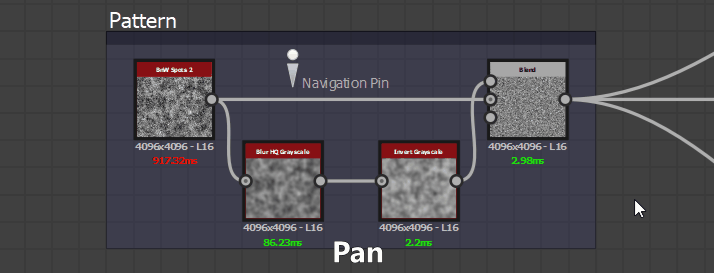
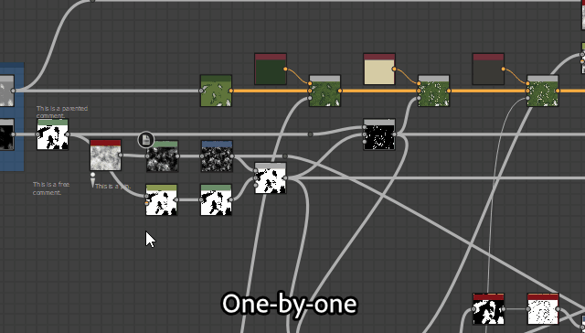
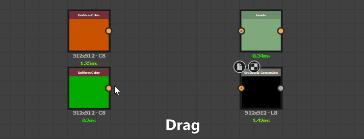
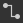
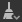

# Vista de gráfico

Esta página presenta el conjunto acoplado de vista de gráfico de Substance 3D Designer.

La vista gráfica es la ventana principal de [Substance 3D Designer](https://www.adobe.com/es/products/substance3d-designer.html), donde puedes crear y editar tus gráficas. La vista del gráfico tiene dos áreas principales: una barra de herramientas en la parte superior, que proporciona acceso rápido a determinadas funciones, y el área gráfica real donde se colocan los nodos.

La vista gráfica se usa para todos los tipos de gráfica, pero difiere ligeramente entre [gráficas de Substance](../../compositing-graphs/substance-compositing-graphs.md), [gráficas de funciones](../../function-graphs/function-graphs.md) y [gráficas FX-Map](../../function-graphs/fxmaps/fxmaps.md), principalmente en el área de la barra de herramientas.

## Navegación de ventanilla

El gráfico se puede navegar mediante las siguientes acciones:

* <b>Panorámica:</b> MB / Ctrl+RMB
* <b>Zoom:</b> MouseWheel / Alt + RMB

Uso de una almohadilla táctil (solo macOS)

* Panorámica <b>: </b>Barrido con dos dedos
* <b>Zoom:</b> Pellizcar con dos dedos / Deslizar con dos dedos mientras se mantiene presionada la tecla Cmd

>[!NOTE]
>
> Dirección del zoom
> 
> Cada uno de los métodos de zoom se invierte con el otro:
> 
> * La rueda del ratón *acerca la vista del gráfico*
> * Alt+RMB y arrastrar *empuja* la vista del gráfico
> 
> La dirección del zoom se puede invertir en [Preferencias](../../interface/preferences-window/preferences-window.md).

Se <b>enfoca</b> en los nodos seleccionados, o en todo el gráfico si no hay nada seleccionado, con la tecla F.

La navegación también se puede realizar mediante <b>pin de navegación </b> y la clave F2. Consulte [elementos de gráfico](#graph-items) a continuación[.](../../interface/the-graph-view/graph-items/graph-items.md)

## Movimiento de objetos

Haz clic en LMB en un objeto (es decir, un nodo o elemento de gráfico) y mantén pulsado y arrastra el cursor para <b>mover un nodo</b> alrededor del gráfico. Si hay más de un objeto seleccionado, todos los objetos seleccionados se mueven junto con el que se encuentra bajo el cursor.

Si el cursor <b> alcanza un borde </b> de la vista de gráfico al mover objetos, la vista se ve en la dirección del cursor. Tenga en cuenta que la panorámica es más rápida a medida que el cursor se aleja más del borde.\
Esto también se aplica al dibujo de cuadros de selección a través de los bordes de la vista de gráfico.

De forma predeterminada, los objetos se <b>ajustan a la cuadrícula</b> a medida que se mueven. Mantenga presionada la tecla Ctrl (Windows) / ⌘ (macOS) mientras mueve objetos para deshabilitar ese ajuste.

## Elementos de gráfico

Hay varios objetos auxiliares disponibles para ayudar a organizar y navegar por el gráfico, especialmente cuando se convierte en una compleja red de nodos que puede ser difícil de leer:

Los <b>nodos Dot</b> te permiten redireccionar y combinar conexiones, y se pueden usar como <b>portales</b> para ocultar conexiones largas o difíciles de manejar;

<b>Marcos</b> le ayuda a agrupar nodos con un título visible y un código de colores;

<b>Comentarios</b> le permite realizar un seguimiento del propósito de un nodo o grupo de nodos y realizar otras anotaciones útiles;

<b>Los pines de navegación</b> permiten saltar rápidamente a los puntos de interés del gráfico.

>[!NOTE]
>
> Obtenga más información en la sección [Elementos de gráficos](../../interface/the-graph-view/graph-items/graph-items.md) de esta documentación.

## Menú contextual del gráfico

Al hacer clic en RMB en el espacio vacío del gráfico, aparece un menú contextual que puede incluir las siguientes opciones:

<b>Agregar nodo:</b> Abra el menú Nodo para agregar un nodo en el gráfico;

<b>Agregar comentario:</b> Agregar un objeto de gráfico [Comment](../../interface/the-graph-view/graph-items/graph-items.md) sin elemento primario;

<b>Agregar marco:</b> Agregar un objeto de gráfico [Frame](../../interface/the-graph-view/graph-items/graph-items.md);

<b>Agregar pin:</b> Agregar un objeto gráfico [Pin](../../interface/the-graph-view/graph-items/graph-items.md);

<b>Agregar nodo Punto:</b> Agregar un nodo [Punto](../../interface/the-graph-view/graph-items/graph-items.md);

<b>Ver salidas en vista 3D:</b> Asigne todas las salidas del gráfico a un material en la [vista 3D](../../interface/3d-view/3d-view.md) haciendo coincidir los usos, consulte [Interactuar con la vista 3D](#interacting-with-the-3d-view) a continuación;

<b>Restablecer y ver resultados en vista 3D:</b> Restablezca un material en la [vista 3D](../../interface/3d-view/3d-view.md) y asigne todas las salidas del gráfico a ese material haciendo coincidir los usos. Consulte [Interacción con la vista 3D](#interacting-with-the-3d-view) más abajo;

<b>Ver salida en vista 2D:</b> Mostrar una de las salidas del gráfico en la [vista 2D](../../interface/2d-view/2d-view.md); consulte [Interacción con la vista 2D](#interacting-with-the-2d-view) a continuación;

<b>Calcular miniaturas de nodos:</b> Active el cálculo del resultado de todos los nodos del gráfico, que se almacenarán en la [caché de imágenes](../../interface/preferences-window/preferences-window.md), y use su primer resultado como miniatura;

<b>Borrar miniaturas de nodos:</b> Borre la [caché de imágenes](../../interface/preferences-window/preferences-window.md) que contiene el resultado de todos los nodos del gráfico, lo que a su vez borra las miniaturas del nodo;

<b>Guardar paquete:</b> Guarde el paquete que contiene este gráfico;

<b>Pegar:</b> Pega los nodos copiados actualmente en el portapapeles, incluidas sus conexiones ascendentes, en la ubicación del cursor. Si el cursor no está en la ventana gráfica, los nodos se sitúan en el centro de la ventana gráfica.

<b>Pegar sin vínculo:</b> Pega los nodos copiados actualmente en el portapapeles, excluyendo sus conexiones ascendentes, en la ubicación del cursor. Si el cursor no está en la ventana gráfica, los nodos se sitúan en el centro de la ventana gráfica.

<b>Seleccionar todo:</b> Seleccionar todos los nodos del gráfico;

<b>Fijar anterior:</b> Desplácese hasta el objeto [Fijar](../../interface/the-graph-view/graph-items/graph-items.md) anterior en el gráfico;

<b>Pin siguiente:</b> Vaya al siguiente objeto [Pin](../../interface/the-graph-view/graph-items/graph-items.md) del gráfico;

<b>Copiar selección:</b> Copie los nodos, conexiones y valores de parámetros seleccionados al portapapeles;

<b>Eliminar selección:</b> Eliminar los nodos seleccionados;

<b>Eliminar y volver a vincular:</b> Elimine los nodos seleccionados y reemplácelos por conexiones directas desde sus nodos ascendentes a sus nodos descendentes, si es posible;

<b>Duplicar selección:</b> Duplica los nodos seleccionados en el mismo gráfico, incluidas sus conexiones ascendentes, en la ubicación del cursor. Si el cursor no está en la ventana gráfica, los nodos se sitúan en el centro de la ventana gráfica.

<b>Duplicar selección sin vínculo:</b> Duplica los nodos seleccionados en el mismo gráfico, excluyendo sus conexiones ascendentes, en la ubicación del cursor. Si el cursor no está en la ventana gráfica, los nodos se sitúan en el centro de la ventana gráfica.

<b>Seleccionar nodos ascendentes:</b> Seleccionar todos los nodos ascendentes del nodo o nodos seleccionados;

<b>Seleccionar nodos descendentes:</b> Seleccionar todos los nodos descendentes de los nodos seleccionados;

<b>Intercambiar vínculos\*:</b> Intercambie las conexiones entre el par seleccionado de conectores de entrada y salida;

<b>Deshabilitar nodo/selección:</b> Deshabilite los nodos seleccionados para que no afecten al resultado de la secuencia. Consulte <b>Deshabilitar nodos</b> más abajo.

<b>\*:</b> Solo está disponible cuando la selección incluye dos vínculos o tres nodos en los que dos de los nodos están conectados a entradas del mismo tercer nodo.

## Uso de nodos

Los gráficos son principalmente recipientes para nodos que pueden ingestar, generar y modificar datos y, a continuación, generarlos como resultado del gráfico. El uso de nodos implica los siguientes conceptos y acciones.

### CREACIÓN Y ADMINISTRACIÓN DE NODOS

Los nodos se pueden colocar en gráficos de 5 maneras, independientemente del tipo de gráfico:

* Hacer clic o arrastrar desde un icono de la barra de herramientas del nodo (consulte a continuación). Solo se pueden colocar [nodos atómicos](../../compositing-graphs/nodes-reference-for-com/atomic-nodes/atomic-nodes.md) de esta manera.
* Haga clic con el botón derecho en un área vacía del gráfico y seleccione <b>Agregar nodo</b>. Solo se pueden colocar [nodos atómicos](../../compositing-graphs/nodes-reference-for-com/atomic-nodes/atomic-nodes.md) de esta manera.
* Arrastre de una miniatura desde la vista de biblioteca a la vista de gráfico. Este método funciona para [todos los tipos de nodos, incluidas las instancias de nodo](../../compositing-graphs/nodes-reference-for-com/node-library/node-library.md).
* Pulsando <b>Barra espaciadora</b> para acceder al <b>menú Nodo</b>. Consulte a continuación.
* Utilizar el método abreviado de teclado asignado a un nodo. La asignación se realiza en la [ventana de preferencias](../../interface/preferences-window/preferences-window.md).

Si se coloca un nodo cuando se selecciona otro, Designer intentará conectar automáticamente el nuevo nodo al antiguo.\
Esta conexión automática siempre coloca el nuevo nodo *después* del antiguo en el flujo.

La eliminación de nodos se puede realizar de dos maneras, dependiendo de cómo desee que se trate un vínculo perdido:

* Seleccione un nodo y presione Supr, o haga clic con el botón derecho y elija <b>Eliminar selección</b>. Esto interrumpe todas las conexiones existentes, lo que podría provocar una funcionalidad dañada.
* Seleccione un nodo y presione Retroceso, o haga clic con el botón derecho y elija <b>Eliminar y volver a vincular</b>. De este modo, se intenta mantener los vínculos siempre que sea posible, lo que evita que se interrumpa la funcionalidad.

<table>
<tr style="border: 0;">
<td width="100.00%" style="border: 0;" valign="top">

### Menú Nodo

Al pulsar <b>barra espaciadora</b> en la vista de gráficos, se muestra el menú Nodo.

Este menú proporciona acceso a todos los nodos de [Library](../../interface/the-library/the-library.md) mediante una interfaz de búsqueda y permite que sus nodos favoritos aparezcan en la parte superior de la lista.

Puede utilizar las teclas de flecha para revisar los resultados de búsqueda. El muestra *bucles*, de modo que si se usa la tecla de flecha &#39;Arriba&#39; en el primer elemento se vaya al último.

La búsqueda es *difusa*, lo que significa que perdona pequeñas diferencias en el término de búsqueda. Por ejemplo, &quot;Color&quot; frente a &quot;Color&quot;, &quot;Normalizar&quot; frente a &quot;Normalizar&quot;, etc.

Si se selecciona un *nodo único* en el gráfico o se genera el menú Nodo arrastrando un conector de nodo, los resultados de la búsqueda se *filtran* automáticamente en función del tipo de salida.\
Por ejemplo, solo se muestran los nodos con una [Entrada principal](../../compositing-graphs/inheritance-compositing/inheritance-in-substance-compositing-graphs.md) de tipo Escala de grises para una salida de tipo Escala de grises.

</td>
<td width="33.33%" style="border: 0;" valign="top">

</td>
</tr>
</table>

### SELECCIÓN DE NODOS

Puede seleccionar uno o más nodos para copiarlos, eliminarlos, moverlos por el gráfico, etc.

Para seleccionar un *nodo único*, coloque el cursor en el nodo y haga clic en LMB.

Para seleccionar *varios* nodos, hay varios métodos disponibles:

* <b>Uno por uno:</b> Mantenga presionada la tecla Ctrl y haga clic en LMB en los nodos. Los nodos no seleccionados se *agregan* a la selección, mientras que los nodos seleccionados se *quitan* de la selección;
* <b>Cuadro de selección:</b> Haga clic en LMB en el espacio vacío del gráfico, *mantenga presionado y arrastre* el cursor para dibujar un cuadro de selección. Los nodos *incluidos al menos parcialmente* en el cuadro están seleccionados al liberar LMB;
* <b>Upstream:</b> Haga clic en RMB en un nodo y seleccione la opción <b>Seleccionar nodos ascendentes</b>: se seleccionan el nodo y todos los nodos que forman parte de secuencias conectadas a las *entradas* del nodo;
* <b>Dirección descendente:</b> Haga clic en RMB en un nodo y seleccione la opción <b>Seleccionar nodos descendentes</b>: se seleccionan el nodo y todos los nodos que forman parte de secuencias conectadas a las *salidas* del nodo.

### Menú contextual del nodo

Al hacer clic en RMB en un nodo, aparece un menú contextual que puede incluir las siguientes opciones:

<b>Ver salida en vista 2D:</b> Mostrar una de las salidas del nodo en la [vista 2D](../../interface/2d-view/2d-view.md), consulte [Interacción con la vista 2D](#interacting-with-the-2d-view) a continuación;

<b>Ver en vista 3D</b>: Asigne todos los resultados del nodo a un material en la [vista 3D](../../interface/3d-view/3d-view.md) haciendo coincidir los usos. Consulte [Interacción con la vista 3D](#interacting-with-the-3d-view) a continuación;

<b>Restablecer y ver en vista 3D:</b> Restablezca un material en la [vista 3D](../../interface/3d-view/3d-view.md) y asigne todos los resultados del nodo a ese material haciendo coincidir los usos. Consulte [Interacción con la vista 3D](#interacting-with-the-3d-view) más abajo;

<b>Ver salida en vista 3D\*:</b> Asigne una salida de nodo específica a un material en la [vista 3D](../../interface/3d-view/3d-view.md) haciendo coincidir los usos;

<b>Agregar comentario:</b> Cree un objeto de gráfico [Comment](../../interface/the-graph-view/graph-items/graph-items.md) y lo asocie a este nodo;

<b>Agregar marco:</b> Cree un objeto de gráfico [Frame](../../interface/the-graph-view/graph-items/graph-items.md) y ajústelo a los nodos seleccionados;

<b>Copiar información en el portapapeles:</b> Copie el identificador único (UID) del nodo en el portapapeles;

<b>Exponer parámetros:</b> Muestra el cuadro de diálogo [Exponer parámetros de nodo](../../compositing-graphs/manage-parameters/exposing-a-parameter/exposing-a-parameter.md) para este nodo;

<b>Crear\*:</b> Crear nodos de entrada o salida para cada una de las entradas o salidas de este nodo;

<b>Abrir referencia\*:</b> Cargue el gráfico [al que hace referencia este nodo](../../compositing-graphs/creating-compositing-gra/graph-instances-sub-gra/graph-instances-sub-graphs.md) como una ficha de vista de gráfico independiente;

<b>Abrir referencia en contexto\*\*:</b> Cargue el gráfico [al que hace referencia este nodo](../../compositing-graphs/creating-compositing-gra/graph-instances-sub-gra/graph-instances-sub-graphs.md) en el contexto del gráfico actual, como ruta de exploración en la ficha Vista de gráfico existente;

<b>Crear gráfico a partir de la selección:</b> Copie los nodos seleccionados en un nuevo gráfico;

<b>Copiar selección:</b> Copie los nodos, conexiones y valores de parámetros seleccionados al portapapeles;

<b>Eliminar selección:</b> Eliminar los nodos seleccionados;

<b>Eliminar y volver a vincular:</b> Elimine los nodos seleccionados y reemplácelos por conexiones directas desde sus nodos ascendentes a sus nodos descendentes, si es posible;

<b>Duplicar selección:</b> Duplica los nodos seleccionados en el mismo gráfico, incluidas sus conexiones ascendentes;

<b>Duplicar selección sin vínculo:</b> Duplicar los nodos seleccionados en el mismo gráfico excluyendo sus conexiones ascendentes;

<b>Seleccionar nodos ascendentes:</b> Seleccionar todos los nodos ascendentes del nodo o nodos seleccionados;

<b>Seleccionar nodos descendentes:</b> Seleccionar todos los nodos descendentes de los nodos seleccionados;

<b>Intercambiar vínculos\*\*\*:</b> Intercambie las conexiones entre el par seleccionado de conectores de entrada y salida;

<b>Deshabilitar nodo/selección:</b> Deshabilite el nodo o los nodos seleccionados para que no afecten al resultado de la secuencia. Consulte <b>Deshabilitar nodos</b> más abajo.

<b>\*</b>: Solo disponible para nodos de [instancia de gráfico](../../compositing-graphs/creating-compositing-gra/graph-instances-sub-gra/graph-instances-sub-graphs.md).\
<b>\*\*:</b> Solo está disponible para [nodos de instancia de gráfico](../../compositing-graphs/creating-compositing-gra/graph-instances-sub-gra/graph-instances-sub-graphs.md) y si la opción <b>Habilitar edición en contexto</b> está activada en [Preferencias](../../interface/preferences-window/preferences-window.md).\
<b>\*\*\*:</b> Solo está disponible cuando la selección incluye dos vínculos o tres nodos en los que dos de los nodos están conectados a entradas del mismo tercer nodo.

>[!IMPORTANT]
>
> Si se hizo clic en *RMB* al colocar el cursor *sobre un nodo*, varias de estas opciones de menú contextual se dirigirán a *ese nodo*, independientemente de si hay otros nodos *seleccionados* en el gráfico.
> 
> Por lo tanto, para un resultado predecible y consistente, se recomienda colocar siempre el cursor sobre el nodo que forma parte de la selección que realmente desea seleccionar con una acción de menú contextual.

### Conectando nodos

El *conector de salida* de un nodo A se puede conectar al *conector de entrada* de otro nodo B, lo que hará que el nodo B utilice la salida de datos de A para realizar sus cálculos.

>[!NOTE]
>
> Todos los conectores de un nodo *no* tienen que estar conectados necesariamente. Dejar los conectores vacíos da como resultado lo siguiente:
> 
> * para un conector *input*: el nodo vuelve a un valor predeterminado establecido para esa entrada;
> * para un conector *output*: los datos se omiten y se descartan cuando se calcula el gráfico.

Puedes <b>crear</b> un nuevo vínculo haciendo clic en LMB en cada uno de esos conectores, en *cualquier orden*.\
Además, si se crea un nodo B mientras se selecciona un nodo A, el *primer resultado* del nodo A se conectará automáticamente a la *entrada principal* del nodo B.

Se pueden realizar las siguientes operaciones en *vínculos* existentes:

<b>Eliminar:</b> Eliminar vínculos haciendo clic en LMB en el vínculo y presionando *Eliminar*<b>, </b> o presionando Alt y haciendo clic en cualquier conexión que tenga vínculos. Al pulsar Alt y hacer clic se eliminan todos los vínculos de esa conexión;

<b>Duplicar:</b> Duplica vínculos manteniendo presionada la tecla Ctrl, haciendo clic en LMB en un conector y arrastrando el cursor. Haga clic en LMB en otro conector para conectar el vínculo;

<b>Mover:</b> Los vínculos se pueden seleccionar y mover de un conector a otro manteniendo presionada la tecla Mayús, haciendo clic en LMB en un conector y arrastrando el cursor. Haga clic en LMB en otro conector para conectar el vínculo.

### Desactivación de nodos

>[!NOTE]
>
> Esto solo se aplica a [Substance](../../compositing-graphs/substance-compositing-graphs.md).

Los nodos se pueden deshabilitar para que no tengan *ningún efecto* en el gráfico, pero no es necesario desconectarlos ni eliminarlos.

Los nodos deshabilitados tienen el siguiente comportamiento:

* Se muestran con la insignia  <b>Deshabilitado</b>*,* un *contorno discontinuo* y un vínculo interior de *redireccionamiento* en lugar de una miniatura;
* Los nodos generarán los datos recibidos en su *entrada principal*;
* Los nodos deshabilitados se pueden *encadenar* juntos;
* Sus propiedades y conexiones están *no modificadas*;
* Su estado deshabilitado es *guardado* y persiste entre sesiones;
* Al publicar en SBSAR, el archivo resultante tiene en cuenta *1} el estado deshabilitado de los nodos, es decir, lo que ves es lo que obtienes.*

Puede deshabilitar un nodo o un grupo de nodos seleccionados usando la pulsación de tecla <b>Mayús+D</b>, o haciendo clic con el botón derecho en el gráfico y seleccionando el elemento <b>Deshabilitar nodo/Deshabilitar selección</b> en el menú contextual.

>[!IMPORTANT]
>
> Sólo se pueden deshabilitar los nodos que cumplan los siguientes criterios:
> 
> * El nodo tiene al menos *una entrada*
> * El nodo solo tiene *un resultado*
> * Los *tipos* de la entrada principal y de la salida deben *coincidir*, es decir, de escala de grises a escala de grises, de color a color
> * Todos los nodos seleccionados deben tener el *mismo estado*; es decir, todos deben estar habilitados; se aplica la misma regla para habilitarlos

{width="512px"}

## Interacción con la vista 2D

>[!NOTE]
>
> Esto solo se aplica a [Substance](../../compositing-graphs/substance-compositing-graphs.md).

Para mostrar una salida de nodo en la [vista 2D](../../interface/2d-view/2d-view.md), haz doble clic en LMB en un nodo o haz clic en RMB en el nodo y selecciona la opción [Ver salida en vista 2D](#interacting-with-the-2d-view) en el menú contextual. Si el nodo tiene más de una salida, seleccione la salida deseada en el submenú.

Puede mostrar cualquiera de las salidas de gráficos en la vista 2D haciendo clic en RMB en un área vacía en la [vista de gráfico](https://substance3d.adobe.com/) y seleccionando la opción [Ver salida en vista 2D](#interacting-with-the-2d-view) en el menú contextual. Si el gráfico tiene más de una salida, seleccione la salida deseada en el submenú.

## Interacción con la vista 3D

>[!NOTE]
>
> Esto solo se aplica a [Substance](../../compositing-graphs/substance-compositing-graphs.md).

Para aplicar un resultado de nodo en la [vista 3D](../../interface/3d-view/3d-view.md), haz clic en RMB en un nodo y selecciona la opción <b>Ver en vista 3D</b> en el menú contextual. Si el nodo tiene más de una salida, seleccione la salida deseada en el submenú. A continuación, elija un canal de destino del sombreado que se utiliza actualmente en la vista 3D.

(*[Solo gráfico de Substance](../../compositing-graphs/substance-compositing-graphs.md)*) Puedes aplicar todas las salidas de gráfico en la vista 3D haciendo clic en RMB en un área vacía en la vista de gráfico y seleccionando la opción <b>Ver salidas en vista 3D</b> en el menú contextual. Asegúrese de que hay uno o varios nodos [Output](../../compositing-graphs/nodes-reference-for-com/atomic-nodes/output/output.md) en el gráfico y de que está [configurado correctamente](../../compositing-graphs/nodes-reference-for-com/atomic-nodes/output/output.md).

## Barras de herramientas

>[!NOTE]
>
> La lista completa solo se aplica a [gráficos de Substance](../../compositing-graphs/substance-compositing-graphs.md). Otros tipos de gráficos tienen un *conjunto limitado* de estas opciones.

### Herramientas de gráficos

La barra de herramientas principal se puede encontrar en todos los tipos de gráficos y proporciona funciones generales, así como conmutadores para la visibilidad de las otras barras de herramientas. Puede encontrar las siguientes funciones:

 <b>Selección de enfoque</b> (F)\
Centrar la vista en la selección o en toda la escena si la selección está vacía.

 <b>Restablecer zoom</b> (Z)\
Vuelva a poner el nivel de zoom actual en su estado predeterminado y centre la vista en el centro del gráfico. Puede significar acercar o alejar la imagen.

 <b>Exportar vista de gráfico\
</b>Exporta el gráfico completo con una resolución de 1:1 como una imagen. Resulta útil para compartir una captura de pantalla de todo el gráfico.

 <b>Información del nodo\
</b>*- Mostrar nombre de conector:* Cambia la presentación del nombre de cada conector individual en un nodo.\
*: mostrar insignias de nodo:* Alterna las insignias de nodo en todos los nodos.\
*: Mostrar tamaño de nodo:* Alterna la presentación de la resolución de nodo ([solo gráfico de Substance](../../compositing-graphs/substance-compositing-graphs.md)).\
*: Mostrar intervalos:* Alterna la presentación de intervalos de milisegundos para cada nodo ([solo gráfico de Substance](../../compositing-graphs/substance-compositing-graphs.md)).\
*: limitar la escala del texto al alejar la imagen:* Mantiene el texto de [elementos de gráfico](../../interface/the-graph-view/graph-items/graph-items.md) con un tamaño de pantalla constante que supera el umbral de zoom, lo que mantiene el texto claramente visible al alejar la imagen.

Buscador de nodos <b></b> (Ctrl+F)\
Permite a una herramienta buscar nodos, parámetros expuestos y otras variables en el gráfico. Obtenga más información en la [página dedicada](../../interface/the-graph-view/node-finder/node-finder.md).

 <b>Resaltar flujo\
</b>Resalte cualquier nodo conectado antes o después del nodo seleccionado actualmente. Ideal para trazar una ruta compleja de nodos.

 <b>Paleta de nodos\
</b>Muestra u oculta la barra de herramientas del nodo, consulte a continuación.

 <b>Vínculos de rectángulo\
</b>Cambiar entre vínculos redondeados o rectangulares entre nodos. No disponible para [FX-Maps.](../../compositing-graphs/nodes-reference-for-com/atomic-nodes/fx-map/fx-map.md)

 <b>Herramientas de alineación de nodos\
</b>Permite a las herramientas organizar los nodos seleccionados en el gráfico. Obtenga más información en la [página dedicada](../../interface/the-graph-view/node-alignment-tools/node-alignment-tools.md).

Solo en [gráficos de Substance](../../compositing-graphs/substance-compositing-graphs.md):

 <b>Tamaño primario\
</b>Alterna la presentación de la configuración del control de resolución principal, consulte a continuación.

 <b>Modos de creación de vínculos</b> (1, 2, 3)\
Elija entre los modos de creación de vínculos Estándar (1), Material (2) y Material compacto (3) para vincular conectores de nodo individualmente o en lote. Obtenga más información en la [página dedicada](../../interface/the-graph-view/link-creation-modes/link-creation-modes.md).

Control <b>Timings de \
</b>Permite restablecer todos los nodos y todas las horas.

 <b>Herramientas\
</b>*- Limpiar:* Quita todos los nodos que forman parte de una secuencia no conectada a un nodo [Output](../../compositing-graphs/nodes-reference-for-com/atomic-nodes/output/output.md).\
*: exportar resultados:* Abre la [interfaz de exportación de mapa de bits](../../compositing-graphs/exporting-bitmaps/exporting-bitmaps.md).\
*: volver a exportar resultados:* Vuelve a realizar la operación de exportación anterior.\
*- Exportador de PSD:* Abre la interfaz [Exportador de PSD](../../compositing-graphs/exporting-psd-files/exporting-psd-files.md).

 <b>Caché de imágenes de nodo\
</b>Alterna la visualización del conmutador de caché de imagen de nodo, consulte a continuación.

 Quitar nodos no utilizados\
</b>Muestra las opciones para eliminar los nodos no utilizados en los gráficos, consulte a continuación.

### Paleta de nodos

La barra de herramientas del nodo varía en función del tipo de gráfico:

 
<b>[Gráficos de Substance](../../compositing-graphs/substance-compositing-graphs.md):</b> consulte [nodos atómicos](../../compositing-graphs/nodes-reference-for-com/atomic-nodes/atomic-nodes.md) y [elementos de gráficos](../../interface/the-graph-view/graph-items/graph-items.md).

 
<b>[Gráficos de funciones de Substance](../../function-graphs/function-graphs.md):</b> consulte [elementos de gráfico](../../interface/the-graph-view/graph-items/graph-items.md).

 
<b>[Gráficos FX-Map](../../compositing-graphs/nodes-reference-for-com/atomic-nodes/fx-map/fx-map.md):</b> vea [elementos de gráfico.](../../interface/the-graph-view/graph-items/graph-items.md)

### Tamaño principal

Esta barra de herramientas solo está disponible en [gráficos de Substance](../../compositing-graphs/substance-compositing-graphs.md) y establece el [tamaño de salida](../../compositing-graphs/output-size/output-size.md) del *principal* del gráfico, lo que afecta al tamaño de salida del gráfico si utiliza el *método de herencia [Relativo al principal*](../../compositing-graphs/inheritance-compositing/inheritance-in-substance-compositing-graphs.md).

Los tamaños horizontal y vertical están vinculados de forma predeterminada, pero se pueden *desvincular* para texturas no cuadradas. Los valores también se pueden restablecer al valor predeterminado de 256 x 256.

### Caché de imagen de nodo

Esto cambia el uso de la memoria caché al calcular nodos en [gráficos de Substance](../../compositing-graphs/substance-compositing-graphs.md).

Cuando se calcula un nodo, sus imágenes de salida se almacenan en memoria, es decir, en caché, por lo que se pueden *reutilizar* al volver a calcular el gráfico si este nodo no se ve afectado por un cambio. Esto significa que solo se vuelve a calcular la parte del gráfico que realmente cambia.

El límite de almacenamiento de memoria de esta caché se puede cambiar en la sección <b>General</b> de [Preferencias](../../interface/preferences-window/preferences-window.md), en la sección <b>Memoria</b>.

Al activar esta opción, se obtiene un gran aumento de la capacidad de respuesta general de los cálculos de gráficos, a costa de un aumento significativo del uso de memoria de Designer.

### Eliminar nodos no utilizados

A medida que itera en gráficos y prueba cosas, algunos nodos que no tienen ningún efecto en el resultado final pueden quedarse atrás. Esto añade desorden, así como cálculo derrochador, ya que todos los nodos se evalúan en las primeras etapas de procesamiento de gráficos.

La herramienta  Quitar nodos no utilizados</b> elimina todos los nodos que *no* forman parte de una secuencia que *termina en un nodo de salida*. La única excepción son los *nodos de entrada*, ya que al eliminarlos se cambiaría la interfaz de los [nodos de instancia](../../compositing-graphs/creating-compositing-gra/graph-instances-sub-gra/graph-instances-sub-graphs.md) que hacen referencia a este gráfico.

La primera opción aplica la limpieza exclusivamente al gráfico *current*.

Si el gráfico actual es un [gráfico de Substance](../../compositing-graphs/substance-compositing-graphs.md), se habilita una segunda opción que permite *incluir todas las funciones de parámetros de nodo* en el proceso de limpieza. Esto significa que si un [gráfico de funciones](../../function-graphs/function-graphs.md) que controla un valor de parámetro de nodo tiene nodos no utilizados, ese gráfico también se limpiará siguiendo las mismas reglas.

Una vez finalizada la limpieza, se muestra un cuadro de diálogo de informe. Encontrará más detalles en <b>Console</b>, como registros etiquetados como `GraphCleaner`. Estos registros incluirán el número de nodos eliminados por gráfico y funciones de parámetros.

La limpieza se puede deshacer en todos los gráficos afectados como una acción *única*.
