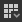

# La biblioteca

Esta página presenta el panel **Biblioteca** de Substance 3D Designer, su diseño y las herramientas que ofrece para buscar y filtrar contenido.

## Información general

El panel <b>Biblioteca</b> es un *administrador de recursos* de vista dividida, donde puedes encontrar y reunir todos tus *activos* con los que necesitas trabajar en tu gráfico.

Supervisa las *carpetas* del disco duro o de una red que se han agregado a la lista de [rutas controladas por la biblioteca](https://docs.substance3d.com/display/SDDOC/Project+Settings#ProjectSettings-proj-libraryLibrary) en la [configuración del proyecto](../../interface/preferences-window/project-settings/project-settings.md). Cualquier cambio que se produzca en esas carpetas (adición, eliminación y actualización de contenido) se *traspasa* a la <b>biblioteca</b>.

>[!WARNING]
>
> **Acerca del contenido personalizado**
> 
> Aunque los recursos personalizados se agregarán a **Biblioteca**, es posible que no se vean debido a las reglas de filtrado establecidas para las categorías existentes. Le recomendamos que cree sus propios filtros organizados en carpetas para garantizar que su contenido se pueda encontrar de forma fiable mientras trabaja en sus proyectos.\
> Consulte la sección [Administración de contenido y filtros personalizados](./managing-custom-content/managing-custom-content-and-filters.md) de la documentación para obtener más información.

La **biblioteca** puede supervisar todos los recursos admitidos [Resources](../../resources/resources.md):

* Gráficos de [Paquetes de Substance](../../getting-started/overview/overview.md) (SBS) y [Archivos de Substance](../../getting-started/overview/overview.md) (SBSAR)
* [Imágenes de mapa de bits](../../resources/bitmap-resource/bitmap-resource.md)
* [Imágenes vectoriales](../../resources/vector-graphics-svg-res/vector-graphics-svg-resource.md)
* [Gráficas de funciones](../../function-graphs/function-graphs.md)
* [Archivos AxF](../../resources/axf-appearance-exchange/axf-appearance-exchange-format.md)
* [Fuentes](../../resources/font-resource/font-resource.md)
* [Escenas 3D](../../resources/3d-scene-resource/3d-scene-resource.md)

El panel se divide en dos partes principales:

* La sección **Categorías** de la izquierda
* La sección **Content** de la derecha

## Categorías

Ubicada a la izquierda del panel <b>Biblioteca </b>, la sección <b>Categoría</b> contiene todos los activos *categorías* (es decir, carpetas) y *filtros*, como una vista de árbol.\
Puede hacer clic en cualquier elemento de esta vista de árbol para mostrar su contenido, junto con el contenido de *todos sus elementos secundarios*.

### Las categorías

Las categorías y filtros predeterminados contienen todos los recursos enviados con Designer. No se pueden editar ni eliminar.\
Las categorías predeterminadas incluyen:

* Favoritos: recopila todos los activos marcados como &quot;Favoritos&quot;
* [Elementos de gráfico](../../interface/the-graph-view/graph-items/graph-items.md): muestra objetos especiales para organizar gráficos
* [Nodos atómicos](../../compositing-graphs/nodes-reference-for-com/atomic-nodes/atomic-nodes.md): enumera nodos atómicos para [gráficos de Substance](../../compositing-graphs/substance-compositing-graphs.md)
* [nodos FX-Map](../../function-graphs/fxmaps/fxmaps.md): incluye nodos específicos de gráficos calculados por [FX-Map](../../compositing-graphs/nodes-reference-for-com/atomic-nodes/fx-map/fx-map.md) nodos
* [Nodos de función](../../function-graphs/nodes-reference-for-fun/atomic-function-nodes/atomic-function-nodes.md): enumera nodos atómicos para [gráficos de funciones](../../function-graphs/function-graphs.md)
* [Generadores de texturas](../../compositing-graphs/nodes-reference-for-com/node-library/texture-generators/texture-generators.md): contiene nodos que representan [gráficos de Substance](../../compositing-graphs/substance-compositing-graphs.md) que generan contenido de forma autónoma
* [Filtros](../../compositing-graphs/nodes-reference-for-com/node-library/filters/filters.md): contiene nodos que representan [gráficos de Substance](../../compositing-graphs/substance-compositing-graphs.md) que modifican una entrada
* [Herramientas de spline y rutas](../../compositing-graphs/nodes-reference-for-com/node-library/spline-paths-tools/spline-paths-tools.md): El catálogo de nodos [Spline](../../compositing-graphs/nodes-reference-for-com/node-library/spline-paths-tools/spline-tools/spline-tools.md) y [Paths](../../compositing-graphs/nodes-reference-for-com/node-library/spline-paths-tools/path-tools/path-tools.md)
* [Funciones SDF](../../function-graphs/nodes-reference-for-fun/function-node-library/function-node-library.md#sdf-functions): incluye nodos para la creación de Funciones SDF 3D que se utilizarán con los nodos [Shape splatter v2](../../compositing-graphs/nodes-reference-for-com/node-library/texture-generators/patterns/shape-splatter-v2/shape-splatter-v2.md) y [3D viewer](../../compositing-graphs/nodes-reference-for-com/node-library/filters/effects/3d-viewer/3d-viewer.md)
* [Funciones](../../function-graphs/nodes-reference-for-fun/function-node-library/function-node-library.md): incluye nodos que representan [gráficos de funciones](../../function-graphs/the-function-graph/the-function-graph.md)
* [Vista 3D](../3d-view/3d-view.md): ofrece contenido relacionado con los mapas utilizados para iluminación basada en imágenes en una escena 3D, como en la [Vista 3D](../../interface/3d-view/3d-view.md), como mapas de entorno y nodos para crear mapas de entorno
* Materiales PBR: Materiales prefabricados que se pueden utilizar como marcadores de posición para probar otros nodos, &#39;recetas&#39; o una configuración de espacio de trabajo personalizado. Para aprender sobre los materiales de creación, recomendamos echar un vistazo a nuestros [ejemplos de materiales](../../compositing-graphs/creating-compositing-gra/material-samples/material-samples.md) dedicados.
* [Valores](../../compositing-graphs/nodes-reference-for-com/node-library/values/constant.md): Nodos para generar valores simples en Substance gráficos.

## Contenido

El contenido de <b>Library</b> se muestra como *miniaturas etiquetadas*. Estas miniaturas tendrán un aspecto diferente en función de los siguientes factores:

* Los [gráficos de Substance](../../compositing-graphs/substance-compositing-graphs.md) de los archivos [SBS](../../getting-started/overview/overview.md) y [SBSAR](../../getting-started/overview/overview.md) están representados por su *primer resultado*, o por su *icono personalizado* si el autor del gráfico lo ha establecido
* [Bitmaps](../../resources/bitmap-resource/bitmap-resource.md) y [gráficos vectoriales (SVG)](../../resources/vector-graphics-svg-res/vector-graphics-svg-resource.md) están representados por un *renderizado en miniatura* del propio mapa de bits
* Los archivos [3D scenes](../../resources/3d-scene-resource/3d-scene-resource.md), [Function graphs](../../function-graphs/the-function-graph/the-function-graph.md), [fonts](../../resources/font-resource/font-resource.md) y [AxF](../../resources/axf-appearance-exchange/axf-appearance-exchange-format.md) están representados por *iconos genéricos* para cada tipo

>[!WARNING]
>
> **En caso de problemas de miniaturas**
> 
> Nuestro paso recomendado para solucionar cualquier problema relacionado con las miniaturas de biblioteca (imagen incorrecta, procesamiento bloqueado en el icono de actualización, etc.) es para activar manualmente una actualización de *miniaturas*.\
> Para ello, usa el botón **Reconstruir miniaturas** en la sección [Biblioteca](../../interface/preferences-window/preferences-window.md) de la [ventana de preferencias](../../interface/preferences-window/preferences-window.md).

<table>
<tr style="border: 0;">
<td width="100.00%" style="border: 0;" valign="top">

### Usar un recurso de la biblioteca

Para usar un activo de la biblioteca, *arrástralo y suéltalo* en la ubicación deseada.\
Puede seleccionar *varios* elementos en la sección <b>Contenido</b> manteniendo presionada la tecla <b>Ctrl</b> mientras hace clic en los elementos. En este caso, la operación de arrastrar y soltar colocará nodos en el gráfico para *toda la selección*.

</td>
<td width="41.67%" style="border: 0;" valign="top">

</td>
</tr>
</table>

### Búsqueda de un recurso por nombre

La barra <b>Buscar</b>, situada en la parte superior izquierda de la sección <b>Contenido</b>, te permite buscar *cualquier activo por nombre*. Al buscar contenido de esta manera, se omite la selección actual de la sección <b>Categorías</b> y se busca *todo el contenido* de la <b>Biblioteca</b>.\
Puede filtrar los resultados de la búsqueda por *tipo de gráfico*, usando el  <b>Filtro por...Icono de </b> junto a la barra de <b>búsqueda</b>.

>[!NOTE]
>
> La barra de búsqueda tendrá en cuenta el nombre del activo que está buscando, pero también las *etiquetas* que puede contener el activo o la *categoría* a la que pertenece.\
> Por ejemplo, si escribe &#39;*Normal*&#39;, se mostrarán todos los recursos que se pueden usar para generar o modificar una asignación normal. Esta es una buena manera de descubrir nuevos nodos, y por lo tanto nuevas posibilidades!

<table>
<tr style="border: 0;">
<td width="100.00%" style="border: 0;" valign="top">

### Visualización de recursos de biblioteca

Con el botón desplegable  <b>Modo de visualización</b>, puede seleccionar el tamaño de visualización de los elementos de contenido.

</td>
<td width="25.00%" style="border: 0;" valign="top">

</td>
</tr>
</table>

<table>
<tr style="border: 0;">
<td style="border: 0;" valign="top">

El botón  **Alternar etiquetas** le permite mostrar u ocultar las etiquetas de los nodos.

</td>
<td style="border: 0;" valign="top">

</td>
</tr>
</table>

<table>
<tr style="border: 0;">
<td style="border: 0;" valign="top">

Al situar el cursor en un elemento de contenido, tras un breve tiempo aparecerá una información sobre herramientas que muestra una *descripción* del elemento si su autor ha proporcionado una.\
*Haga clic con el botón secundario en el elemento para mostrar información adicional, incluida una ruta de acceso al archivo de origen de ese elemento.*

</td>
<td style="border: 0;" valign="top">

</td>
</tr>
</table>

>[!NOTE]
>
> Para [nodos de instancia](../../compositing-graphs/creating-compositing-gra/graph-instances-sub-gra/graph-instances-sub-graphs.md), es decir, nodos no atómicos, esta ruta es un *hipervínculo* que mostrará el archivo en el explorador de archivos del sistema.\
> Los nodos atómicos utilizan una ruta de acceso con alias especial (por ejemplo, `graphatomic://`, `structure://`, ...) que no se puede hacer clic porque apunta a una biblioteca interna.

<table>
<tr style="border: 0;">
<td style="border: 0;" valign="top">

### Favoritos

Puedes agregar cualquier elemento de la sección <b>Contenido</b> a tu lista de <b>Favoritos</b>, usando el botón  <b>Agregar a favoritos</b>. El botón también te permite *eliminar* contenido de esta lista si ya está agregado.\
Cuando el contenido se agrega a esta lista, está disponible en la categoría <b>Favoritos</b> de la <b>Biblioteca</b>, y se mostrará en la *parte superior* de la lista de menú <b>Nodo</b> al buscar un nodo en el gráfico, siempre que los términos de búsqueda lo coincidan.

</td>
<td style="border: 0;" valign="top">

</td>
</tr>
</table>
