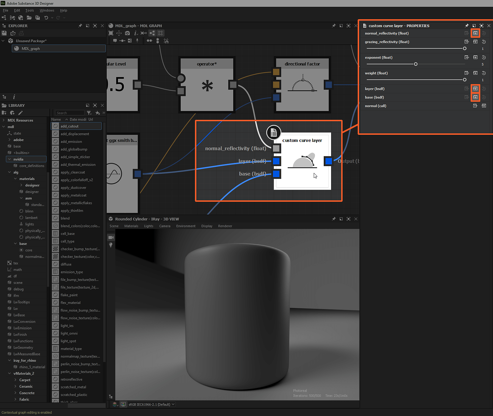

# Exposición de parámetros en gráficos MDL

Esta página explica el proceso de exponer parámetros en gráficos MDL para que se puedan conectar a valores y texturas proporcionados por *otros nodos* del gráfico o por *fuentes externas*.

*Estado expuesto de las entradas de nodo*

## Exposición de entradas de nodo

En la mayoría de los casos, los *conectores de entrada* de las propiedades de un nodo se pueden exponer para que otros nodos *del gráfico establezcan su* valor. Esta es una parte *crítica* de cualquier flujo de trabajo en gráficos MDL y debe entenderse bien.

Cuando se selecciona un nodo en la <b>vista Gráfica</b>, sus propiedades se muestran en el panel <b>Propiedades</b>. La mayoría de las propiedades se muestran con un conjunto de botones a la derecha de su etiqueta:

* **Copiar valor a un nuevo nodo y vincularlo a este parámetro**: crea un *conector de entrada* para esta propiedad y la conecta a un *nuevo nodo* que genera el valor actual de esta propiedad
* **Crear una ubicación de entrada para este parámetro**: crea un *conector de entrada* para esta propiedad
* **Restablezca este parámetro a su valor predeterminado**: cuando no hay ningún valor conectado al conector de entrada de esta propiedad, restablece su valor predeterminado

*Manipulando entradas de nodo*

Al hacer clic en cualquiera de los dos primeros botones, se agrega al nodo un *conector de entrada con tipo*. Las propiedades del nodo reaccionan al *estado de conexión* de este conector:

* **No conectado**: el parámetro todavía se puede modificar en el panel **Propiedades** y la entrada de valor en este panel se *aplica*
* **Conectado**: Si el parámetro ya no se puede modificar en el panel **Propiedades**, el valor introducido en este panel se *reemplazó* por el valor recibido por el *conector de entrada*, la propiedad no se puede restablecer a su valor predeterminado

El conector de entrada se puede *quitar* haciendo clic de nuevo en el botón **Crear una chincheta de entrada para este parámetro**. En ese momento, el valor de la propiedad vuelve al valor establecido en el panel **Properties**.

*Parámetros de nodo expuestos*

## Exposición de entradas de gráficos

En el gráfico MDL, la exposición de un parámetro al nivel del gráfico, es decir, para que aparezca como parámetro de entrada de material MDL, se realiza exponiendo el nodo que emite el valor.

Los nodos que se pueden exponer tienen la opción <b>Expose</b> en su menú contextual. En la mayoría de los casos, se trata de nodos que generan un valor o datos como coordenadas de flotante, color o textura.

Opción &quot;Expose&quot; de 

Opción &quot;Expose&quot; de *en el menú contextual de un nodo*

El parámetro expuesto se configura directamente en el *nodo expuesto*, no en las propiedades del gráfico. Las propiedades de los parámetros expuestos son las siguientes:

* <b>Identificador</b>: el nombre único de este parámetro de entrada en el gráfico actual
* <b>Valor predeterminado</b>: Valor predeterminado de este parámetro. También se puede usar como *vista previa* del aspecto que tendrá el parámetro de entrada en Designer. Las propiedades <b>Display name</b>, <b>In Group</b> y <b>Ranges</b> se utilizan para obtener la vista previa más precisa posible
* <b>Rangos</b>:
  * *Intervalo flexible*: Define el rango predeterminado del widget utilizado para mostrar este parámetro, por ejemplo, un regulador. Esta propiedad existe sólo para fines de interfaz y los valores que se encuentran fuera del intervalo simplificado se pueden introducir manualmente
  * *Intervalo duro*: Define el rango de valores aceptados para este parámetro. Los valores por debajo del intervalo se fijan al valor mínimo, mientras que los valores por encima del intervalo se fijan al valor máximo. Los valores de rango suave y predeterminado del parámetro se *ajustan automáticamente* para que se ajusten a este rango.
* <b>Descripción</b>: La descripción del parámetro
* <b>En el grupo</b>: El grupo de parámetros al que pertenece este parámetro de entrada. Si no se deja en blanco, el parámetro se mostrará en Designer como parte de una sección contraíble con el nombre del grupo
* <b>Nombre para mostrar</b>: El nombre del parámetro que se muestra en la interfaz
* <b>Oculto</b>: Cuando se establece en True, el parámetro no está visible en las entradas de gráfico y las propiedades del material MDL
* <b>Tipo de gamma</b>: El valor gamma que debe utilizarse al tomar muestras de valores de una textura conectada a este parámetro
* <b>Visible de forma predeterminada</b>: Establece la visibilidad de este parámetro en integraciones MDL en los casos en los que algunos parámetros pueden estar ocultos
* <b>Modificador de tipo</b>: Establece si el valor es uniforme o variable. Cuando se establece en auto, el parámetro hereda esta propiedad de su entrada (p. ej., para un valor Float: uniforme cuando se conecta a un flotador, que varía cuando se conecta a una textura)
* <b>Uso de Sampler</b>: El identificador del uso del parámetro, que se utiliza para *conectar la textura apropiada* s cuando se conectan varias salidas a un material MDL a la vez. Por ejemplo, al conectar un [gráfico de Substance](../../compositing-graphs/substance-compositing-graphs.md) a un material MDL en la vista 3D, las texturas se conectan a las entradas correctas según sus identificadores de uso.

>[!WARNING]
>
> Mientras que las entradas de gráfico se configuran como configuradas en el nivel *node*, su ordenación se administra en el nivel *graph* en la sección **Graph input** de las [propiedades de gráfico](../../mdl-graphs/creating-an-mdl-graph/creating-an-mdl-graph.md).

*Exponiendo nodos en entradas de gráficos*
