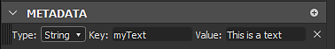

# Metadatos del paquete

Los metadatos del paquete son un diccionario de valores de texto (cadena) definidos en el nivel del paquete. Se incluye en SBSAR al publicar y es un almacenamiento de uso general destinado a ser utilizado por scripts de python.

## Visualización y edición de metadatos mediante la interfaz de Designer

Si está desarrollando un complemento de Python, es posible que desee editar los metadatos manualmente para probarlos y depurarlos. Así es como se puede hacer:

1. Si hace doble clic en un paquete en el explorador, se abre el panel Propiedades de este paquete.

   
1. Aquí tiene una sección dedicada &quot;Metadatos&quot;. Es probable que esté vacía en su caso, como en la captura anterior.

   Puede agregar nuevos metadatos utilizando el botón &quot;más&quot;.

   
1. Aparece un nuevo elemento en la sección:

   
1. Hay un campo &quot;Clave&quot; y un campo &quot;Valor&quot;. Ambos se pueden configurar para cualquier cosa que se adapte a sus necesidades. El campo &quot;Clave&quot; debe tener un valor único en la lista.

   
1. También puede elegir el &quot;Tipo&quot; del elemento. Por el momento puede ser &quot;String&quot; o &quot;URL&quot;:

   
1. En este caso, &quot;URL&quot; significa una referencia a un recurso incluido en el paquete. Para ello, elija un archivo en el disco duro y arrástrelo y colóquelo en el paquete en el Explorador. Puede ser un recurso normal, como una imagen, o cualquier otro archivo, como un archivo de texto.

   
1. El archivo aparece como un nuevo recurso en el paquete.

   Ahora vuelva al panel Propiedades del paquete, cree nuevos metadatos, asígnele una clave adecuada y elija &quot;URL&quot; como tipo. A continuación, seleccione el icono &quot;...&quot; en el campo &quot;Valor&quot; y seleccione &quot;De Recurso&quot;. Por último, elija el archivo que incluyó justo antes y valide:

   
1. Ahora puede ver que la &quot;URL&quot; del recurso se almacena en el campo &quot;Valor&quot;.

   También puede eliminar metadatos mediante el botón &quot;X&quot; situado a la derecha del elemento:

   

>[!NOTE]
>
> Mover o reordenar entradas de metadatos está desactivado: el orden no es significativo y no se mantendrá al publicar el paquete.

## Metadatos en archivos SBSAR publicados

En algunos casos, es posible que desee recuperar los metadatos definidos en un paquete en el SBSAR publicado coincidente. A continuación puede leer cómo se transforman y almacenan los metadatos en el archivo, y la forma adecuada de aprovecharlos de ello.

Los metadatos se almacenan según el formato JSON en un archivo denominado /assemblies/content/0000/metadata.json (la ruta de acceso es relativa a la raíz del archivo .sbsar).

Los metadatos normales (de cadena) se almacenan tal cual, p. ej. &quot;clave&quot;: &quot;stringValue&quot;, uno por línea. Una vez más, el orden original de las distintas claves no se conserva y se define la implementación. Nunca confíe en el pedido en su proceso, como con los dictados regulares de Python!

Dado que el objetivo de los metadatos de URL es permitir a los usuarios y complementos incluir archivos externos en el archivo .sbsar, están sujetos a una transformación específica: En primer lugar, el archivo del recurso que coincide con la dirección URL almacenada se copia en el archivo en una ubicación definida de implementación (normalmente en una subcarpeta numerada, que contendrá sólo este archivo). El punto es evitar el conflicto de nombres.) El archivo conservará su nombre original (el nombre del recurso se descarta en este momento). A continuación, en lugar de la dirección URL original en metadata.json, se escribe la ruta al archivo copiado en el archivo relativo al metadata.json.

Si exportamos el paquete de ejemplo creado en la sección anterior (después de crear al menos un gráfico con algunas salidas), obtenemos este contenido de archivo:

```
myPackage.sbsar

|-- assemblies

        |-- content

            |-- 0000

                |-- New_Graph.sbsasm

                |-- New_Graph.xml

                |-- metadata.json

                |-- resources

                    |-- 0

                        |-- TEXT.txt
```


Y el contenido metadata.json es:

```
{

    "myResource": "resources/0/TEXT.txt",

    "myText": "This is a text"

}
```


Por el momento, no se proporciona ninguna herramienta específica para acceder a los metadatos y recursos almacenados en el archivo. La forma recomendada es abrir el archivo con el descodificador LZMA de su elección y analizar metadata.json con un analizador JSON normal (si las claves o cadenas de valor contienen algunos caracteres sofisticados, se les aplicará escape de la forma JSON).

>[!NOTE]
>
> No queda información sobre si cada metadato era una simple cadena o una URL, por lo que tiene que saber qué significa cada clave que desee leer.
