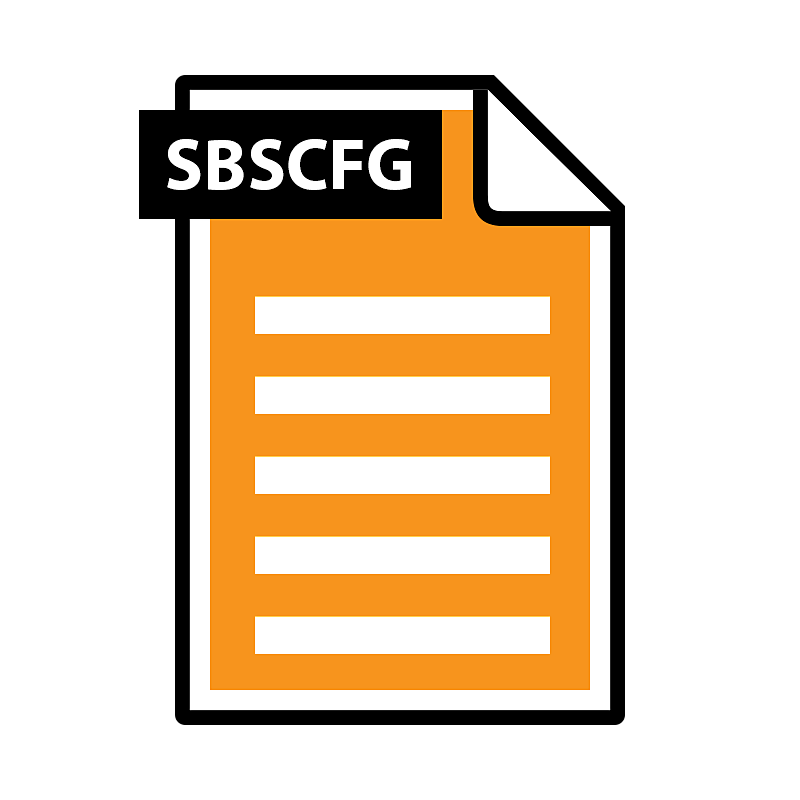
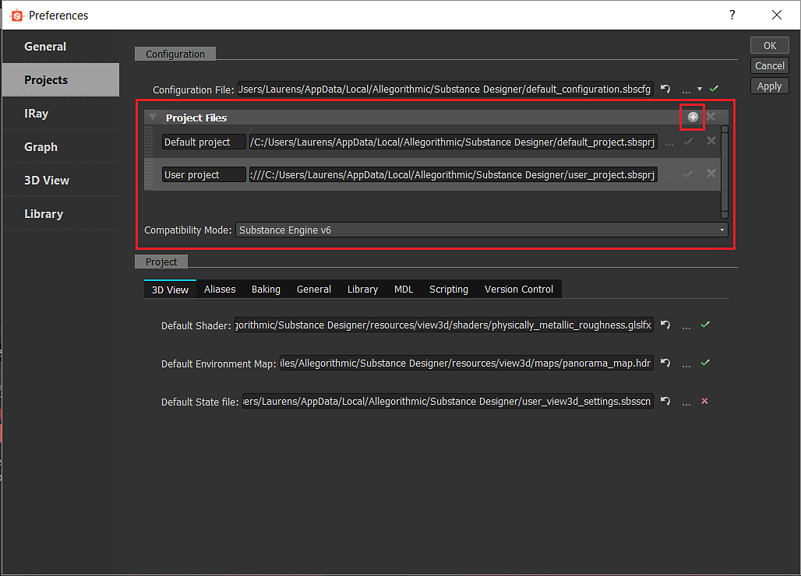

# Lista de configuración - SBSCFG

<table>
<tr style="border: 0;">
<td width="100.00%" style="border: 0;" valign="top">

El archivo de configuración es mucho más sencillo que los [archivos de configuración del proyecto](../../pipeline-and-project-con/project-configuration-fil/project-configuration-files-sbsprj.md), ya que contiene únicamente una lista de proyectos, así como un modo de compatibilidad del motor. Sirven como una lista de configuración de proyecto/entorno de nivel superior que los archivos de Project individuales.

Puede tener varias configuraciones para diferentes entornos; estos archivos se pueden mantener bajo control de versiones junto con los archivos SBSPRJ.

</td>
<td width="25.00%" style="border: 0;" valign="top">



</td>
</tr>
</table>

## Modificar archivos de configuración

Estos archivos son sencillos, pero se pueden modificar de dos maneras diferentes, como los archivos SBSPRJ.

### En la configuración del proyecto

La sección resaltada es la parte que se relaciona con los Archivos de configuración, simplemente se agregan más Proyectos a la lista que se almacenan en el archivo SBSCFG definido anteriormente.



### Edición externa como XML

Para Windows <b>Notepad++</b> es una buena opción gratuita, para macOS <b>Sublime Text</b> es una alternativa. Sin embargo, cualquier editor con sangría adecuada, contracción de secciones y alguna forma de resaltado de sintaxis hará su vida mucho más fácil.

Una vez que abra el archivo SBSCFG en un editor, debería ver un diseño estructurado bastante sencillo, con secciones correspondientes a la interfaz de usuario.

```
<?xml version="1.0" encoding="UTF-8"?> 

<root> 

 <projects> 

  <projectfiles> 

   <size>1</size> 

   <_1 prefix="_"> 

    <path>custom_project.sbsprj</path> 

   </_1> 

  </projectfiles> 

 </projects> 

 <preferences> 

  <configuration> 

   <compatibilitymode>sbs_engine_v6</compatibilitymode> 

  </configuration> 

 </preferences> 

</root>
```


Tenga en cuenta que los proyectos predeterminados y de usuario no se muestran explícitamente y que los proyectos adicionales se definen después de estos.

El ejemplo anterior también utiliza [rutas relativas](../../pipeline-and-project-con/project-configuration-fil/project-configuration-files-sbsprj.md). Tenga en cuenta que la lógica de las rutas relativas es ligeramente diferente entre los archivos CFG y PRJ: para los archivos CFG, como se ha indicado anteriormente, **no debe escribir &quot;file:/&quot; antes de la ruta de acceso**. En su lugar, la ruta solo se anexa a la ubicación del archivo CFG en el que está definido.

## Eliminación de la biblioteca predeterminada

Por ahora, la biblioteca predeterminada no se puede eliminar. Probablemente no sea una buena idea hacerlo de todos modos, ya que perderías gran parte de la funcionalidad de Designer.
