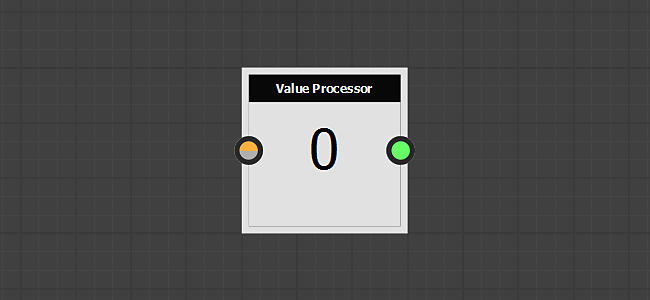
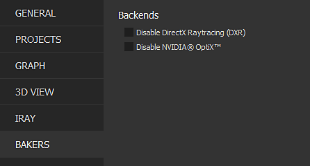
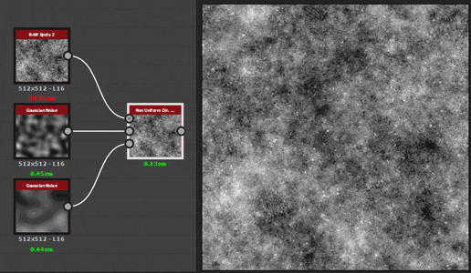
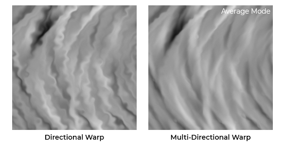

# Versión 2019.1 (9.1)

**Substance Designer 2019.1** incluye una nueva actualización en el Substance Engine para ampliar aún más sus funciones, así como nuevos filtros adicionales.

## Funciones principales

### Nuevo nodo de procesador de valor

El Substance Engine está ahora en la versión 7 y con él trae el nuevo concepto de &quot;Valores&quot; dentro del gráfico de composición. Los valores son números y no texturas y, como tales, se pueden utilizar para realizar diversos cálculos que se pueden compartir entre nodos a través de los gráficos de funciones y los gráficos de composición. El nodo Procesador de valores puede leer una imagen de entrada y calcular un único valor de salida.

El nodo Procesador de valor no es el único, para poder transmitir información a través del gráfico se han realizado algunos cambios y adiciones:

* Los nodos de salida se pueden alimentar directamente con un valor y ya no necesariamente con una imagen.

  
* Se ha agregado un nuevo **nodo de entrada** denominado &quot;Valor de entrada&quot; para que el gráfico pueda consultar los valores.

  
* Los nodos ahora tienen una nueva categoría debajo de sus parámetros denominada &quot;Valores de entrada&quot; que se puede utilizar para crear valores de entrada para el propio nodo.\
  Los valores de entrada se pueden referenciar dentro del gráfico de funciones a través de los nodos &quot;Get&quot;.

  

>[!NOTE]
>
> Al igual que con cada cambio importante de Substance Engine, el modo de compatibilidad se establece en la versión anterior (nueva versión 6 de forma predeterminada). Lo que significa que los nodos incompatibles tendrán un borde amarillo en el gráfico. Para desactivar u ocultar el borde amarillo, simplemente cambie la versión del motor en la configuración principal a la versión más reciente (a través de la configuración del proyecto) :
> 
> 

### Compatibilidad con Optix en panaderos

La última actualización del Substance Designer introdujo DXR que permite realizar Trazados de rayos de GPU en hardware compatible con RTX. Ahora hemos añadido compatibilidad con [Optix](https://developer.nvidia.com/optix), que permite raytrace en otras GPU de NVIDIA incluso en Linux. Puede esperar al menos **5 veces más rápido** al usar Optix que con el trazado de rayos de CPU normal.

Esta es la lista de panaderos afectados por este cambio :

* Oclusión ambiental desde malla
* Normales dobladas de la malla
* Thickness de malla

Si desea deshabilitar uno de los dos backends, diríjase a las preferencias principales (**Editar > Preferencias**) y a la configuración de Bakers :

>[!NOTE]
>
> Para acceder a la función, asegúrese de **actualizar a los siguientes controladores**:
> 
> * GPU NVIDIA 10XX y 20XX : **controladores 430.39** (compatibles con DXR y Optix)
> * Nvidia 9XX y versiones anteriores : **d** **rivers 419.67 o 430.39** (los controladores 425.31 tienen un problema con Optix)
> 
> Tenga en cuenta que DXR también está disponible en [GPU GeForce GTX 10xx](https://www.nvidia.com/en-us/geforce/news/geforce-gtx-dxr-ray-tracing-available-now/) (con controladores actualizados). DXR también requiere que Windows esté actualizado para trabajar. Consulte [esta página](../../../best-practices/performance-optimization/performance-optimization-guidelines.md) para obtener más información.

### Tiempos de carga mejorados para mallas OBJ

En esta versión, hemos mejorado nuestro lector de archivos **obj** para reducir el tiempo de carga de mallas 3D. Los tiempos de carga se han acelerado hasta 3 veces, especialmente para mallas que no tienen UV ni Normales definidos.

Esta mejora del rendimiento afectará tanto a los Panaderos como a la Vista 3D.

### Sistema de complementos de Python mejorado

Con esta actualización hemos añadido muchas funciones nuevas al sistema de scripts :

* **Compatibilidad con Qt**: Permite crear una interfaz de usuario personalizada que sigue el mismo estilo que el resto de la aplicación. La interfaz de usuario personalizada también se puede integrar mucho más fácilmente con este nuevo sistema. (Tkinter ya no se usa).
* **Funciones de devolución de llamada** : Ahora es posible registrar funciones de devolución de llamada. Por el momento solo incluye abrir y guardar archivos, así como la creación de elementos de interfaz de usuario. En el futuro, se añadirán devoluciones de llamada adicionales.
* **Subprocesamiento** : Ahora, los complementos pueden crear subprocesos para procesar en segundo plano o esperar a los eventos del sistema operativo (como las conexiones de red).

Para obtener más información, consulta el registro de cambios de la API, al que puedes acceder a través de la entrada de menú **Ayuda > Documentación de la API de Python** en Substance Designer.

### Nuevo contenido

También tenemos algunos nodos nuevos disponibles en la biblioteca predeterminada, algunos de los cuales ahora están equipados con el nuevo nodo de procesador Value :

* **Flood Fill al índice**\
  Asigna un índice único a las formas de un nodo de Flood Fill.\
  En el ejemplo siguiente, el nodo Procesador de píxeles hace coincidir la Entrada de valor con la forma y, como resultado, da salida a una máscara.

  
* **Non Uniform Directional Warp**\
  Aplica una Deformación direccional en la que la intensidad y el ángulo se muestrean a partir de las entradas de la imagen.

  
* **Deformación direccional múltiple**\
  Deforma la imagen de entrada varias veces en varias direcciones.

  
* **Extrusión de altura**\
  Genera una representación en 3D ortográfica del Height especificado. La vista de cámara se puede controlar con el gizmo de posición.

  
* **Valor mín./máx.**\
  Devuelve el valor de píxel mínimo y máximo de la imagen de entrada.

  

>[!WARNING]
>
> Esta versión ya no es compatible con CentOS 6.x. Para utilizar la última versión de Substance Designer, actualice a CentOS 7.x.

## Notas de la versión

### 2019.1.3

*(Publicado El 19 De Agosto De 2019)*

**Corregido:**

* [Bakers] Bloqueo en DXR cuando las proporciones de aspecto de la salida de la torta y el mapa de sesgo no coinciden
* [Bakers] El panadero &quot;Oclusión ambiental desde malla&quot; genera resultados incorrectos con Optix o DXR al usar un mapa normal
* [Panaderos] El panadero de curvatura genera resultados incorrectos al utilizar el ajuste Por vértice
* [Panaderos] Los mensajes de error indican el motor que ha fallado en lugar de la causa del error
* [Panaderos] Bloqueo al procesar un panadero de mapa de detalles sin una malla de poli alta
* [Bakers] El mapa de sesgo no parece afectar a toda la salida con DXR activado
* [Contenido] mg\_leaks: error tipográfico en el nombre de parámetros
* [Contenido] &quot;Forma&quot; devuelve una advertencia de cocción
* [Contenido] Los polígonos 1 y 2 no admiten funciones aleatorias
* [Contenido] Los polígonos 1 y 2 pueden tener menos de 3 lados
* [Contenido] Normal a Height HQ no funciona correctamente en formato no cuadrado
* [Parámetros] Parámetros de entrada de enteros: la lista desplegable no muestra los valores

### 2019.1.2

*(Publicado El 2 De Julio De 2019)*

**Corregido:**

* [Vista 3D] La exportación de la vista 3D con la profundidad de campo activada parece incorrecta
* [Vista 3D] El canal de Alpha de las imágenes de PSD es incorrecto al utilizar guardar procesamiento
* [Vista 3D] PNG y PSD se rompen al utilizar la opción de guardar procesamiento con Iray
* [Vista 3D] El formato dds no funciona al guardar el procesamiento
* [Graph] Los nodos se desplazan al combinar la acción de arrastrar del botón derecho y del izquierdo de formas específicas
* [Graph] La modificación de instancias de una función ya no actualiza el resultado del nodo
* [Graph] Bloqueo al mostrar el menú de la barra espaciadora
* [Content] Extrusión de forma: problema de calidad cuando la forma no tiene rotación
* [Contenido] La sombra paralela de forma (y la escala de grises) no produce sombras sin mosaicos H y V
* [Contenido] Problema normal de recorte de material
* [Bakers] Los ajustes preestablecidos de JSON Bakers no se cargan correctamente
* [Bakers] Bloqueo al hornear mallas pesadas usando Optix o DXR (ahora puede fallar debido a Vram insuficiente pero no se bloqueará)
* [Editor de mapa de bits] Las herramientas de pintura de mapa de bits desplazan los trazos y vuelven a dibujarlos en el cuadro delimitador del trazo
* [Editor de mapa de bits] Herramientas de pintura de mapa de bits rotas en OSX
* [UI] Apenas se puede acceder al menú de algunos botones
* [UI] Bloqueo al arrastrar y soltar una instancia de Baker
* [SVG] Las herramientas de edición de SVG incorporadas no son fiables
* [Parameters] Bloqueo al aplicar un ajuste preestablecido con parámetros booleanos en una instancia SBSAR
* [Red] Bloqueo a veces cuando se produce un error en una conexión cifrada SSL

### 2019.1.1

*(Publicado El 28 De Mayo De 2019)*

**Agregado:**

* [PythonIntegration] Guardar y restaurar el estado del administrador de complementos
* [Preferencias][Dependencias] Agregue una opción para determinar cómo se almacenan las rutas de acceso de los archivos de dependencias
* [Content] Asignador de Flood Fill: Añade la opción &quot;Ajustar cuadro de forma&quot;

**Corregido:**

* [Content] Asignador de Flood Fill: La &quot;Escala automática de rotación&quot; hace el efecto contrario
* [Content] &quot;luminance\_offset\_map&quot; no se utiliza en &quot;Flood Fill Mapper Color&quot;
* [Content] El nodo &quot;Flood Fill Mapper Grayscale&quot; genera artefactos de ejecución de pasos
* [Contenido] No se puede publicar la Extrusión de altura
* [Parámetros] Los ajustes preestablecidos incrustados en sbsar no se cargan en Designer
* [Panaderos] El nombre del panadero no se muestra correctamente en la lista de panaderos
* [Vista 3D] &quot;Ver resultados en vista 3D&quot; no funciona para valores
* [Cooker] Bloqueo al corregir un tipo de parámetro incorrecto
* [API] La función SDResource.setInputPropertyFromId no funciona en los parámetros de entrada de SDSBSCompGraph
* [Updater] Algunos subprogramas no se pueden actualizar en 2019
* [Explorer] Bloqueo al importar un archivo .obj específico
* [PythonIntegration] Las barras invertidas no se escapan correctamente en Windows al inicializar PYTHONPATH
* [UI] Problema de valor con algunos reguladores en panaderos
* [Linux] Designer no se puede ejecutar en CentOS &lt; 7.6

### 2019.1

*(Publicado El 9 De Mayo De 2019)*

**Agregado:**

* [API] Agregue el parámetro &#39;updatePackages&#39; al método SDPackageMGR.loadUserPackage() para controlar si los actualizadores se deben aplicar o no durante la carga
* [API] Añadir la capacidad de desconectar un SDConnection
* [API] Agregue la clase SDSBSARExporter para publicar un SDPackage
* [API] Agregue la clase SDHistoryUtils para administrar los comandos que se pueden deshacer
* [API] Agregar definición de nodo de entrada de escala de grises en Gráfico de composición de Substance (sbs::compositing::input\_grayscale)
* [API] Agregar definición de nodo de entrada de valor en Gráfica de composición de Substance (sbs::compositing::input\_value)
* [API] Método Add SDProperty.isFunctionOnly()
* [API] Agregar compatibilidad con parámetros de entrada personalizados en SDSBSCompNode
* [API] Agregue el parámetro &#39;reloadIfModified&#39; al método SDPackageMGR.loadUserPackage() para controlar si un paquete se ha vuelto a cargar si se ha modificado
* [API] Método Add SDPackageMgr.getPackages()
* [API] Añadir la posibilidad de obtener/añadir/eliminar rutas raíz de SDModuleMgr
* [API] Permite obtener el puntero del búfer de píxeles y el tono de una SDTexture
* [API] Permite recuperar el puntero de MainWindow
* [API] Permite crear menús personalizados en el menú principal
* [API] Permite crear DockWidgets personalizados en la ventana principal
* [API] Usar nombres de objeto para buscar menús en barras de herramientas
* [API] Proporcionar un sistema para administrar las notificaciones de la aplicación a la API
* [PythonIntegration] Agregue una variable de entorno predeterminada para buscar complementos de Python
* [PythonIntegration] Añadir búsqueda de texto y reemplazar al editor de Python
* [PythonIntegration] Instanciar complementos de Python al inicio
* [PythonIntegration] Tenga en cuenta la variable de entorno PYTHONPATH
* [PythonIntegration] Permitir la creación de barras de herramientas en widgets de gráficos
* [PythonIntegration] Compatibilidad con subprocesos de Python
* [PythonIntegration] Añadir un administrador de complementos (en el menú Herramientas)
* [Contenido] Rotación de vectores normal: añadir una entrada de imagen opcional para controlar el ángulo
* [Contenido] Nuevo filtro Mín./Máx.
* [Contenido] Nuevo filtro &quot;Flood Fill a índice&quot;
* [Contenido] Nuevo filtro &quot;Asignador de Flood Fill&quot;
* [Content] Nuevo filtro de Atlas splitter
* [Contenido] Mejora el filtro Tri Planar
* [Contenido] Nuevo filtro de Non Uniform Directional Warp
* [Contenido] Nueva deformación multidireccional
* [Contenido] Nuevo filtro de Extrusión de altura
* [Motor] Fxmap: nuevo patrón de &quot;Gradación con desplazamiento&quot;
* [Motor] Compatibilidad con el procesamiento uniforme de valores (nodo Nuevo procesador de valores)
* [Vista 3D] [Panaderos] Mejora el rendimiento de la cargadora OBJ
* [Vista 3D] Aumente las distancias del plano del clip de cámara
* [Preferencias] Añadir configuración para panaderos
* [Graph] Agiliza la invalidación evitando las comparaciones de cadenas
* [MDL] Compatibilidad con matrices MDL
* [UI] Mejoras en la IU de selección de motor
* [IRay] Actualización al SDK de IRay 2018.1.4
* [Administrador de dependencias] Usar &quot;última ruta&quot; al reubicar un recurso
* [Cocinar] Añada compatibilidad con etiquetas booleanas en la barra de base de datos
* Integrar Qt 5.12.2

**Corregido:**

* [Graph] Las conexiones se rompen al cambiar el nombre de la entrada
* [Gráfico] Se activan demasiadas invalidaciones al ajustar parámetros
* [Graph] La acción &quot;Copiar al Portapapeles&quot; no funciona si hacemos el clic derecho en una insignia
* [Graph] Mover un marco mediante Alt no se almacena en los archivos .sbs
* [MDL] El perfil de color no se actualiza automáticamente en el editor MDL
* [MDL] Bloqueo al exportar un módulo que contiene una configuración específica
* [MDL] Error al exportar un gráfico MDL que contiene un recurso LightProfile o MBSDF
* [UI] Los métodos abreviados ya no se muestran en los menús contextuales
* [UI] La ventana flotante se puede acoplar después de reiniciar
* [Scripting] La opción Cancelar no funciona en el editor de Python
* [Scripting] La opción &quot;sí a todo&quot; del menú guardar no funciona
* La lista desplegable [Parámetros] no se muestra correctamente después de la copia
* [Explorer] Al reubicar recursos, se debe abrir la última ruta reubicada de forma predeterminada
* [Biblioteca] El contenido de la biblioteca siempre se vuelve a generar al cambiar de una versión a otra
* [Biblioteca] Los mapas de bits importados se invalidan al guardar
* [IRay] El espacio de tangente no se calcula correctamente / asignación normal incorrecta
* [Función] Bloqueo o error al crear un gráfico nuevo a partir de una selección
* [API] El valor predeterminado de las propiedades no está definido
