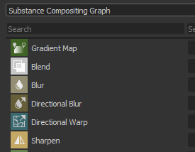
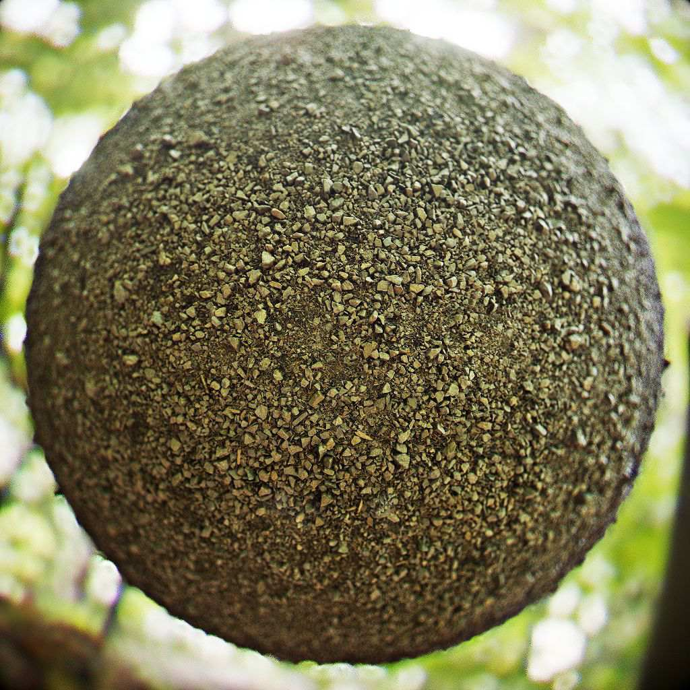

# Versión 2020.1 (10.1)

**Substance Designer 2020.1** incluye un nuevo editor de accesos directos, un complemento de MaterialX y muchas mejoras nuevas para la administración de color con funciones de Adobe Color Engine y panaderos nuevos.

Fecha de publicación: *10 de abril de 2020*

>[!NOTE]
>
> A partir de esta versión, el número de versión de la aplicación cambiará su formato. Lo que debería haber sido **2020.1** ahora se convierte en **10.1.0**.

## Funciones principales

### Nuevo editor de accesos directos para la creación de nodos

En esta versión presentamos un nuevo editor de atajos que permite definir atajos de teclado para acelerar la creación de nodos en los diferentes modos de gráfica.

Se puede acceder al nuevo editor de accesos directos en las preferencias principales a través de **Editar > Preferencias > Accesos directos**. De forma predeterminada, todos los campos de acceso directo están vacíos.

* **Métodos abreviados para cada tipo de gráfico**\
  Es posible definir un método abreviado para cada tipo de gráfica disponible en Substance Designer, desde gráfica de composición normal hasta más avanzada, como funciones y MDL.

  
* **Asignar métodos abreviados para nodos atómicos y filtros personalizados**\
  Por defecto, la interfaz muestra los nodos atómicos para cada tipo de gráfico. El uso del campo de búsqueda permite refinar la lista, pero también hacer que los filtros y nodos de biblioteca personalizados sean accesibles:

  
* **Creando un nuevo acceso directo**\
  Para crear un nuevo método abreviado para un nodo específico, simplemente haga clic en el campo de texto junto a su nombre y escriba las teclas solicitadas en el teclado. Para borrar un método abreviado, utilice el botón de cruz.

  
* **Administrar conflictos de accesos directos**\
  Utilice la información sobre herramientas del icono de advertencia para obtener más información sobre un conflicto. Indica si una clave entra en conflicto con otra existente o si la aplicación ya la utiliza para otro fin.

  

  
* **Buscar accesos directos**\
  Si hay demasiados métodos abreviados de teclado para realizar el seguimiento o si un nodo no está visible de forma predeterminada, utilice el sistema de búsqueda para aislarlos:

  

### Nuevo complemento de MaterialX (beta)

Durante SIGGRAPH 2019 mostramos un plugin MaterialX para Substance Designer. [MaterialX](http://www.materialx.org/) es un formato desarrollado por [Industrial Light &amp; Magic (ILM)](https://www.ilm.com/) que permite a los artistas crear materiales que luego se pueden usar en una amplia variedad de plataformas y muchos usos (como películas, programas de televisión, juegos, experiencias de realidad virtual y manufactura). Este nuevo plugin, que ahora está disponible en versión beta, permite crear materiales de MaterialX para usarlos en otras aplicaciones de DCC compatibles. Echa un vistazo a nuestro reciente [artículo sobre MaterialX](https://magazine.substance3d.com/research-a-portable-shader-graph/) para obtener más información sobre el proceso y los objetivos que hay detrás de este nuevo complemento.

Este nuevo plugin permite:

* Desarrolla sombreadores de procedimientos y texturas en paralelo.
* Cree sombreadores avanzados para Substance Painter con funciones como mapas de detalles y máscaras de procedimientos que se pueden cambiar en tiempo de ejecución.
* Las funciones de sombreado de coincidencia de un motor de juego o canalización de efectos visuales en la ventana gráfica del Substance Designer y el Substance Painter.

Para obtener el complemento, solo tienes que ir a [Substance share](https://share.substance3d.com/libraries/6111) para descargarlo.

### Nueva integración del Adobe Color Engine (ACE)

Además de OpenColorIO, ahora es posible utilizar Adobe Color Engine (ACE) para admitir perfiles ICC en la gestión de color. Esto significa que ahora puede importar y exportar imágenes calibradas para que se correspondan con otro software, como Photoshop y Illustrator.

* **Habilitando Adobe Color Engine**\
  Utilice la configuración del proyecto para definir qué sistema de gestión de color utilizar:

  
* **Cambiando el perfil de pantalla**\
  Al previsualizar imágenes mediante la vista 2D o 3D, utilice el menú desplegable para especificar el perfil que desea utilizar:

  
* **ACES para la administración de color heredada**\
  La transformación de salida de asignación de tonos ACES ahora está disponible con el modo de gestión de color heredado.

### Panaderos mejorados

Hemos refinado algunos de nuestros panaderos con dos cambios principales:

* **Muestreo mejorado**\
  El panadero de Oclusión ambiental, Thickness y curvatura ahora utilizan un nuevo método de muestreo que mejora enormemente la calidad de los resultados horneados. Produce un ruido más atractivo y resultados más estables, sin necesidad de aumentar el recuento de muestras. La imagen siguiente muestra el método de muestreo anterior en la parte superior y el nuevo método en la parte inferior con 4, 8 y 16 muestras de izquierda a derecha (todos los procesamientos se realizaron con el suavizado establecido en submuestreo 4x4).

  {width="600px"}
* **Nueva configuración de normalización**\
  Los panaderos Thickness y Altura (Heightmap) tienen un nuevo parámetro de normalización que permite convertir valores sin procesar en texturas en lugar de valores sujetos en el rango 0-1. Esto es útil con un mapa de height para conocer las distancias crudas entre una malla de baja y alta densidad de polietileno, por ejemplo. El valor del divisor se corresponderá exactamente con la intensidad de desplazamiento que se debe configurar en la malla de baja polietileno para que coincida con la silueta de la malla de alta polietileno. Para interpretar correctamente el mapa de height también hemos expuesto un nuevo parámetro &quot;Valor Cero Escalar&quot; para definir el valor de píxel correspondiente a 0. Además, el factor manual permite corregir posibles problemas de costura en mallas UDIM causados por una normalización por UV-Tile.

  

### Vista 3D mejorada

La vista 3D recibió varias mejoras de calidad de vida que deberían hacer más agradable el trabajo diario:

* **Sincronización de parámetros entre procesadores**\
  Los parámetros de Shader ahora están sincronizados entre OpenGl e Iray, lo que hace que saltar entre ellos sea mucho más fácil.
* **Mostrar vista previa de entrada de textura y agregar parámetro de deshabilitación**\
  Los parámetros de entrada del sombreador ahora muestran una vista previa de su entrada: puede ser un parámetro de color uniforme, un nodo de gráfico o un mapa de bits. También es posible desmarcar un parámetro para desactivarlo temporalmente.

  

  
* **Vista previa del mapa de entorno en la configuración**\
  Al ir a **Vista 3D > Entorno > Editar**, ahora hay una vista previa del mapa de entorno utilizado para iluminar la escena.

  
* **Nuevo sombreador para dejar de iluminar**\
  Se ha incluido de forma predeterminada un nuevo sombreado denominado &quot;unlit&quot;. No reacciona a ninguna iluminación y, en su lugar, se puede utilizar para mostrar una única textura en la ventana gráfica sobre una malla. Esto resulta útil para ver, por ejemplo, las texturas al horno.

  {width="500px"}
* **Rendimiento mejorado en pantallas High DPI con reducción de escala de la ventana gráfica**\
  De forma similar a Substance Painter, ahora hay un nuevo parámetro denominado **Escala de ventana gráfica** en las preferencias principales que detecta que una pantalla utiliza una escala HDPI (como pantallas Retina en MacOS) y divide automáticamente la resolución de la ventana gráfica por 2. Este comportamiento evita dibujar la ventana gráfica con resoluciones demasiado altas y mejora el rendimiento general.\
  Los valores de configuración actuales son:

  * **Ninguno**: sin escala de ventanilla.
  * **Automático** (predeterminado): si la aplicación se encuentra en una pantalla HDPI, la resolución de la ventana gráfica se dividirá por dos.

  

### Nuevo contenido

Esta versión también incluye algunos nodos nuevos o mejorados:

* **Nodo de Renderización PBR mejorado**\
  Este nodo ya se ha introducido en una versión anterior y se ha mejorado considerablemente. Ahora ofrece controles de cámara, nuevas formas (como un plano y un cilindro), efectos posteriores (Profundidad de campo, Bloom/Brillo, Viñeta, etc.) y nuevos tipos de materiales (como Clear-Coat y Anisotropía), así como soporte para materiales con opacidad.\
  Para obtener más información, consulte la [página de documentación](../../../compositing-graphs/nodes-reference-for-com/node-library/material-filters/pbr-utilities/pbr-render/pbr-render.md) dedicada.

  {width="250px"}

  {width="250px"}

  {width="250px"}
* **Nuevo nodo de asignación de Renderizaciones PBR**\
  Como extensión para Renderización PBR, puede utilizar este nuevo nodo para crear vistas previas compuestas de canales de mapa.\
  Para obtener más información, consulte la [página de documentación](../../../compositing-graphs/nodes-reference-for-com/node-library/material-filters/pbr-utilities/pbr-render-mapping/pbr-render-mapping.md) dedicada.

  {width="250px"}

  {width="250px"}
* **Nuevo filtro FXAA**\
  El nuevo filtro implementa el algoritmo de suavizado rápido aproximado (FXAA), que es un método de suavizado. Se puede utilizar en texturas normales para suavizar líneas o bordes irregulares.\
  Para obtener más información, consulte la [página de documentación](../../../compositing-graphs/nodes-reference-for-com/node-library/filters/effects/fxaa/fxaa.md) dedicada.

  {width="600px"}
* **Nuevo filtro Hald CLUT**\
  Este filtro permite ajustar el tono y el color de una imagen con una tabla de búsqueda (LUT) de entrada. Utiliza el formato Hald CLUT para crear una LUT de identidad [disponible aquí](http://www.quelsolaar.com/technology/clut.html).\
  Para obtener más información, consulte la [página de documentación](../../../compositing-graphs/nodes-reference-for-com/node-library/filters/adjustments/hald-clut/hald-clut.md) dedicada.

  {width="600px"}

## Notas de la versión

### 2020.1.3

*(Publicado El 11 De Junio De 2020)*

**Agregado:**

* [Content] Exponer el parámetro &quot;Color mate&quot; en el nodo Escala de grises de transformación segura
* [Contenido] Renderización PBR: Añadir una opción de entrada de fondo personalizada
* [Contenido] Nodos de luz de panorama: nueva opción para probar el color de la imagen de fondo
* [Parámetros] Ocultar parámetros con el indicador &quot;no compatible&quot; de la lista de la ventana Exponer parámetros

**Corregido:**

* [Vista 3D] Bloqueo al cambiar mallas personalizadas en un caso específico
* [Vista 3D] El formato normal siempre es DirectX al inicio
* [Contenido] Ruido Worley 3D: artefacto de procesamiento al utilizar un valor de tamaño de cuadrícula alto
* [Contenido] La fusión de nodos de disolución es incorrecta
* [Contenido] Renderización PBR: quitar advertencia de cocina
* [Contenido] Renderización PBR: El resultado contiene colores negativos en algunos casos
* [Cooker] Problema de inyección de caché para nodos de instancia de varias salidas
* [Explorer] Bloqueo al cerrar un paquete que contiene un gráfico MDL mostrado
* [Graph] 2 pases de cocción: el cambio de tipo de nodo no desencadena una recuperación
* [Graph] Bloqueo al eliminar entradas mientras se utiliza la conexión
* [Graph] Los extremos del vínculo se pueden mover a un espacio vacío
* [MDL] Bloqueo al cancelar la exportación de MDL desde el gráfico de MaterialX
* [MDL] Error al cancelar la exportación a MDLE
* [Presets] Bloqueo en la pestaña Presets tras cambiar el tipo de parámetro incluido en el ajuste preestablecido
* [Resources] La lista de materiales está vacía en el menú contextual del gráfico para mallas vinculadas como no UDIM

### 2020.1.2

*(Publicado El 27 De Abril De 2020)*

**Agregado:**

* [Contenido] Agregar plantilla de filtro de Alchemist
* [Contenido] Renderización PBR: añadir parámetros para controlar las intensidades de las sombras difusas/de specular
* [Contenido] Nodos de luz de forma: añadir parámetro de posición de cámara
* [Noticias] El estilo de grupo &quot;Flecha&quot; se rompe la primera vez que se muestra la ventana
* [Bakers] Añada el método abreviado Z a la vista 2D para ver la imagen en 1:1
* [Project] Ocultar el alias $(PROJECT\_DIR) de la lista
* [Explorador] No crear recursos personalizados para recursos que no son un archivo en disco

**Corregido:**

* [Player] Informar de alias que faltan al cargar paquetes SBS
* [Player] Muestra el valor Raíz aleatoria en base decimal
* [Player] Combina todos los mapas de entorno incluidos con Substance Designer
* [Player] Bloqueo al salir de macOS High Sierra
* [Player] No se pueden cargar los paquetes que utilizan la carpeta sbs://
* [Contenido] Ruido Worley 3D: artefacto de procesamiento al utilizar un valor de tamaño de cuadrícula alto
* [Content] No se utiliza la entrada &#39;mayor que cero&#39; en el nodo &#39;Onda&#39;
* [Contenido] Luz plana: El modo de posición del espacio mundial no funciona
* [Contenido] Luz de esfera: la posición de la luz interna no funciona correctamente
* [Bakers] Bloqueo al hornear con la ventana de hornear mientras se está ejecutando la opción Actualizar todos los mapas con bake
* [Panaderos] Fallo de horneado en Optix para AO desde Mesh usando Baja como Alta con un mapa Normal
* [Bakers] La resolución de la vista previa de los archivos UVT no coincide con el tamaño de la pantalla
* [Vista 3D] El mapa de bits asignado se reemplaza al cargar un MDL si el valor predeterminado no es una textura 2d
* [Vista 3D] Los widgets de Propiedades de materiales cambian después de restablecer una propiedad
* [Vista 3D] La preferencia global de formato normal ya no funciona
* Biblioteca [MatX]: La categoría MaterialX Graph no muestra todos los nodos disponibles
* [MatX] El menú contextual de un gráfico personalizado puede contener subcarpetas vacías en la carpeta &quot;Agregar nodo&quot;
* [SBSAR] La entrada principal se vuelve a la primera entrada de la lista
* [Biblioteca] Solo se incluye el primer gráfico de SBSAR con varios gráficos
* [CustomGraph] Los nodos que no forman parte del tipo de gráfico actual se crean automáticamente en algunos casos
* [Iray] El parámetro &#39;Profundidad&#39; de proyección de cuadro no funciona correctamente
* [Preferencias] Mejora del diseño en la configuración del proyecto
* [Parámetros] Bloqueo al mover un widget de posición después de eliminar un parámetro
* [UI] Bloqueo al cambiar la jerarquía de usos en el nodo de salidas
* [Graph] Bloqueo al utilizar un cuadro de selección en un comentario y un nodo marcado

### 2020.1.1

*(Lanzamiento 10 de abril de 2020)*

**Corregido:**

* [Vista 3D] El uso de memoria es demasiado alto cuando se trabaja en un gráfico de composición
* [Contenido] Formas inesperadas en la salida no cuadrada de nodos &quot;Polígono&quot;
* [Contenido] Renderización PBR: La cámara ortográfica no funciona correctamente si no se usa una resolución cuadrada
* [Contenido] Renderización PBR: El efecto bokeh con remolino aumenta el brillo del borde de la imagen
* [Gestión de color] El selector de color del cuadro de diálogo Nuevo mapa de bits no se gestiona por color.
* [Gestión de color] Los selectores de color de las herramientas de pintura y vectores en la vista 2D no se administran por color.

### 2020.1.0

*(Publicado el 9 de abril de 2020)*

**Agregado:**

* [Atajos] Administrador de accesos directos para la creación de nodos
* [Contenido] Nuevo nodo de Renderización PBR
* [Contenido] Nuevo filtro FXAA
* [Contenido] Nuevo filtro Hald CLUT
* [Content] Exponer el filtrado en nodos &quot;Crop&quot;
* [Vista 3D] Mejora del flujo de trabajo de asignación de texturas y parámetros de sombreado
* [Vista 3D] Nuevo sombreado sin iluminar
* [Vista 3D] Agregue un &quot;Valor cero escalar&quot; a los sombreadores de desplazamiento
* [Vista 3D] Añada una opción para reducir la resolución de la ventana gráfica cuando se activa PPP altos
* [Vista 3D] GLSLFX: Permitir establecer la información de la interfaz gráfica de usuario en sampler (default, min, max, guiMin, guiMax, guiStep, guiWidget, guiName, guiGroup)
* [Vista 3D] Agregar &#39;Cargar estado con malla...&#39; en el menú Escena
* [Vista 3D] Añada la transformación de salida de ACES tonemapped en el modo de administración de color heredado
* [Panaderos] Nuevo método de muestreo en AO, Curvatura, Bent Normal, panaderos de Thickness
* [Panaderos] Nuevas opciones de normalización en panaderos de Height y Thickness
* [Gestión de color] Integración de Adobe ACE (Adobe Color Engine)
* [Gestión de color] Añadir opciones para definir el comportamiento predeterminado cuando falta el perfil ICC
* [Parámetros] Hacer que los reguladores aumenten de forma coherente con Substance Painter
* [Packaging] Agrupa tantos archivos .dll de Qt como podamos para los scripts de Python
* [Project] Desactive la configuración de los archivos de proyecto de solo lectura y comunique claramente ese estado
* [Preferencias] Ocultar opciones de configuración no claras específicas relacionadas con la capacidad de respuesta y los períodos de cálculo
* [UI] Cambiar nombre Pow2 -> 2Pow
* [Propiedades] Optimizar la visualización de propiedades de gráficos de composición
* [AXF] Actualización a AXF SDK 1.7.1

**Corregido:**

* [Vista 3D] Los parámetros de luz ambiente no son visibles aunque estén activados
* [Vista 3D] glslfx: El widget de color siempre es un vec3 sin alfa
* [Vista 3D] El conjunto de asignaciones de entorno de un recurso no se guarda en el recurso de escena
* [Vista 3D] Iray: La luz ambiente se convierte en una luz puntual en el origen de la escena
* [Vista 3D] glslfx: El widget de color siempre es un vec3 sin alfa
* [Parámetros] La URL del paquete de instancias no es correcta en el grupo de atributos.
* [Parameters] Bloqueo al exponer parámetros
* [Parámetros] Los iconos no se alinean correctamente en los parámetros de los nodos Curva
* [Parámetros] La cadena de nodo &#39;Texto&#39; solo se muestra en modo &#39;Vista previa&#39; cuando se muestra
* [Parameters] Bloqueo al cambiar el nombre de un parámetro de entrada utilizado en la instrucción &#39;Visible If&#39;
* [Parameters] Bloqueo al eliminar un nodo Levels que tiene una función definida en cualquiera de sus parámetros
* [UI] El icono de advertencia de la lista de parámetros de entrada se coloca encima de un botón existente
* [UI] Las advertencias no se borran en el elemento de parámetro de entrada correcto en un caso específico
* [UI] Impedir el &quot;¿Es UDIM de malla?&quot; que aparece cuando las UV de malla están estrictamente en el mosaico [0,1]
* [UI] Las listas desplegables de ajustes preestablecidos se pueden desplazar con la rueda del ratón con un simple desplazamiento del ratón
* [UI] La opción Cálculo de salida en atributos de gráficos se denomina incorrectamente
* [MDL] Bloqueo al colocar un recurso de gráfico SBS en un gráfico MDL
* [MDL] El nodo SBS con entrada de imagen no funciona correctamente
* [MDL] Enlaces de textura y nombres de uso incorrectos
* [Graph] El grupo de valores de entrada y el uso se omiten en el modo de creación de vínculos &quot;Material&quot;
* [Graph] Los valores de entrada utilizan el valor predeterminado en lugar de los datos de entrada para los valores booleanos
* [Panaderos] Normales incorrectas en el Panadero de Normales Espaciales Mundiales usando un mapa Normal tangente en casos específicos
* [Bakers] Uso excesivo de la memoria al hornear con la ventana de previsualización abierta
* [Presets] El ajuste preestablecido dañado hace que el procesamiento se bloquee
* [Presets] El ajuste preestablecido no afecta al parámetro booleano del SBS antiguo
* [Biblioteca] Los recursos del primer paquete abierto se muestran en el menú flotante de creación de nodos
* [Publish] La publicación en SBSAR devuelve el código de error 13 en SBSCooker en macOS
* [Publish] Advertencia de argumento obsoleto en SBSCooker al publicar en SBSAR
* [API] No se pueden obtener los metadatos de un paquete procedente de un archivo .sbsar
* [Exportar] En el modo heredado, la opción de espacio de color vuelve a los valores predeterminados para salidas específicas
* [Vista 2D] Copiar al portapapeles no tiene en cuenta el estado de Gestión de color
* [Unix] Designer ignora las señales del sistema
* [Biblioteca] Algunos filtros de la biblioteca no funcionan correctamente debido a etiquetas traducidas
* [Cocinero] La raíz cuadrada de números negativos debe devolver 0 en lugar de NaN
* [Vista 2D] Los canales rojo y azul se intercambian después de deshacer el primer trazo de pintura
* [Consola] Demasiados mensajes de advertencia en la consola &quot;QPixmap::scaled: Pixmap es un pixmap nulo&quot;
* [Contenido] &quot;Resplandor de forma&quot;: aviso cocción
* [Dependencias] Asignar un gráfico ubicado en un paquete diferente a una malla no crea dependencias
* [Iray] Las propiedades de material se vuelven inactivas después de cambiar la geometría

**Agregado:**

* [Atajos] Administrador de accesos directos para la creación de nodos
* [Contenido] Nuevo nodo de Renderización PBR
* [Contenido] Nuevo filtro FXAA
* [Contenido] Nuevo filtro Hald CLUT
* [Content] Exponer el filtrado en nodos &quot;Crop&quot;
* [Vista 3D] Mejora del flujo de trabajo de asignación de texturas y parámetros de sombreado
* [Vista 3D] Nuevo sombreado sin iluminar
* [Vista 3D] Agregue un &quot;Valor cero escalar&quot; a los sombreadores de desplazamiento
* [Vista 3D] Añada una opción para reducir la resolución de la ventana gráfica cuando se activa PPP altos
* [Vista 3D] GLSLFX: Permitir establecer la información de la interfaz gráfica de usuario en sampler (default, min, max, guiMin, guiMax, guiStep, guiWidget, guiName, guiGroup)
* [Vista 3D] Agregar &#39;Cargar estado con malla...&#39; en el menú Escena
* [Vista 3D] Añada la transformación de salida de ACES tonemapped en el modo de administración de color heredado
* [Panaderos] Nuevo método de muestreo en AO, Curvatura, Bent Normal, panaderos de Thickness
* [Panaderos] Nuevas opciones de normalización en panaderos de Height y Thickness
* [Gestión de color] Integración de Adobe ACE (Adobe Color Engine)
* [Gestión de color] Añadir opciones para definir el comportamiento predeterminado cuando falta el perfil ICC
* [Parámetros] Hacer que los reguladores aumenten de forma coherente con Substance Painter
* [Packaging] Agrupa tantos archivos .dll de Qt como podamos para los scripts de Python
* [Project] Desactive la configuración de los archivos de proyecto de solo lectura y comunique claramente ese estado
* [Preferencias] Ocultar opciones de configuración no claras específicas relacionadas con la capacidad de respuesta y los períodos de cálculo
* [UI] Cambiar nombre Pow2 -> 2Pow
* [Propiedades] Optimizar la visualización de propiedades de gráficos de composición
* [AXF] Actualización a AXF SDK 1.7.1
