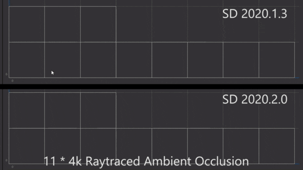
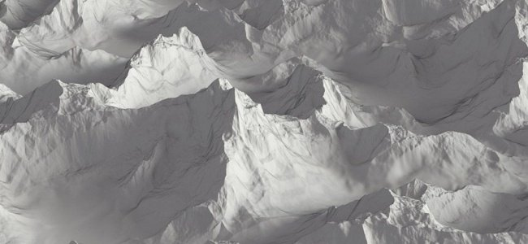

# Versión 2020.2 (10.2)

**Substance Designer 2020.2** incluye una nueva actualización de Substance Engine, un flujo de trabajo mejorado para exponer parámetros, algunas mejoras de rendimiento y nuevo contenido.

Fecha de publicación: *12 de octubre de 2020*

## Funciones principales

### Nueva actualización del motor (versión 8)

En esta nueva versión, el Substance Engine se encuentra ahora en la versión 8 y trae nuevas funcionalidades y varias mejoras:

* **Valores predeterminados para imágenes de entrada**\
  Las entradas de imagen en el gráfico ahora pueden definir un color predeterminado, lo que resulta útil para volver a un valor adecuado cuando no hay nada cargado o conectado a esa entrada.

  {width="600px"}

* **Nuevos modos de distancia**\
  [El nodo de distancia](../../../compositing-graphs/nodes-reference-for-com/atomic-nodes/distance/distance.md) ahora tiene dos nuevos modos que cambian la forma en que se realiza el cálculo:

  * **Euclidean** (modo original): distancia recta entre puntos en geometría euclidiana.
  * **Manhattan**: distancia entre puntos pero limitada en una cuadrícula, similar a los bloques de la ciudad.
  * **Chebyshev**: distancia máxima de la diferencia de dos puntos en una cuadrícula de tamaño uniforme.

  {width="600px"}

* **Nueva interpolación de degradado**&#x200B;[&#x200B; El nodo de degradado](../../../compositing-graphs/nodes-reference-for-com/atomic-nodes/gradient-map/gradient-map.md) tiene un nuevo modo **Suavizar** para interpolar teclas que produce transiciones de colores mucho más naturales. Funciona mirando las teclas de los vecinos. Se ha cambiado el nombre del modo anterior **Interpolation** a **Flat Tangent**.

  {width="600px"}

  

  También hay un parámetro adicional para el modo **Suavizar** que controla la longitud de la Tangente utilizada para calcular la curva que se fusiona entre los colores. Un valor de 0 significa que las tangentes tienen una longitud de 0, mientras que un valor o 1 significa que las tangentes tendrán la mitad de la longitud entre dos teclas.

  

* **Nodo de curva mejorado**&#x200B;[&#x200B; El nodo de curva](../../../compositing-graphs/nodes-reference-for-com/atomic-nodes/curve/curve.md) ahora puede generar directamente una imagen en escala de grises. Este cambio permite definir una curva y generarla directamente sin necesidad de conectar primero una textura de degradado.

  

### Parámetro de exposición mejorado

El flujo de trabajo para exponer y editar parámetros se ha mejorado para que sea más sencillo:

* **Acciones de menú mejoradas** Las acciones para exponer y editar los parámetros expuestos se han separado para ser más explícitas. También se han introducido nuevos métodos abreviados para editar de forma más fácil y rápida los parámetros expuestos. Por ejemplo, ahora hay un botón dedicado para editar la función de un parámetro y una acción dedicada para saltar al parámetro de gráfico expuesto.

  

  

* **Configurando el nuevo parámetro directamente desde el cuadro de diálogo** Al exponer un parámetro, ahora se puede acceder a todos los controles normales, como la descripción y los valores predeterminados, desde el cuadro de diálogo **Exponer parámetro**. Esto hace que la configuración y creación de nuevos parámetros de Graph sea mucho más fácil y rápida, evitando la necesidad de ir a la vista de parámetros de Graph inmediatamente después de crear un parámetro.

  {width="600px"}

### Configuración de iconos mejorada para el gráfico del Substance

La configuración de miniaturas en el gráfico de Substance ahora es mucho más fácil con la interfaz mejorada:

* **Generación automática de miniaturas de gráficos**\
  Ahora es posible generar automáticamente una previsualización para un gráfico de Substance simplemente haciendo clic en el botón Generar situado junto al icono en los parámetros del gráfico. Actualmente solo admite gráficos con el flujo de trabajo de PBR Metallic/Roughness como nodos de salida. Al generar la miniatura, la intensidad del desplazamiento se calcula a partir del valor del Tamaño físico, si se ha definido, de lo contrario, se establece de forma predeterminada un valor de 0,1.

  {width="600px"}

* **Agregando miniaturas personalizadas con los nuevos botones**\
  Hemos añadido varios botones nuevos para simplificar la configuración de las miniaturas personalizadas:

  * **Examinar**: Abra el cuadro de diálogo de un archivo para cargar una imagen. También se puede hacer haciendo clic en el icono de carpeta junto a los botones.
  * **Generar**: Ver la demostración de arriba.
  * **Pegar**: Cargue una imagen del portapapeles.
  * **Quitar**: Quite la imagen asignada actualmente al icono.

  

### Rendimiento mejorado

En esta nueva versión se han realizado dos nuevas optimizaciones que reducen el tiempo entre iteraciones:

* **Rendimiento mejorado de cálculo de gráficos**\
  Los nodos de salida ahora se calculan directamente cuando se solicitan en lugar de calcular los nodos intermedios en el camino (que ahora está en un segundo paso). Este cambio permite previsualizar los resultados de un gráfico mucho más rápidamente, incluso al ajustar los nodos raíz. En la siguiente comparación, la optimización permite ver más iteraciones de la gráfica en el mismo período de tiempo (aquí con un material con una resolución 4K):

  

* **Generación mejorada de dilatación y difusión de Bakeres**\
  La generación de dilatación y difusión de texturas hechas un bake es ahora hasta 4 veces más rápida que en las versiones anteriores. Esto reduce el tiempo de espera entre pasteles.

  

### Nuevo contenido

En esta versión, verá la adición de algunos nodos nuevos, así como posibilidades adicionales en algunos ya existentes:

* **[Nuevo filtro de umbral](../../../compositing-graphs/nodes-reference-for-com/node-library/filters/adjustments/threshold/threshold.md)**&#x200B;Este nodo permite aislar rápidamente como una máscara en blanco y negro alguna parte de una imagen en función de una entrada de escala de grises. Esto es similar en la práctica al filtro de histograma ya existente, pero es más cómodo de usar en el día a día. Obtén más información al respecto en la [página de documentación dedicada](../../../compositing-graphs/nodes-reference-for-com/node-library/filters/adjustments/threshold/threshold.md).

  {width="650px"}

* **[Nuevo filtro de sección cruzada](../../../compositing-graphs/nodes-reference-for-com/node-library/filters/effects/cross-section/cross-section.md)**&#x200B;Este nodo permite visualizar la forma de una entrada de escala de grises como perfil, lo que facilita la creación de mapas de altura y formas con este filtro como herramienta de depuración. Para obtener más información, consulta la [página de documentación dedicada](../../../compositing-graphs/nodes-reference-for-com/node-library/filters/effects/cross-section/cross-section.md) .

  {width="600px"}

  {width="600px"}

* **Tile Generator [mejorado](../../../compositing-graphs/nodes-reference-for-com/node-library/texture-generators/patterns/tile-generator/tile-generator.md) y** [**Sampler de mosaico**](../../../compositing-graphs/nodes-reference-for-com/node-library/texture-generators/patterns/tile-sampler/tile-sampler.md)\
  Estos dos nodos ahora tienen nuevos parámetros para ampliar aún más las capacidades y los usos:

  * **Mantener proporción**: Mantenga la proporción de los mosaicos, sin necesidad de compensar manualmente el tamaño cuando el recuento en los ejes X e Y es desigual.
  * **Absoluto**: Mantenga el azulejo en un porcentaje predefinido de la anchura de la imagen final.
  * **Píxel**: Defina el tamaño del azulejo en píxeles.

  Para obtener más información, consulte la [página de documentación dedicada](../../../compositing-graphs/nodes-reference-for-com/node-library/texture-generators/patterns/tile-generator/tile-generator.md).

  

### Miscelánea

**Iray** se ha actualizado a la versión 2020.1.0, que agrega la compatibilidad de la nueva GPU Ampere de NVIDIA (como RTX 3080 y RTX 3090).

## Notas de la versión

### 2020.2.0

*(Publicado El 12 De Octubre De 2020)*

**Agregado:**

* [Content] Añadir nodo &quot;Sección cruzada&quot;
* [Contenido] Añada la función &quot;Cross product vec2&quot; a functions.sbs
* [Contenido] Añadir nodo de valor &quot;Obtener tamaño&quot;
* [Contenido] Añada la función &quot;Orthogonal vec2&quot; a functions.sbs
* [Contenido] Añadir funciones Average a functions.sbs
* [Contenido] Añadir filtro de umbral
* [Contenido] Coincidencia de color: añadir una entrada de máscara para especificar dónde aplicar el filtro
* [Contenido] Tile Generator/Sampler: añadir nuevas opciones para controlar el tamaño del patrón
* [Contenido] Actualizar nodo de Renderización PBR con valor predeterminado para entradas de imagen
* [Parámetros] Añada iconos de advertencia para resaltar problemas en Parámetros de instancia
* [Parámetros] Ignorar instrucciones If visibles para entradas/salidas que implican parámetros que tienen una función aplicada
* [Parámetros] Mejora de la experiencia de usuario para la asociación de grupos
* [Parámetros] Repaso de la forma de exponer un solo parámetro
* [Parámetros] Resaltar parámetros expuestos
* [Parámetros] Mejorar Limpieza de parámetros no utilizados
* [Engine] Nodo de curva: nueva opción para generar la textura de la curva
* [Motor] Valores predeterminados en imágenes de entrada
* [Motor] Nodo de distancia: nuevos modos de distancia (distancias de Manhattan y Chebyshev)
* [Motor] Nodo de degradado: nuevo modo de interpolación para tener una mezcla más natural entre colores
* [Motor] Algunos parámetros aparecen ahora atenuados en gris según otros parámetros
* [UX] Acepte colores de RGB de 6 dígitos en el campo hexadecimal del Selector de color
* [UX] Evite mostrar las propiedades de los comentarios tan pronto como se seleccionan
* [UX] Visualización de grupos relevantes al empezar a escribir un nombre de grupo
* [UX] Acceso directo para reexportar salidas de gráficos
* [UX] Haga que todas las combinaciones de campos de texto desplegables tengan un aspecto diferente al de las combinaciones normales
* [GraphRender] Muestra las miniaturas de los nodos una a una y no sólo cuando se calculan todos
* [GraphRender] Mejora el retraso de cancelación durante el procesamiento de gráficos
* [GraphRender] Mejorar la precisión de la barra de progreso de procesamiento
* [Miniaturas] Cálculo automático de miniaturas (icono)
* [Miniaturas] Repaso de la experiencia de usuario para añadir una miniatura (icono) a un paquete
* [Preferencias] Habilitar Trazado de rayos de GPU de forma predeterminada para nuevos usuarios
* [Preferencias] 3DView / OpenGL / Calidad: reemplazar el regulador para los recuentos de muestras por una lista de opciones más intuitiva
* [Panaderos] Mejorar el rendimiento de los procesos posteriores
* [Gestión de color] Mostrar el espacio de color de trabajo actual en el cuadro de diálogo de preferencias.
* [Iray] Cambia automáticamente al modo de CPU cuando no hay GPU compatible
* [Prestaciones] Mejorar el tiempo de respuesta para calcular el nodo en el que estamos interesados (ahora calculado primero)
* [API de Python] Nuevo método addActionToExplorerToolbar para añadir iconos a la barra de herramientas del explorador
* [Resources] Actualización a FBX 2020.0.1
* [iRay] Actualización a Iray 2020.1.0
* [API] Añadir acceso de Python a la configuración y las propiedades de gestión de color

**Corregido:**

* [Gráfico] Al cambiar el tamaño principal o el mosaico uv, no se cancela el procesamiento actual
* [Graph] Bloqueo al mover una conexión de salida y pulsar Alt+LMB
* [Graph] Bloqueo al mover conexiones en modo Material o Material compacto
* [Graph] Los nodos de entrada no pueden previsualizar recursos de mapa de bits
* [Graph] Compatibilidad de nodos interrumpida en instancias
* [Graph] Se invalidan demasiados nodos al cambiar un parámetro de gráfico
* [Content] La forma de salida &quot;Shape Extrude&quot; se voltea en casos específicos: se necesita una nueva versión, la antigua ya no se usa
* [Contenido] Resultado incorrecto con la variación de color personalizada en el nodo Coincidencia de color
* [Contenido] La proporción de tamaño X/Y en Atlas scatter tiene el efecto contrario
* [Contenido] La proporción de tamaño X/Y en la salpicadura de formas tiene el efecto contrario
* [Vista 3D] Bloqueo en la operación Deshacer después de cargar un recurso de escena de un paquete
* [Vista 3D] El entorno personalizado no se guarda en SBSSCN si la ruta tiene un alias con caracteres especiales
* [Vista 3D] Al cambiar el formato normal en los ajustes de Material, se producen estados volteados
* [UI] El texto del botón Establecer como principal se desborda del área de visualización
* [UI] La posición de la ventana principal no se restaura correctamente al trabajar en modo de ventana
* [UI] El texto de la barra de estado se desplaza cuando la ventana se muestra completa o se arrastra cerca del borde de la pantalla
* [Iray] Bloqueo con el mensaje &quot;Etiqueta no válida&quot; al cambiar entre procesadores
* [Iray] Caras visibles en superficies no opacas
* [Presets] Bloqueo al aplicar ajustes preestablecidos en instancias de algunos Substance Source
* [Presets] Se muestra un nombre incorrecto después de deshacer en la instancia de SBS
* [Renderizar] Procesamiento incorrecto al ajustar un parámetro en el modo de previsualización
* [Panaderos] Actualizar varios mapas con bake provoca advertencias que bloquean algunos pasteles
* [Cooker] Al ajustar nodos SBSAR en instancias SBS, se obtiene una salida 0 de la instancia
* [Explorer] Los alias personalizados no se pasan cuando se utiliza &quot;Guardar y abrir en Substance Player&quot;
* [Editor de degradado] La selección de color absoluto no afecta a todas las teclas seleccionadas
