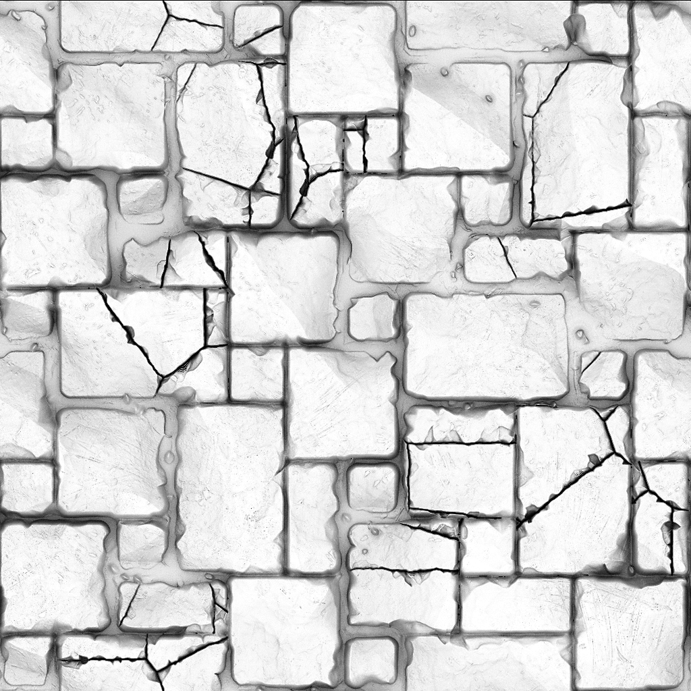
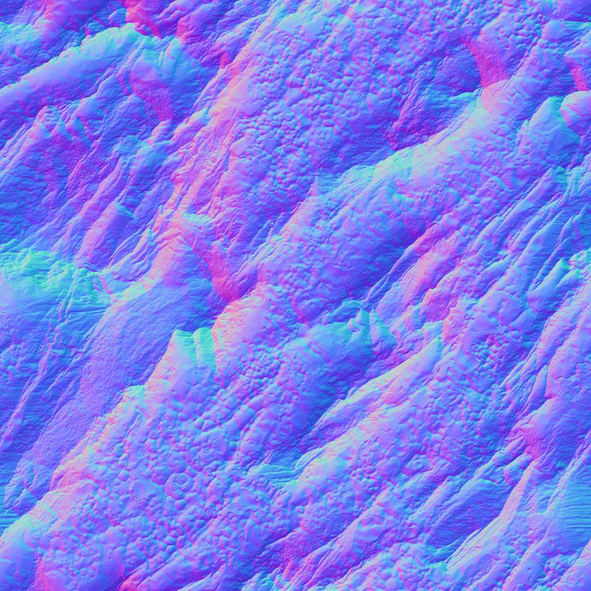

# Versión 11.2

**Substance 3D Designer 11.2** ha cambiado ligeramente de nombre y ahora está conectado a Adobe Creative Cloud. Incluye la primera versión de Substance Model Graphs, la funcionalidad Enviar a, varios nodos basados en Raytrace y algunos cambios en la interfaz de usuario.

Fecha de publicación: *23 de junio de 2021*

## Funciones principales

### Nuevos gráficos del modelo de Substance

Hay disponible un tipo de gráfico completamente nuevo, el gráfico del modelo de Substance, que te permite crear modelos 3D procedimientos mediante una interfaz de nodo familiar.

<table>
<tr style="border: 0;">
<td style="border: 0;" valign="top">

{width="300px"}

</td>
<td style="border: 0;" valign="top">

{width="300px"}

</td>
</tr>
</table>

Profundiza en la nueva sección de documentación dedicada para obtener más información.

Se trata de una primera versión, por lo que debe esperar algunas limitaciones.

### Funcionalidad Enviar a

Las versiones de Adobe de Substance 3D Designer tienen la nueva funcionalidad Enviar a , que le permite enviar recursos a otras aplicaciones de Substance 3D rápidamente. Ya no es necesario publicar como SBSAR y cargar archivos individuales, Enviar a resuelve esto con un solo clic.

>[!NOTE]
>
> Las versiones de Steam de Substance 3D Designer no incluyen la funcionalidad Enviar a .

### Nuevos nodos de Raytrace

No se ha completado ninguna versión de Designer sin algunos nodos nuevos. Basándose en la extraordinaria fortaleza de la Renderización PBR, 5 nuevos nodos basados en RT se unen a nosotros en esta versión.

<table>
<tr style="border: 0;">
<td style="border: 0;" valign="top">

{width="300px"}

</td>
<td style="border: 0;" valign="top">

{width="300px"}

</td>
</tr>
</table>

RTAO hace un trabajo aún mejor en el AO nítido y correcto que el nodo anterior de HBAO.

{width="300px"}

Cáustico genera cáusticos con trazo rayado y correctos físicamente basados en un mapa de alturas, como un simple ruido de Perlin. Ideal para crear texturas animadas realistas de flipbook para los cáusticos en tiempo real.

{width="300px"}

RT Shadow genera sombras precisas y con trazo de rayo, con unos pocos controles sencillos.

<table>
<tr style="border: 0;">
<td style="border: 0;" valign="top">

{width="200px"}

</td>
<td style="border: 0;" valign="top">

{width="200px"}

</td>
<td style="border: 0;" valign="top">

{width="200px"}

</td>
</tr>
</table>

RT La irradiancia es la más avanzada de los nuevos nodos. Hace irradiancia con trazo de rayo basado en un material con mapa de altura, y un mapa de entorno y/o un mapa de Emisivo.

{width="600px"}

Eso significa que puedes hacer texturas con iluminación hecha un bake previamente, como en el caso de proyectos estilizados, o puedes hacer un bake en un resplandor trazo de rayo que rebota en tu mapa de altura.

{width="300px"}

Y por último está el nodo Bent Normal. En comparación con una conversión normal normal, este nodo utiliza AO para modificar el mapa normal y utilizar esa información de AO. Antes de que necesite bakeres de malla para crear el efecto, este nodo lo hace en un espacio de textura para usted.

### Adobe Standard Material Shader

En nuestros esfuerzos por unificar materiales y representaciones en todas nuestras aplicaciones, el nuevo sombreador predeterminado en la vista 3D es el Sombreador de Adobe Standard Material. A primera vista, no es diferente del antiguo sombreador de rugosidad metálica PBR (de todas formas, se basa en él), pero admite muchos más canales exóticos, lo que le permite previsualizarlos sin necesidad de un procesador externo.

### Cambios de IU

Se han realizado pequeñas modificaciones en la interfaz de usuario, pero las más obvias son un menú Archivo > Nuevo paquete mejorado, que permite elegir el tipo de gráfico, y botones mejorados y actualizados en la barra de herramientas principal, que proporciona accesos directos para nuevos tipos de gráficos y su envío a otras aplicaciones.

## Tutoriales

A continuación, se muestran nuestros tutoriales en vídeo sobre las nuevas funciones:

## Notas de la versión

### 11.2.0

*(Publicado El 23 De Junio De 2021)*

**Agregado:**

* [Marca] Substance Designer se convierte en Adobe Substance 3D Designer
* [Modelos de Substance] Nuevos gráficos de modelos de Substance para crear modelos en 3D procedimientos
* [Contenido] Añadir nuevos mapas de entorno HDR.
* [Content] Nuevo nodo Normal doblado
* [Contenido] Nuevo nodo de Oclusión de ambiente de RT
* [Contenido] Nuevo nodo de RT Caustics
* [Contenido] Nuevo nodo de RT Caustics
* [Contenido] Nuevo nodo Irradiancia RT
* [Content] Nuevo nodo Sombras de RT
* [Interoperabilidad] Enviar recurso a Painter, iniciará Painter y agregará o actualizará el recurso en la biblioteca (requiere un plan Substance 3D de Adobe)
* [Interoperabilidad] Enviar recurso a Sampler, iniciará Sampler y agregará o actualizará el recurso en la biblioteca (requiere un plan Substance 3D de Adobe)
* [Interoperabilidad] Examine el recurso en Adobe Bridge y se iniciará Bridge en la ubicación del recurso (requiere un plan de Adobe Substance 3D)
* [ASM] Compatibilidad con el nuevo Adobe Standard Material (ASM) en Gráfico de Substance y MDL Graph
* [ASM] Adición de plantillas de ASM
* [ASM] Agregar sombreador de OpenGL para ASM
* [ASM] Establecer el sombreador de ASM como sombreador predeterminado
* [General] Agregar todos los archivos temporales al directorio temporal definido por el usuario
* [General] Nuevo comando &#39;Guardar una copia como&#39;
* [General] Menú Actualizar archivo
* [General] Menú Ayuda de actualización
* [Publish] Nueva ventana de publicación
* [Publish] Opción Añadir en las preferencias para no guardar el archivo SBSAR al publicar un archivo SBSAR
* [Propiedades] Agregar un campo de tipo de gráfico a las propiedades del gráfico
* [Propiedades] Reordena las propiedades de los gráficos de una forma más relevante
* [Branding] Nueva ventana Acerca de
* [Branding] Actualizar el estilo de aplicación
* [GLSLFX] Añadir una etiqueta a las técnicas
* [GLSLFX] Añada la posibilidad de establecer la etiqueta de un sombreador GLSLFX
* [Metadatos] Añadir metadatos en los recursos del paquete
* [Metadatos] Permitir la edición de metadatos para gráficos, entradas, salidas y recursos
* [Localización] Nuevas traducciones en alemán, francés y chino simplificado
* [UX] Zoom inverso en la vista 3D en el caso de arrastrar el ratón
* [AXF] Actualice a la versión 1.8.0
* [Registros] Agregar complementos instalados a los registros
* [VFX] Añadir configuración de ACES 1.2 OpenColorIO
* [API de Python] Agregue un método para consultar el directorio tmp especificado en la configuración
* [API de Python] Agregue un método isModified a SDPackage para comprobar si se ha guardado un paquete
* [API de Python] Añadir algunos métodos de conversión de color a SDColorManagementEngine
* [API de Python] Eliminación de objetos de gráficos (comentarios, ubicaciones, fotogramas, ...)
* [API de Python] Exponer la propiedad de Tamaño físico para nodos de instancias de gráficos
* [API de Python] Exponer y guardar una copia como
* [API de Python] Solucionar el método SDPackageMgr.savePackage
* [API de Python] Obtener una lista de los objetos de gráfico seleccionados
* [API de Python] Introducir nuevos nombres de método para trabajar con selecciones de gráficos
* [API de Python] Los complementos no pueden agregar acciones al primer panel del explorador creado

**Corregido:**

* [Parámetros] Los valores negativos en los parámetros Integer1 desplegables producen un comportamiento incongruente en la instancia
* [Parámetros] Problema al incrementar un valor en un widget de ángulo
* [Graph] Problemas de temporización cuando la salida se muestra en la vista 2D o 3D.
* [Internacionalización] Algunos caracteres específicos se convierten en espacios en los identificadores de archivo
* [Preferencias] La etiqueta del archivo &quot;Proyecto de usuario&quot; no se traduce del japonés
* [API de Python] Error de recursividad al ejecutar el método SDUIMgr.getCurrentGraphSelectedNodes()
* [API de Python] SDApplication.getPath(SDApplicationPath.InstallationDir) no devuelve nada
* [API de Python] SDSBSARExporter no envía notificaciones de almacenamiento de archivos
