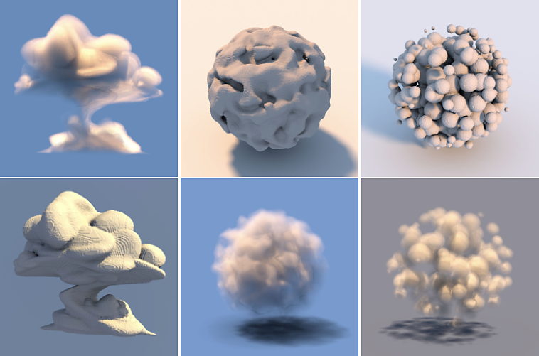

# Versión 12.1

**Substance 3D Designer 12.1** ofrece muchos nodos nuevos para gráficos de materiales de Substance, compatibilidad con formatos de archivo USD y una mayor interoperabilidad con Stager.

Fecha de publicación: *26 de abril de 2022*

## Función principal

### Nuevo contenido para gráficas de materiales de Substance

Se han añadido muchos nodos en esta versión, encontrarás nuevos patrones, nuevos ruidos, nuevos filtros, ...

Eche un vistazo a las páginas de nodos vinculadas a continuación para ver ejemplos de la amplitud de salida que se consigue con estos nuevos y potentes nodos.

* **Nuevos Patrones**

  * Hemos añadido un nuevo nodo <b>Tile Random 2</b> para generar mosaicos adyacentes de proporciones y tamaños aleatorios, lo cual es muy útil para crear rápidamente cuadrículas totalmente irregulares con esquinas inclinadas, redondeadas y biseladas.

    {width="640px"}
  * Nuevo patrón <b>Triangle Grid</b> para generar una cuadrícula hecha de triángulos. Lo estamos utilizando en el material de abajo para simular fácil y perfectamente el grano de cuero. Este generador representa una superficie de vértices en el espacio 3D y se puede utilizar para crear una variedad de estilos poligonales.

    {width="640px"}
* **Nuevos Ruidos**

  * Para ofrecerte más variedad, un conjunto de <b>15 nuevos mapas de Suciedad</b> (Concreto, Fugas, Salpicaduras Sucias, ...) se ha añadido a la biblioteca.

    {width="640px"}
  * También encontrará muchos <b>nuevos ruidos 2D y 3D</b>, como Voronoi (2D y 3D), Voronoi Fractal (2D y 3D), 3D Ridged Fractal y una actualización del actual ruido 3D Perlin (agregando opciones de mosaico y absolutas).\
    Todos estos ruidos se asignan en espacios 3D y ofrecen varios estilos, lo que permite una mayor variedad y control, lo que te dará muchas opciones para crear el mapa perfecto para tu material, como el mar y los materiales de los paneles de ciencia ficción a continuación.

    {width="640px"}

    {width="640px"}
  * Colección de <b>nodos de textura 3D</b> (Posición, SDF, Desplazamiento) y <b>nodos de procesamiento 3D </b> (Superficie o Volumen) para crear y representar texturas 3D, que son un atlas de los sectores de un modelo 3D.

    {width="640px"}

* **Nuevos filtros**

  * Con el nodo <b>Recorte automático</b>, puedes colocar una forma en el *centro* de la imagen sin cambiar su tamaño, o cambiar su tamaño para que se ajuste al espacio. Por ejemplo, tu forma puede retocarse libremente manteniendo una posición y un tamaño consistentes cuando se dispersa.

    {width="640px"}
  * Con el nodo <b> Extend Shape</b>, podrás estirar una sección de una forma en una dirección y distancia personalizadas.

    {width="640px"}
  * Y con el nodo <b>Rotación no uniforme</b> puedes rotar una entrada de acuerdo con un mapa dado.

    {width="640px"}
* **Y también...**

  * Funciones de aceleración (gráfico de funciones) muy útiles para generar un valor de forma no lineal.
  * Por último, esta versión también incluye una versión nueva y más precisa del nodo <b>Quantize</b>, así como un nuevo filtro de utilidad <b>Summed Area Table</b>.

### Mejorar la interoperabilidad

* **Soporte de USD** Además del

  y

  Ahora puede importar y exportar archivos USD ()

  ,

  ,

  ) para utilizarlos como recursos de las gráficas de modelos de su Substance, para hornear o en la vista 3D para mostrar el material de su Substance. También puede utilizar este formato para exportar el gráfico del modelo de Substance o el contenido de la vista 3D.
* <b>Enviar a Stager\
  </b>Ahora puedes enviar el material de tu Substance a Stager con un solo clic, ya que era posible con Sampler y Painter. Gracias a esta función, ya no es necesario publicar como SBSAR y cargar archivos individuales (se requiere la versión 1.2.0 de Stager con el nuevo administrador de materiales)

  

### Miscelánea

* Si está trabajando en tejidos, ahora puede mostrar una malla dedicada en la vista 3D para ver mejor cómo se procesa el material en una forma drapeada. Abra el menú <b>Escena</b> en el panel de vista 3D y seleccione la opción <b>Tela</b> para mostrar este modelo.

  {width="640px"}

* También hemos añadido algunos nodos nuevos de gestión de escenas para los gráficos de modelos de Substance. Estos nodos le permiten cambiar el nombre, cambiar de jerarquía, fusionar o ampliar los elementos de la escena para organizar la jerarquía de la escena. También hay un nuevo nodo para definir el giro de uno o más elementos de una escena.

* Al trabajar en proyectos en Designer, pueden aparecer advertencias y mensajes de error que le notifican de un problema en el proyecto. En esta versión, <b>mejoramos el sistema de administración de errores</b> para mostrar todos los errores y advertencias en el Explorador: todo se enumera en un solo lugar, por lo que es más fácil comprobar si el proyecto contiene algún problema.

  {width="640px"}

## Notas de la versión

### 12.1.0

*(Publicado El 19 De Abril De 2022)*

<b>Agregado:</b>

* [Principal] Nuevo contenido para gráficos de materiales
* [Principal] Enviar materiales a Stager
* [Principal] Compatibilidad con archivos USD
* [Principal] Mejorar la notificación de errores en la interfaz de usuario
* [Principal] Nodos de administración de escenas para gráficos de modelos
* [Contenido] Añadir más opciones a los sonidos de Perlin 3D (mosaico, absoluto...)
* [Contenido] Nuevo nodo Fractal de ruido revestido 3D
* [Content] Nuevo nodo Desplazamiento de textura 3D
* [Contenido] Nuevo nodo Posición de textura 3D
* [Contenido] Nuevo nodo Superficie de procesamiento de textura 3D
* [Content] Nuevo nodo Volumen de procesamiento de textura 3D
* [Content] Nuevo nodo de Campo de distancia con signo de textura 3D
* [Content] Nuevo nodo Recorte automático
* [Content] Nuevas funciones de aceleración
* [Content] Nuevos nodos de Extend Shape
* [Contenido] Nuevos mapas de Suciedad
* [Content] Nuevo nodo Rotación no uniforme
* [Contenido] Nuevo filtro Tabla de área sumada
* [Contenido] Generador de Azulejos Nuevos Aleatorios 2
* [Content] Nuevo generador de patrones de Triangle Grid
* [Content] Nueva versión del nodo Cuantificar escala de grises
* [Contenido] Nuevos ruidos fractales de Voronoi y Voronoi (2D/3D)
* [Contenido] Umbral: agregar modo de comparación &#39;Inferior&#39; e &#39;Inferior e igual&#39;
* [Contenido]&#x200B;[Vista 3D] Añadir un ajuste de malla para mostrar estructuras a los recursos enviados
* [Modelos de Substance] Nuevo nodo Expandir instancias de grupo
* [Modelos de Substance] Nuevo nodo de Fuse
* [Modelos de Substance] Nuevo nodo Cambiar nombre
* [Modelos de Substance] Nuevo nodo Reparent
* [Modelos de Substance] Nuevo nodo Definir tabla dinámica
* [Modelos de Substance] Actualizar a SDK 1.6.0
* [ThirdParty] Actualice Qt (y QtForPython) a 5.15.8
* [ThirdParty] Actualización de Python a 3.9.9
* [ThirdParty] Actualizar OpenSSL a 1.1.1m
* [UI] Mejora el comportamiento del menú Nodo al hacer clic incorrectamente
* [UI] Abrir subgráficos en la misma pestaña incluso si están anclados
* [UI] Botón Eliminar borde de la barra de título del panel Explorador
* [UI] Opción Guardar &quot;No volver a mostrar&quot; en la pantalla de bienvenida entre las distintas versiones
* [Vista 3D] Muestra la unidad de cuadrícula en la ventana gráfica cuando se activa el ayudante &quot;Eje&quot;
* [Automatización] Proporcionar la herramienta de línea de comandos sbsbaker con Designer
* [Gestión de color] Implementación del nuevo motor de GPU para Adobe ACE
* [Cocina] Añadir una opción para cocinar un paquete sin marca de tiempo
* [Graph] Agregar insignias en el gráfico FxMap
* [Biblioteca] Añadir nuevo filtro para las funciones de aceleración
* [Player] Compatibilidad con USD
* [Propiedades] Añada un error de advertencia en el parámetro &quot;Ruta de recurso PKG&quot; de un nodo Bitmap cuando no se encuentra el recurso
* [Substance Engine] Actualización a la versión 8.4.1
* [Yebis] Advertencia al usuario de que los efectos posteriores de Yebis se eliminarán en la siguiente versión
* [Documentación] Nueva página &quot;Advertencias y errores&quot;
* [Documentación] Nueva página que describe la herencia en los gráficos de Substance
* [Documentación] Actualizar la sección &#39;Iray&#39;
* [Documentación] Sección Actualización de &#39;Gráficos MDL&#39;

<b>Corregido:</b>

* [UI] Problemas de recorte en la información sobre herramientas de las plantillas en la nueva ventana de gráficos
* [UI] Texto en blanco difícil de leer en nodos al utilizar el modo oscuro en macOS
* [UI] Problema de diseño en algunos cuadros de diálogo
* [UI] El mensaje de advertencia aparece truncado al crear un gráfico de funciones de Substance en el Explorador.
* [UX] El selector de color desciende en cada nueva apertura
* [UX] La ventana del editor de degradados se mueve hacia arriba cada vez que se genera
* [UX] Las propiedades de los gráficos no se muestran automáticamente para los paquetes cargados
* [Content] Asignador de Flood Fill: Selección de entrada incorrecta en un caso específico
* Flood Fill [Content]: Sangrado de texto en botones de parámetros booleanos
* [Contenido] Rango incorrecto para el parámetro Ángulo de luz de la primera muestra del nodo Multicángulo a Normal
* [Modelos de Substance] Las propiedades del nodo muestran el identificador en lugar del rótulo
* [Modelos de Substance]&#x200B;[Vista 3D] Problema de actualización al volver a abrir un proyecto
* [Modelos de Substance]&#x200B;[Vista en 3D] Problema de actualización al utilizar la vista previa de malla metálica
* [Parámetros] Bloqueo al eliminar entradas de gráficos en sucesión rápida en un caso específico
* [Parameters] Bloqueo al restablecer un parámetro de instancia mientras se edita la descripción de la referencia
* [Bitmap] La detección de UDIM no se activa para los archivos de mapa de bits colocados en el gráfico
* [Graph] Los nodos Bitmap/SVG no se invalidan cuando el recurso se modifica en el disco después de cargar el paquete
* [GraphRender] Pérdida de memoria cuando se cancela la evaluación de gráficos del Substance
* [Localization] La cadena &quot;Rebake all maps for this resource&quot; aparece sin localizar
* [MDL] Parámetro expuesto inicializado en 0 si la entrada está conectada a un nodo Punto no conectado
* [Preferencias] La información sobre herramientas se muestra incluso cuando el cursor está en un espacio vacío
* [Propiedades] Al deshacer un cambio de valor de espacio de color se establece el valor predeterminado en un caso específico
* [Text] No se puede deshacer el cambio de fuente al recurso de fuente que falta
