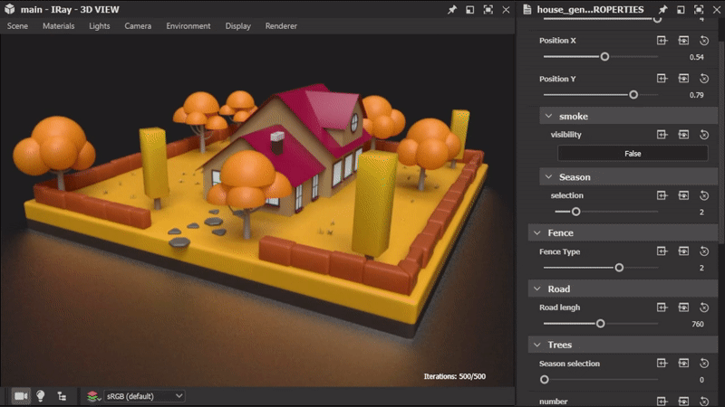

# Versión 12.3

<b>Substance 3D Designer 12.3</b> lleva los gráficos de modelos de Substance a un nuevo nivel con la <b>compatibilidad con subgráficos</b> (o instancias de gráficos), además de <b> &#39;Visible if&#39; </b>control para parámetros expuestos y algunos<b> nuevos nodos</b> dedicados a la edición de curvas. Esta versión también presenta dos nuevos paneles (<b>Bienvenido </b>y <b>Novedades</b>) para mejorar la incorporación de usuarios, así como algunas otras características menores o correcciones de errores que se describen a continuación.

Fecha de publicación: *6 de octubre de 2022*

{width="1111px"}

## Funciones principales

### Compatibilidad de instancias de gráficos en gráficos de modelos de Substance

Si está acostumbrado a crear gráficas, desea poder crear subgráficos (o instancias de gráficas) para reutilizar su trabajo, hacerlo menos recargado y ser más eficiente.\
Esto también es posible ahora para los gráficos de modelos de Substance: Solo tienes que arrastrar y soltar el subgráfico desde el Explorador al gráfico principal para utilizarlo como nodo de instancia.

{width="600px"}

También hemos introducido el concepto de nodos de salida para gráficos de modelos de Substance, como la escena de salida. Ahora tiene la posibilidad de tener una o más salidas en el gráfico.\
Cada salida corresponderá a un pin de salida cuando el gráfico se instancie en otro gráfico.

{width="600px"}

Al pulsar con el botón derecho del ratón en un nodo de instancia, se puede acceder a su subgráfico de referencia para visualizarlo o editarlo.

{width="600px"}

Gracias a los subgráficos y parámetros expuestos, puede crear recursos complejos y aplicar variaciones infinitas, como se muestra en la ilustración siguiente.

{width="600px"}

### Otras mejoras para los gráficos de modelos de Substance

* <b>Visible si para los parámetros expuestos</b>\
  Al exponer parámetros, es posible que desee ocultar o mostrar los parámetros en función del estado de otros parámetros. Por ejemplo, un control deslizante solo se muestra cuando se activa un botón.\
  Con <b>Visible If</b>, puedes agregar condiciones a la visibilidad de los parámetros, manteniendo una interfaz de usuario limpia y funcional. Este mecanismo ya disponible para los gráficos de Substance ahora se extiende a los gráficos de modelos de Substance, utilizando, por supuesto, la misma sintaxis. <b>\
  </b>

  {width="600px"}

* <b>Nuevos nodos dedicados a la edición curva\
  </b>Esta versión incluye algunos nodos nuevos dedicados a la edición curva: <b>Curva inversa</b> intercambia las dos extremidades de una curva, <b>Curva subdividida</b> agrega más vértices en los segmentos de acuerdo con dos métodos, <b>Curva de suavizado </b>suaviza todos los ángulos de una curva 2D y, por último, <b>Curva de desplazamiento</b> infla o desinfla una curva 2D, como se muestra a continuación.<b>

  </b>

  {width="600px"}
* <b>Nueva ventana de gráfico </b>\
  La ventana <b>Nuevo gráfico de modelo de Substance</b> ahora también está disponible para los gráficos de modelo de Substance. Puede añadir sus propias plantillas o seleccionar una predeterminada, a continuación, introduzca directamente el nombre del gráfico y seleccione el paquete al que se añadirá el gráfico.

  {width="600px"}

### Paneles Bienvenido y Novedades

Hemos introducido dos nuevos paneles para ayudarte a dar los primeros pasos con Designer:

En primer lugar, el <b>panel de bienvenida </b>que se muestra la primera vez que *inicia* Designer— ofrece una descripción general del software y su función en el ecosistema de Substance 3D. A continuación, el panel <b>Novedades</b>, que se muestra la primera vez que ejecutas una *nueva versión* de Designer, presenta rápidamente las principales funciones incluidas en esta versión.

También se puede acceder a estos dos paneles desde el menú Ayuda .

### Miscelánea

* <b>Widget de dos botones para parámetros booleanos expuestos</b>\
  Ahora dispone de una nueva forma de mostrar parámetros booleanos en un gráfico de Substance. Además del botón conmutador, puede usar <b>botones contiguos</b> con textos personalizados para hacer más visibles los dos modos diferentes controlados por el parámetro booleano.
* <b>Resolver problemas de escala para pantallas de alta resolución </b>\
  En versiones anteriores, Designer no podía controlar correctamente el factor de escala definido en el sistema operativo. Como puedes ver en la siguiente ilustración, todo se gestiona perfectamente en una pantalla 4K con una escala del 125 %, con todas las fuentes y botones mostrados en un tamaño coherente.\
  Tenga en cuenta que la opción &quot;Deshabilitar alta PPP&quot; en Preferencias se ha restablecido a *False* en esta nueva versión, ya que esta opción ya no es necesaria para tener una interfaz utilizable.

  {width="600px"}

* **Compatibilidad nativa con Apple Silicon (M1 / M2) para la versión de Steam**\
  La versión 12.2 de Designer fue la primera en ofrecer compatibilidad total con las nuevas máquinas Apple basadas en chips M1 o M2, pero esa compatibilidad no figuraba en la edición de Steam. A partir de ahora, todos los usuarios de Designer pueden beneficiarse de una experiencia más rápida y eficaz en estas máquinas.

## Notas de la versión

### 12.3.0

*(Publicado El 6 De Octubre De 2022)*

**Agregado:**

* [General] Panel de bienvenida para nuevos usuarios
* [General] Panel Novedades para mejorar la detección de nuevas funciones
* [Modelo de Substance] Compatibilidad con subgráficos e instancias
* [Modelo de Substance] Compatibilidad visible Si para los parámetros expuestos
* [Modelo de Substance] Agregar compatibilidad con nodos de salida
* [Modelo de Substance] Nodo de desplazamiento de curva
* [Modelo de Substance] Curva revertir nodo
* [Modelo de Substance] Nodo de suavizado de curvas
* [Modelo de Substance] Nodo de subdivisión de curvas
* [Modelo de Substance] Nodo de inserción
* [Modelo de Substance] Actualizar el nodo &quot;Escena de filtro&quot;
* [Modelo de Substance] Hacer que los nodos no atómicos sean detectables en el menú Nodo
* [Modelo de Substance] Añada la acción &quot;Abrir referencia&quot; en el menú contextual de un nodo de instancia
* [Modelo de Substance] Añada una acción &quot;Ver en 3DView&quot; en el menú contextual de nodos que se pueden enviar a 3DView
* [Modelo de Substance] Muestra automáticamente las propiedades de un nodo después de exponerlo
* [Modelo de Substance] Crear la ventana &#39;Nuevo gráfico de modelo de Substance&#39; con la lista de plantillas
* [UI] Mejora la coherencia de las opciones de guardado de imágenes en la vista 2D y la vista 3D
* [UI] Cambie el nombre &quot;Vínculo > Malla 3D&quot; a &quot;Vínculo > Escena 3D&quot; en el menú contextual del Explorador
* [UI] El diseño de restablecimiento ahora se aplica a todas las ventanas flotantes
* [UI] Uso de la etiqueta &quot;Ver resultados en vista 3D&quot; en menús contextuales para gráficos
* [Biblioteca] Compatibilidad con gráficos de modelos de Substance no atómicos
* [SBSAR] Gráfico de soporte muestra la descripción de los resultados en SBSAR
* [Shader] Establezca el valor predeterminado del factor de teselación en 1 para todos los sombreadores
* [UI] Exponer el widget de 2 botones para parámetros booleanos
* [Motor] Actualizar a la versión 8.6.4
* [Steam] Compilación optimizada para chipset Apple Silicon (Apple M1 / M2)

**Corregido:**

* [UI] Resolver problemas de escalado de pantallas de alta resolución
* [UI] Falta la plantilla &#39;$(udim)&#39; en la lista de la ventana de procesamiento
* [UI] Bloqueo al mostrar el menú Nodo en el borde derecho de la pantalla (solo macOS)
* [UI] El botón de extensión del menú de la vista 3D no está visible
* [UI] El menú de extensión de la barra de herramientas Gráfico está incompleto
* [UI] Valor incorrecto del widget de parámetro después de deshacer la activación del rango duro
* [Vista 3D] La configuración de sombreado no predeterminada se pierde en Iray de una sesión a otra
* [Bakers] Bloqueo al cargar la ventana de horno con una escena sin mallas
* [Función] Bloqueo al copiar una instancia en su gráfico de referencia
* [Función] Solucionar un posible bloqueo al manipular nodos
* [Globalización] La cursiva no siempre se desactiva correctamente en japonés/coreano/chino
* [Graph] Identificador de reserva incorrecto para los nuevos gráficos de modelos MDL y de Substance
* [Graph] Los parámetros heredados gobernados por valores a veces se calculan incorrectamente
* [GraphRender] Bloqueo al cambiar de motor al calcular gráficos de alta resolución (solo macOS)
