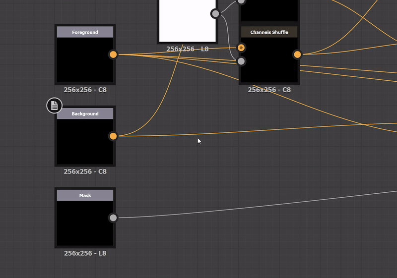

# Versión 12.4

**Substance 3D Designer 12.4** ofrece varias mejoras en la calidad de vida (una herramienta para limpiar un gráfico, usar fórmulas básicas para establecer parámetros, un botón para generar semillas aleatorias, un bloqueo para el tamaño, etc.) y compatibilidad con gráficos de modelos de Substance en la API de Python. Consulte a continuación para obtener más información sobre todos estos cambios.

Fecha de publicación: *31 de enero de 2023*

## Mejoras en la calidad de vida

### Herramienta Limpiar gráficos

Cuando edita su gráfico, a veces tiene que experimentar varias posibilidades, y conectar / desconectar varios nodos hasta el momento en que obtenga el resultado que desea. Al final, tiene algunos nodos en el gráfico que no están conectados a una salida, por lo tanto no tienen impacto en el resultado final. Esta nueva herramienta le permitirá detectar y eliminar automáticamente esos nodos para limpiar sus gráficos antes de finalizarlos. Opcionalmente, la herramienta de limpieza también está buscando funciones de parámetros y se puede iniciar en el gráfico actual mediante el botón dedicado de la barra de herramientas Vista de gráfico o en una selección de gráficos de la vista del explorador.

{width="640px"}

### Escribir fórmulas en campos de parámetros

Ya no es necesario utilizar una calculadora ni calcular en la cabeza cuando se desea introducir valores de parámetros específicos. Ahora puede introducir directamente fórmulas básicas como adiciones, divisiones, multiplicaciones o sustracciones al establecer un valor numérico para un parámetro en [Properties](https://helpx.adobe.com/es/substance-3d/unlisted/documentation/sddoc/parameters-ui-129368153.html) y otros lugares de la aplicación.

{width="640px"}

### Botones de acceso rápido en la vista 3D

Hemos añadido una barra de herramientas adicional en la [vista 3D](../../interface/3d-view/3d-view.md) correspondiente a todas las opciones disponibles en el menú [Mostrar](../../interface/3d-view/3d-view.md), para acceder rápidamente a todas estas opciones (por ejemplo, Malla metálica, Cuadrícula, Cuadro delimitador, etc.) como el botón cambia. También hemos añadido un botón de alternancia para mostrar/ocultar el mapa de entorno.

{width="640px"}

### Botón para generar una semilla aleatoria

Ahora puede crear rápidamente diferentes variaciones utilizando un nuevo botón para generar la semilla aleatoria de su gráfico, en lugar de mover un regulador.

{width="640px"}

### Bloquear para el widget Tamaño de salida

Ahora puede bloquear la anchura y el height del tamaño de salida para asegurarse de mantener un tamaño cuadrado y evitar manipular los dos valores cada vez que desee actualizarlos.

{width="640px"}

### Transformar la entrada de imagen a color/escala de grises

Cambia rápidamente entre un [color de entrada](../../compositing-graphs/nodes-reference-for-com/atomic-nodes/input/input.md) y una [escala de grises de entrada](../../compositing-graphs/nodes-reference-for-com/atomic-nodes/input/input.md) a través del menú contextual del nodo.

{width="640px"}

### Seleccionar la chincheta seleccionada al mostrar el Editor de degradado

En el panel de propiedades, si hace clic en una chincheta para editar un degradado, ahora seleccionará automáticamente la chincheta correspondiente en el [Editor de degradado](../../compositing-graphs/nodes-reference-for-com/atomic-nodes/gradient-map/gradient-map.md) mostrado.

{width="640px"}

### Seleccionar nodos descendentes

Nueva entrada en el [menú contextual del nodo](../../interface/the-graph-view/the-graph-view.md) para seleccionar todos los nodos conectados a la salida de los nodos seleccionados, directa o indirectamente. Por lo tanto, se seleccionan todos los nodos afectados por el nodo. Resulta útil para eliminar parte del gráfico o rediseñar su diseño.

{width="640px"}

## Actualizaciones de API de Python

Esta versión 12.4 también ofrece compatibilidad total con gráficos de modelos de Substance a través de la API de Python. Esto significa que ya dispone de todas las herramientas necesarias para crear, editar o evaluar los gráficos de modelos de Substance. Para obtener más información, consulte la documentación disponible en el menú Ayuda del software.

## Notas de la versión

### 12.4.0

*(Publicado El 24 De Enero De 2023)*

<b>Agregado:</b>

* [Vista 3D] Añada botones de acceso rápido para definir las opciones de visualización (Malla metálica, mapa de entorno, estadísticas de escena, etc.)
* [Gestión de color] Mejora la calidad de las LUT 3D horneadas en modo ACE
* [Documentación] Ejemplos de proyectos para gráficos de Substance
* [Documentación] Proyecto de muestra para gráficos de funciones
* [Explorer] Permite mover gráficos y recursos de un elemento principal a otro sin cerrar ni invalidar los widgets
* [Editor de degradado] Seleccionar la chincheta seleccionada al mostrar el editor de degradado
* [Graph] Añadir opción en el menú contextual de un nodo para seleccionar todos sus hijos
* [Graph] Limpia la herramienta de gráficos para detectar y eliminar los nodos no utilizados en todos los tipos de gráficos y gráficos de propiedades
* [Graph] Transformar la entrada de imagen a color/escala de grises
* [Parámetros] Añadir un bloqueo en widgets integer2
* [Parámetros] Permite escribir fórmulas básicas como un parámetro
* [Modelo de Substance] Alternar para cambiar entre valores e iconos para nodos de valores
* [UI] Botón para generar un valor aleatorio cuando se requiere una semilla aleatoria
* [UI] Resaltar en la vista 3D el elemento seleccionado actualmente en el explorador de escenas
* [UX] Restablecer intervalos del regulador cuando se restablece su valor
* [API] Permitir la adición de acciones a las barras de herramientas de la vista de gráfico
* [API] Permite crear/editar/evaluar un gráfico de modelo de Substance desde la API.

<b>Corregido:</b>

* [Vista 3D] El valor de la propiedad &quot;Normal de DirectX&quot; no se comparte entre los procesadores
* [Vista 3D] La visualización de estadísticas de escena se amplía cuando la ventana gráfica es pequeña
* [Vista 3D] La propiedad de visualización de Mallas metálicas no se guarda
* [Contenido] Los parámetros de color de desenfoque radial no afectan al canal alfa
* [Localización] Se muestran reguladores y botones adicionales en Propiedades de OpenGL de entorno.
* [MDL]&#x200B;[Modelo de Substance] Bloqueo al eliminar nodos expuestos
* [Preferencias] El archivo Default\_config nunca se vuelve a crear si se elimina
* [Modelo de Substance] Parámetro de reordenación de bloqueo que no aparece en el nivel de instancia
* [API] SDProperty.getDefaultValue() casi siempre devuelve None
