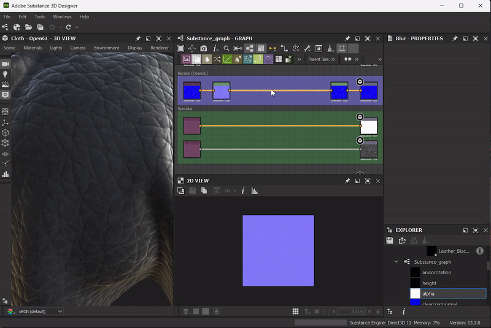

# Versión 13.1

<b>Substance 3D Designer 13.1</b> añade muchas mejoras de calidad de vida al gráfico de nodos, principalmente en lo que respecta a los fotogramas, para mejorar la experiencia de creación de materiales. También se incluye la exportación de AxF, que permite un flujo de trabajo de interoperabilidad para los usuarios que trabajan con el formato AxF.

*Fecha de publicación: 12 de diciembre de 2023*

## Mejoras de los marcos

Los marcos son una herramienta obligatoria para mantener el gráfico bien organizado y legible. Esa es la razón por la que decidimos pulirlos en esta nueva versión.

### Expandir automáticamente

A medida que crece el gráfico, puede ser necesario reorganizar el contenido de los marcos. Es posible que los nodos cambien para dejar espacio para las adiciones o que el contenido deba espaciarse más para facilitar la lectura. Para facilitar estos ajustes, ahora es posible ampliar automáticamente un fotograma al mover objetos incluidos: mantén <b>Shift</b> pulsado en cualquier momento mientras mueves un objeto para que los bordes del marco se ajusten automáticamente y mantener ese objeto dentro de sus límites.

### Ajustar tamaño al contenido

Al realizar ajustes en el gráfico, es posible que un marco ya no se ajuste correctamente a su contenido. Este nuevo comando le permite ajustar automáticamente la posición y el tamaño del marco para que se ajuste a la extensión de su contenido, con un relleno de una celda de cuadrícula media. Si el marco tiene una descripción, se ajusta para utilizar cualquier espacio vacío junto a la descripción, si es posible.

### Descripciones mejoradas

Gracias al código del HTML, ahora puede tener texto con formato en la descripción de un marco. Esto también se aplica a los comentarios.

### <b>... ¡Y mucho más!</b>

Se han repensado muchas cosas, como pertenecer a reglas para ser más tolerantes, zonas de interacción para cambiar fácilmente el tamaño de los marcos, ajustar reglas para no alinear mal los nodos en la cuadrícula y el aspecto visual para aportar un poco de frescura. No dude en visitar la [documentación](../../interface/the-graph-view/graph-items/frame/frame.md) de los marcos para obtener más información.

## Mejoras en la calidad de vida

* <b>Mejoras en el menú Nodo: </b>para ahorrar tiempo al buscar el nodo que necesita, hemos mejorado un poco el menú de nodos. La búsqueda ahora es más indulgente y te dará un resultado incluso si no hay una coincidencia perfecta. Además, ahora puede utilizar la flecha hacia arriba para acceder directamente al último elemento de la lista.
* <b>Ubicación del nodo: </b>si te gusta tener un diseño perfecto para tu gráfico, estos dos pequeños cambios te complacerán! Al copiar y pegar nodos de un gráfico a otro, los nodos pegados ahora se alinean con la cuadrícula principal. Y cuando añades un nodo en un enlace largo, éste se colocará ahora en el centro de la parte visible del enlace, para que sea visible en cada situación.
* <b>Opciones de vista 2D: </b>Si eres un usuario intensivo de la [vista 2D](../../interface/2d-view/2d-view.md), ahorrarás tiempo ya que ahora se guardan opciones como &#39;Mostrar tablero de ajedrez&#39;, &#39;Mantener tamaño de vista&#39;, &#39;Usar tamaño físico&#39; y &#39;Mostrar mosaico&#39;, para que no tengas que volver a configurarlas cuando crees una nueva vista 2D o incluso cuando reinicies Designer.

## Exportación de AxF

<table>
<tr style="border: 0;">
<td width="25.00%" style="border: 0;" valign="top">

</td>
<td width="100.00%" style="border: 0;" valign="top">

AxF es un formato de [X-Rite](https://www.xrite.com/axf). Proporciona una forma de capturar, almacenar, editar y comunicar características de materiales complejos mediante datos numéricos en todo el flujo de trabajo de diseño digital. En versiones anteriores de Designer, podía [importar archivos AxF](../../resources/axf-appearance-exchange/axf-appearance-exchange-format.md) y, a continuación, mejorar el mosaico o agregar efectos de procedimiento, pero luego se vio obligado a exportar los cambios como un nuevo archivo .sbsar.

En esta nueva versión, presentamos la posibilidad de editar materiales AxF en su lugar y luego [exportar los cambios](../../resources/axf-appearance-exchange/axf-appearance-exchange-format.md) como una nueva capa en el archivo AxF importado.

</td>
</tr>
</table>

## API

Por último, esta versión 13.1 sigue mejorando la API de Python al añadir dos posibilidades más:

* Propiedades &quot;Visible if&quot; de <b>: </b>ahora puede establecer esta propiedad para parámetros de gráficos, entradas y salidas.
* <b>Orden de las gráficas Entradas/Salidas:</b> use sdsbscompgraph::reorderGraphInput y sdsbscompgraph::reorderGraphOutput para organizar los parámetros según sea necesario.

>[!NOTE]
>
> Designer 13.1 es la última versión importante basada en Qt5, las próximas versiones principales se actualizarán a Qt6. Puede tener un impacto en sus complementos personalizados.

## Notas de la versión

### 13.1.0

*(Lanzado el 12 de diciembre de 2023)*

### Añadido

* [Frames] Expansión automática
* [Frames] Cambiar reglas para definir cuándo un objeto pertenece a un marco
* [Frames] Desactivar la escala de texto para la descripción de marcos
* [Marcos] Ajustar tamaño al contenido
* [Fotogramas] Nuevos estados predeterminados, de cursor encima y seleccionados
* [Fotogramas] Ajustar a cuadrícula grande
* [Frames] Código de HTML de soporte para descripción de marcos
* [Frames] Actualizar zonas de interacción
* [Frames] Actualizar aspecto visual
* [Gráfico] Cree el nodo en el centro del vínculo visible en lugar de en el centro del vínculo
* [Graph] Muestra las propiedades de un elemento si es el único elemento con propiedades disponibles en una selección
* [Gráfico] Eliminación de la opción &quot;Escalado&quot; de los comentarios del gráfico
* [Graph] Ajuste nodos en la cuadrícula principal al copiar y pegar
* [UX] Permitir búsqueda difusa en el menú Nodo y en la búsqueda de biblioteca
* [UX] Hacer que la lista del menú Nodo sea loopN
* [AxF] Compatibilidad con exportación AxF
* [AxF] Desactivar AxF en Linux
* [API] Establezca la propiedad &#39;Visible if&#39; de los parámetros de gráficos, entradas y salidas mediante la API de Python
* [API] Establecer el orden de las E/S de gráficos mediante la API de Python
* [Dependencias] Actualizar Boost a 1.80.0
* [Dependencias] Actualizar OpenSubdiv a 3.5.x
* [Dependencias] Actualizar FBX SDK a 2020.3
* [Dependencias] Actualizar NGL a 1.35.0.20
* [Gestión de color] Añadir compatibilidad con pantallas OCIO ICC
* [Niveles] Agregue una forma de restablecer el histograma
* [Python] Advertir a los usuarios si no se puede importar QtForPython
* [Vista 2D] Guarde el estado de las opciones de vista
* [Vista 3D] Añadir la técnica Posición al sombreador de información de malla
* [Exportar] Añada un botón &quot;Guardar configuración&quot; para guardar los cambios en las opciones de exportación

### Correcciones

* [Vista 3D] No se puede asignar una textura a una entrada de tipo texture\_2d de un material MDL
* [AxF] Los identificadores de gráficos de la lista de plantillas pueden estar en blanco
* [AxF] El campo de plantilla de gráfica de Substance está en blanco de forma predeterminada
* atlas scatter [Content]: comportamiento incorrecto en casos específicos
* [Content] Asignador de Flood Fill: salida en blanco cuando todas las formas tienen el mismo tamaño de cuadro de texto
* [Contenido] FloodFill a posición: Artefactos de imprecisión en algunas situaciones
* [Content] Salida incorrecta de &#39;Specular&#39; en el nodo &#39;BaseColor/Metallic/Roughness converter&#39;
* [Contenido] Máscara a trazado no funciona en vertical no cuadrado
* [Contenido] Falta la descripción de los nodos Valor de entrada, Escala de grises de entrada, Color de entrada y Salida
* [Content] Falta la descripción de los nodos Set y Sequence
* [Contenido] Salpicadura de forma: Artefactos de imprecisión en la salida de datos de salpicaduras 2
* [Motor] Los valores booleanos de los procesadores de valores siempre se evalúan como &#39;False&#39; (solo Apple Silicon)
* [Explorer] El orden de los botones de la barra de herramientas es incoherente entre los sistemas operativos
* [Frames] No agarrar nodos al mover un marco con el modificador CTRL
* [Mapa de degradado] la opción restablecer todo también debe restablecer el widget de degradado
* [GraphRender] Algunos nodos se vuelven negros al ajustar en el modo de vista previa
* [Graph] La previsualización del &quot;valor de entrada&quot; se bloquea en &quot;False&quot; al ajustar el valor booleano predeterminado (solo Apple Silicon)
* [Graph] Los nodos de puntos cercanos al borde del marco no se mueven por el marco
* [Interoperabilidad] El icono Volver a enviar no se actualiza después de enviarlo a Substance 3D Stager
* [MDL] Imposible cambiar el valor de Rugosidad en los nodos donde este parámetro está disponible
* [MDL] Conexiones no válidas en la plantilla &#39;AxF to Metallic Roughness&#39;
* [UI] La ventana &quot;Exportar salidas&quot; se puede minimizar (solo Windows)
* [UI] Las imágenes aparecen pixeladas en la pantalla Acerca de al utilizar la escala de visualización
* [UI] Las herramientas de alineación de nodos de la barra de herramientas de gráficos crean varios pasos de deshacer

### ERRORES CONOCIDOS

* [AxF OpenGL Shader] Pabellón incorrecto para la distribución anisotrópica
* [AxF OpenGL Shader] Rugosidad predeterminada incorrecta
* [AxF OpenGL Shader] Rotación de base de sombreado incorrecta
* [AxF OpenGL Shader] Rayo incorrecto debajo de hemispherediscovery
* [AxF OpenGL Shader] Detección de contribución incorrecta
* [AxF] Los valores del mapa &quot;Color de Specular&quot; son incorrectos al exportar
* [AxF] La vista previa y las texturas no se muestran correctamente en el cuadro de diálogo Importar AxF
* [AxF] La propiedad &quot;cc no refraction&quot; no se ha insertado correctamente en la plantilla AxF a AxF
