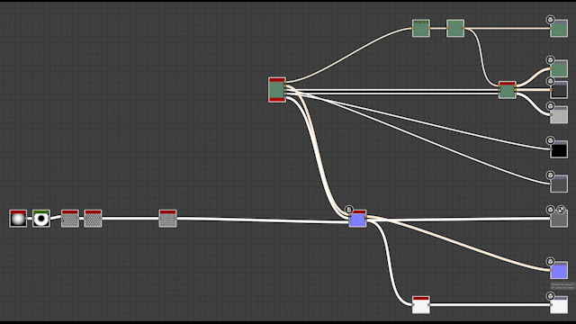

# Versión 14.1

Esta actualización presenta nuevas funciones para mejorar el uso diario de Substance 3D Designer: herramientas de organización de nodos para mejorar rápidamente el diseño del gráfico, copiar y pegar parámetros para aplicar un conjunto de parámetros a otro nodo, y una ubicación de píxeles en la vista 2D para realizar un seguimiento de un píxel específico mientras se depura el gráfico. También añade nuevo contenido, principalmente para completar los conjuntos de nodos Spline y Path.

*Fecha de publicación: 14 de enero de 2025*

## Actualizaciones de splines y trazados

Las splines y los nodos de trazado se introdujeron en la versión 13.0 y, gracias a sus comentarios, hemos realizado un conjunto inicial de mejoras. Primero, agregamos el nodo [Splines de Dispersión en Splines](../../compositing-graphs/nodes-reference-for-com/node-library/spline-paths-tools/spline-tools/scatter-splines-splines/scatter-splines-on-splines.md), que distribuye las splines a lo largo de una spline primaria, ofreciendo opciones similares a las de un nodo de dispersión normal. Además, se ha mejorado el nodo [Mask to Paths](../../compositing-graphs/nodes-reference-for-com/node-library/spline-paths-tools/path-tools/mask-to-paths/mask-to-paths.md) para proporcionar más control sobre la posición del primer vértice del trazado. También hicimos posible introducir aleatoriedad en el nodo [Spline Bridge List](../../compositing-graphs/nodes-reference-for-com/node-library/spline-paths-tools/spline-tools/spline-bridge-list/spline-bridge-list.md).

<table>
<tr style="border: 0;">
<td style="border: 0;" valign="top">

{zoomable="yes"}

</td>
<td style="border: 0;" valign="top">

{zoomable="yes"}

</td>
</tr>
</table>

## Herramientas de alineación de nodos

Si estás interesado en mantener un gráfico limpio y legible, las [herramientas de alineación de nodos](../../interface/the-graph-view/node-alignment-tools/node-alignment-tools.md) están hechas para ti y se han renovado por completo. Ahora es posible espaciar uniformemente los nodos (horizontal o verticalmente), y alinear los nodos evita cualquier superposición apilándolos cuidadosamente. Cereza arriba: ambas funciones tienen en cuenta el tamaño real de los nodos.

{zoomable="yes"}

## Parámetros de copiar/pegar

Ahora es posible [copiar los parámetros de un nodo y pegarlos en otro](../../compositing-graphs/manage-parameters/manage-parameters.md), por lo que todos los parámetros coincidentes en el nodo de destino se actualizarán a los valores del nodo de origen. Esto resulta muy útil, por ejemplo, si desea pasar los parámetros de un nodo de color a su versión en escala de grises o viceversa. (p. ej., el nodo Tile Sampler )

## Fijar píxel en la vista 2D

La nueva [herramienta Sampler de color](../../interface/2d-view/color-sampler/color-sampler.md) de la vista 2D te permite rastrear el valor de un píxel seleccionado colocando una chincheta sobre él. Esto resulta muy útil para asegurarse de que siempre está viendo la información del mismo píxel en varios nodos de un gráfico. Abra el panel de información para acceder a la herramienta y probarla.

{width="640px" zoomable="yes"}

## Mejoras de búsqueda

La herramienta [Buscador de nodos](../../interface/the-graph-view/node-finder/node-finder.md) se ha mejorado ligeramente:

* Ahora puede habilitar un modo recursivo para realizar una búsqueda más profunda;
* El modo difuso se puede deshabilitar si desea buscar un término exacto;
* El enfoque se establece automáticamente en el campo de búsqueda al habilitar la herramienta Buscador de nodos;
* El diseño de la barra de herramientas se ha rediseñado para ahorrar espacio.

{width="640px"}

## Vídeos

<table>
<tr style="border: 0;">
<td style="border: 0;" valign="top">

</td>
<td style="border: 0;" valign="top">

</td>
</tr>
</table>

## Notas de la versión

### 14.1.0

*(Lanzado el 14 de enero de 2025)*

### Añadido

* [Vista 2D] Adición de una visualización de píxeles anclados en el panel Información
* [API] Exponga el tamaño del cuadro de nodos en la escena de la vista de gráficos
* [Content] &#39;Fusión de Height de material&#39;: Agregar salida de máscara de Height
* [Content] &#39;Procesador de vértices de ruta&#39;: Usar el botón &quot;Editar función&quot; para el parámetro &quot;Por función de vértice&quot;
* [Contenido] Niveles automáticos: Limpiar los parámetros no utilizados, ajustar las etiquetas y la información sobre herramientas
* [Contenido] Máscara en rutas v2
* [Contenido] Nuevo nodo Media de Varianza Mínima (MLV)
* [Content] Nuevo nodo de filtro mediano
* [Contenido] Cuantificar color: Añadir la opción de filtrado Más cercana
* [Content] Lista de puentes polinomiales: Añadir parámetros de desvío de spline aleatorio
* herramientas de spline [Content]: Nuevo nodo Spline (Quadratic)
* Triangle Grid [Content]: cambiar el método de triangulación y usar bucles
* [Contenido] Nueva Dispersión Splines en el nodo Splines
* [Cooker] Exponer el parámetro base de &#39;Proporción de píxeles&#39; como variable estática &#39;$pixelratio&#39;
* [CrashReport] Integrar nueva ventana de informe de bloqueo
* [Motor] Añada la versión Vulkan/Metal del motor de mezcla
* Modo de material [Graph]: permitir que la conexión entre sin uso cuando se selecciona un solo vínculo
* [Graph] Vínculo de material: permitir conexiones estándar cuando la conexión no es ambigua
* [Graph] Herramientas de alineación de nodos: añadir distribuciones horizontales/verticales, alineaciones izquierda/derecha/superior/inferior y nodos de soporte apilados
* [Biblioteca] Corrección del color del texto en menús contextuales
* [Parámetros] Copiar parámetros de un nodo a otro
* [Propiedades] &quot;Restablecer todo&quot;: Quitar la ventana emergente de confirmación
* [Resources] Establezca el formato en &quot;All format&quot; (Todos los formatos) en el cuadro de diálogo &quot;Link Bitmap&quot; (Vincular mapa de bits)
* [Buscar] Agregar una forma de habilitar/deshabilitar un modo recursivo
* [Buscar] Añada una forma de activar o desactivar la búsqueda aproximada
* [Buscar] Mostrar siempre y establecer el foco en el campo de término de búsqueda al habilitar el Buscador de nodos usando su método abreviado de teclado
* [Buscar] Volver a trabajar la opción de filtro
* [Atajos] Permite asignar las teclas &#39;V&#39;, &#39;H&#39; y &#39;S&#39;
* [ThirdParty] Actualización a Qt 6.5.7
* [UX] Los cuadros de diálogo modales no se deben minimizar
* [UX] Eliminación del desplazamiento horizontal en el cuadro de diálogo de alerta

### Correcciones

* [Contenido] Bisel: El formato normal no se ve afectado por la preferencia global
* [Contenido] El nodo Color a máscara no omite el alfa
* distancia direccional [Content]: Resultado incorrecto cuando la entrada tiene una proporción de imagen vertical
* [Content] Asignador de Flood Fill: Advertencia provocada para la variable ausente
* [Contenido] Histograma Compute: El resultado es 16 veces más de lo que debería ser
* [Contenido] La cáustica de RT no funciona en resoluciones no cuadradas
* [Content] Lista de puentes polinomiales: Resultado incorrecto al utilizar desplazamientos de inicio/fin
* [Content] Selección de spline: la cantidad de spline de salida puede ser mayor que la cantidad de spline de entrada
* [Contenido] Deformación polinomial produce un resultado negro con el motor SSE
* Triangle Grid [Content]: el patrón no está colocando el mosaico correctamente
* Triangle Grid [Content]: El mosaico se rompe en un caso específico
* [Data] Bloqueo al cambiar el identificador de entrada de gráfico en un caso específico
* [Gráfica de funciones] Los valores largos aparecen superpuestos en los nodos &#39;Float&#39;
* [Fx-Map] Bloqueo al mostrar las propiedades del nodo Cuadrante
* [Graph] [UDIM] Tener una barra de desplazamiento en la lista UDIM da como resultado 1.1 1.2 entradas
* [Graph]&#x200B;[Shortcuts] El nodo creado mediante un método abreviado no se coloca en el vínculo existente después de la duplicación del nodo
* [Propiedades] Visualización incorrecta del parámetro cuando el valor no es válido
* [Publish] Las dependencias recíprocas producen un bucle infinito al publicar un paquete
* [Publish] Error silencioso al utilizar la acción &quot;Publish&quot; en un paquete con dependencia descargada
* [UI] El widget &quot;Tamaño principal&quot; no se muestra correctamente cuando se expande y puede bloquear la interfaz (solo macOS)
* [UI] La ventana principal se oculta tras otras aplicaciones en algunos casos (solo Windows)
