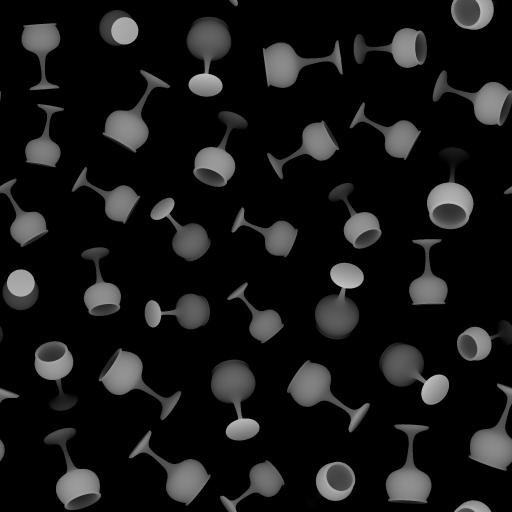
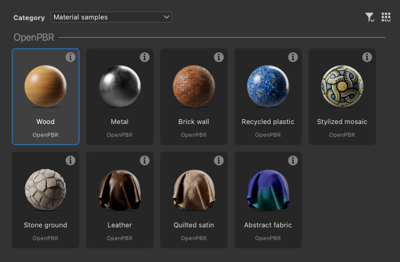

# Versión 16.0

Esta versión 16.0 introduce un flujo de trabajo más creativo para la dispersión y manipulación de patrones gracias a los nuevos nodos Shape Splatter y SDF. También admite de forma nativa el OpenPBR y mejora la configuración de desplazamiento en la vista 3D.

*Fecha de publicación: 14 de abril de 2026*

## Nodos de Shape Splatter v2

### Nuevas formas de dispersión de formas

Los nuevos nodos [Shape splatter v2](../../compositing-graphs/nodes-reference-for-com/node-library/texture-generators/patterns/shape-splatter-v2/shape-splatter-v2.md) desbloquean comportamientos de dispersión complejos que han sido difíciles hasta ahora, con **más métodos de distribución de formas** (disco Poisson, uniforme) que son *sin colisiones* de forma predeterminada, y control sobre la *reunión limpia* de formas en áreas específicas con un **mapa de densidad**.\
Los usuarios avanzados pueden configurar *distribuciones personalizadas* definidas por un gráfico de funciones.

<table style="margin-top: 32px; margin-bottom: 32px">
    <tr style="border: 0">
        <td style="width: 33%; border: 0">
             <i>Distribución de Poisson</i>
        </td>
        <td style="width: 33%; border: 0">
             <i>Distribución uniforme</i>
        </td>
        <td style="width: 33%; border: 0">
             <i>Salpicadura de forma v2: Mapa de densidad</i>
        </td>
    </tr>
</table>

### Formas 3D

Las formas dispersas son ahora **objetos 3D** que se pueden mover, rotar y escalar en todos los ejes XYZ.

Usa **simples formas simples** como cubos, esferas y cilindros, o **formas personalizadas complejas** formadas por *extrusión de un mapa de height* o creación de *formas 3D SDF*. (Más sobre esto a continuación)

Esto desbloquea las dispersiones que son más dinámicas, más variadas y más creíbles en todos los aspectos. Y ahora es posible reutilizar formas 3D para variaciones invirtiéndolas. (¡Nos vemos, artistas del medio ambiente!)

<table style="margin-top: 32px; margin-bottom: 32px; border: none">
    <tr style="border: 0">
        <td style="width: 33%; border: 0">
             <i>Rotación 3D aleatoria</i>
        </td>
        <td style="width: 33%; border: 0">
             <i>Extrusión de formas</i>
        </td>
        <td style="width: 33%; border: 0">
             <i>Formas 3D SDF</i>
        </td>
    </tr>
</table>

### Nodos complementarios

De forma similar a la familia de nodos Shape splatter v1, Shape splatter v2 incluye su propia cohorte de nodos complementarios.

Los nodos [Shape Splatter v2 mapper](../../compositing-graphs/nodes-reference-for-com/node-library/texture-generators/patterns/shape-splatter-v2-mapper-color/shape-splatter-v2-mapper-color.md) permiten la proyección de texturas en las formas 3D dispersas, con compatibilidad con *proyección triplanar* e *ID de material* para la asignación de varias texturas. Los resultados se pueden ajustar globalmente o por forma para los desplazamientos de textura y las variaciones de color.\
Una vez más, los usuarios avanzados pueden configurar *asignaciones de textura personalizadas* definidas por un gráfico de funciones.

[Salpicadura de forma v2 para enmascarar](../../compositing-graphs/nodes-reference-for-com/node-library/texture-generators/patterns/shape-splatter-v2-to-mask/shape-splatter-v2-to-mask.md) crea máscaras para una selección específica de ID de formas o materiales, lo que permite un uso más granular de las formas aguas abajo en el gráfico.

<table style="margin-top: 32px; margin-bottom: 32px; border: none">
    <tr style="border: 0">
        <td style="width: 33%; border: 0">
             <i>Asignación triplanar</i>
        </td>
        <td style="width: 33%; border: 0">
             <i>Asignación normal</i>
        </td>
        <td style="width: 33%; border: 0">
             <i>Asignación por ID de material de formas SDF</i>
        </td>
    </tr>
</table>

### Atlas de cuadrícula

<table>
    <tr style="vertical-align: top; border: 0">
        <td style="border: 0">
            
Los patrones personalizados se pueden proporcionar por separado al nodo Shape splatter v2 o empaquetarse en un atlas de cuadrícula para flujos de trabajo más sencillos y eficaces.

Los patrones de empaquetado se simplifican gracias a los nuevos nodos <a href="../../compositing-graphs/nodes-reference-for-com/node-library/texture-generators/patterns/grid-atlas-color/grid-atlas-color.md">Atlas de cuadrícula</a>.

        </td>
        <td style="text-align: right; width: 33%; margin-left: 32px; border: 0">
            
        </td>
    </tr>
</table>

### Muestra de material

<table style="border: none">
    <tr style="border: none">
        <td style="border: none; vertical-align: top">
            
La <b>muestra de material</a> de <a href="../../compositing-graphs/creating-compositing-gra/material-samples/material-samples.md">Rusty bolt</b> está disponible para saltar la familia de nodos Shape splatter v2 y sus características.

El gráfico se organiza y se anota para guiarle a través de su estructura, configuración de nodos y técnicas.

También es <i>totalmente editable</i>, por lo que se puede usar como espacio aislado para obtener una comprensión más práctica del conjunto de herramientas de Shape splatter v2. Puedes crear tantos gráficos de muestra como quieras, así que siéntete libre de jugar.

        </td>
        <td style="border: none; width: 20%; vertical-align: top; text-align: right">
            
        </td>
    </tr>
</table>

## Nodos 3D SDF (campo de distancia firmado)

<table>
    <tr style="vertical-align: top; width: 75%; border: 0">
        <td style="border: 0">
            
Designer 16.0 añade un potente método para generar formas 3D en un gráfico de funciones mediante un amplio catálogo de nodos para crear Funciones SDF.

Los campos de distancia firmados son representaciones del espacio como una distancia a superficies definidas matemáticamente. Se pueden utilizar para definir formas de complejidad creciente a medida que estas superficies se transforman y combinan utilizando diversos operadores.

        </td>
        <td style="text-align: right; width: 25%; margin-left: 32px; border: 0">
            
        </td>
    </tr>
</table>

### Creación de Funciones SDF 3D

Las Funciones SDF incluyen una [nueva familia de nodos](../../function-graphs/nodes-reference-for-fun/function-node-library/function-node-library.md#sdf-functions) que se dividen en 4 categorías:

* **Primitives** son los bloques de construcción básicos, generan formas simples ajustables con algunos controles que te permiten adaptarlas según sea necesario.
* **Operadores** combinan o replican formas de forma sencilla o compleja según el nodo: desde simples operadores booleanos hasta morfos, shell y simetrías, expanden dramáticamente las posibilidades de qué tipo de forma 3D se puede lograr
* **Transforma** te permite ajustar la posición, la rotación y el tamaño de las formas como puedes esperar y más allá con las curvas, las torceduras y el alargamiento.
* Los nodos **Material** te permiten establecer algunos atributos básicos de material, como el color y el identificador de material, que puede usar la familia de nodos [Shape splatter v2](../../compositing-graphs/nodes-reference-for-com/node-library/texture-generators/patterns/shape-splatter-v2/shape-splatter-v2.md) para enmascarar o colorear formas.

>[!INFO]
> 
> Vaya a la página [Trabajando con Funciones SDF](../../function-graphs/nodes-reference-for-fun/function-node-library/function-nodes-sdf-functions/working-with-sdf-functions.md) para empezar a trabajar con estos nodos.

Los nodos livianos con iconos claros y legibles hacen que la creación de Funciones SDF 3D sea más fácil de lo que crees, especialmente con esta próxima adición al conjunto de herramientas...

### Nodo del visor 3D

Al crear Funciones SDF 3D, tendrá que visualizar las formas resultantes en el espacio 3D. El [nodo del visor 3D](../../compositing-graphs/nodes-reference-for-com/node-library/filters/effects/3d-viewer/3d-viewer.md) representa las funciones de intersección o SDF 3D como una escena 3D con controles de cámara ajustables, luz ambiental personalizada y compatibilidad con la representación de materiales básicos. (Color, rugosidad y metalidad)

El nodo también incluye características para comprobar detalladamente las formas generadas y problemas de depuración: pases de representación separados (AOV), aislamientos de SDF y ayudantes visuales. (E.g. Bbox sangrado color, cuadrícula y arcos de rotación)

<table style="margin-top: 32px; margin-bottom: 32px">
    <tr style="width: 50%; border: 0">
        <td style="text-align: center; width: 50%; border: 0; padding: 15px">
            
        </td>
        <td style="width: 50%; border: 0; padding: 0">
            <table>
                <tr style="vertical-align: top; border: 0">
                    <td style="text-align: center; border: 0">
                        
                    </td>
                    <td style="text-align: center; border: 0">
                        
                    </td>
                </tr>
                <tr style="vertical-align: top; border: 0; background: transparent">
                    <td style="text-align: center; border: 0; background: transparent">
                        
                    </td>
                    <td style="text-align: center; border: 0; background: transparent">
                        
                    </td>
                </tr>
            </table>
    </tr>
</table>

## Compatibilidad con OpenPBR

[Superficie de OpenPBR](https://academysoftwarefoundation.github.io/OpenPBR/) es una especificación de un modelo de sombreado de superficie diseñado como estándar para gráficos de computadora y es capaz de modelar con precisión la gran mayoría de los materiales.

Este modelo de material ahora es compatible con toda la aplicación, con [sombreadores dedicados](../../interface/3d-view/material-properties/material-properties.md#openpbr) tanto en nuestros nuevos procesadores (Rasterizador, Trazador de ruta de GPU) como en el procesador OpenGL.

Empieza con este estándar del sector ampliamente adoptado con nuevas plantillas de gráficos o revisa las muestras de materiales integradas ahora basadas en el OpenPBR.

<table style="border: none; margin-top: 32px; margin-bottom: 32px">
    <tr style="vertical-align: top; border: 0">
        <td style="text-align: center; border: 0">
            
        </td>
        <td style="text-align: center; border: 0">
            
        </td>
    </tr>
</table>

El sombreador de OpenPBRs ahora es el valor predeterminado para la vista 3D y admite de forma nativa gráficos de versiones anteriores al hacer coincidir los usos de la PBR heredada con los de OpenPBR.

Los sombreadores de OpenPBR admiten más efectos que los sombreados existentes, como película fina y pared fina. Todos los efectos están disponibles en la rasterización (Rasterizer, OpenGL), incluida la refracción por fin!

<table style="border: none;">
    <tr style="vertical-align: top; border: 0">
        <td style="border: 0">
            También es más fácil mantener sincronizados los flujos de trabajo que implican sombreadores específicos, con un nuevo atributo <a href="../../compositing-graphs/graph-parameters/graph-parameters.md#attributes">'Modelo de material'</a> para Substance que garantiza que los gráficos visualizados en la vista 3D utilicen el sombreado adecuado para el modelo de material del gráfico.
        </td>
        <td style="text-align: right; margin-left: 32px; border: 0">
            
        </td>
    </tr>
</table>

>[!NOTE]
> 
>El atributo también se incluye en los archivos SBSAR publicados para integrarlo en el flujo de trabajo de materiales.

## Controles de desplazamiento en la vista 3D

Ahora es más rápido y fácil ajustar el desplazamiento y la teselación en la vista 3D, con acceso directo en una [nueva ventana emergente de Desplazamiento](../../interface/3d-view/displacement/displacement.md) disponible en la barra de herramientas de la vista 3D.

Ajuste los valores de **escala de Height**, **nivel de Height** y **Mosaico** sin repetir varias veces en las propiedades de materiales y la configuración del procesador.

Estos controles están disponibles tanto para nuestros nuevos procesadores (Rasterizador, Trazador de ruta de GPU) como para el procesador OpenGL.

Si la escena incluye varios materiales, selecciona el objeto de la escena que deseas ajustar de antemano manteniendo pulsada la tecla <code>Mayús</code> y hacer clic en él (solo Rasterizer y Trazador de ruta de GPU) o seleccionarlo en el explorador de escenas.

>[!NOTE]
> 
>La teselación es de *por objeto* en Rasterizador y Trazador de ruta de GPU, y de *por material* en OpenGL.

## Otros cambios

### Nodos de valor constante

<table style="border: none; margin-top: 32px; margin-bottom: 32px">
    <tr style="vertical-align: top; border: 0">
        <td style="border: 0">
            
Para facilitar el acceso a los valores constantes en los gráficos de Substance, se han agregado <a href="../../compositing-graphs/nodes-reference-for-com/node-library/values/constant.md">nuevos nodos</a> para generar un valor simple de cada tipo.

Puede encontrarlos todos en la sección <b>Valores &gt; Constantes</b> de la biblioteca.

        </td>
        <td style="width: 60%; border: 0">
            
        </td>
    </tr>
</table>

### Gráficos MDL y final de la vida útil de Iray

Tal y como se le notificó en la versión 15.1, el conjunto de funciones de gráficos MDL y el procesador de Iray ahora se eliminan de Designer.\
Nuestro Trazador de ruta de GPU interno es el procesador preferido para la representación fotorrealista de alta calidad en Designer.

Designer se está alejando de MDL en favor de MaterialX como su lenguaje de sombreado preferido para definiciones de materiales intercambiables y ampliamente soportadas.\
MaterialX ha ganado tracción rápidamente en las industrias de gráficos de ordenador, y puede ser transportado por archivos USD para la portabilidad completa de escenas a través de los DCC y renderizadores.

>[!NOTE]
> 
>La documentación de los gráficos MDL y del procesador Iray está disponible en su [página dedicada de fin de vida útil](../../technical-issues/mdl-graph-iray-eol/mdl-graph-iray-eol.md).

### Actualizaciones de la plataforma VFX y versión mínima de macOS

Las siguientes bibliotecas se han actualizado para cumplir con el estándar de plataforma VFX más reciente:

* C++ 20
* Python 3.13
* Qt 6,8
* Boost 1,88
* OpenColorIO 2,5
* OpenSubDiv 3.7
* OpenEXR 3.4
* oneTBB 2022

Los requisitos para la versión mínima compatible de macOS se han actualizado a macOS 14 Sonoma.

## Notas de la versión

### 16.0.0

*(Lanzado el 14 de abril de 2026)*

### Añadido

* [Contenido] Nodo de salpicaduras de formas v2
* [Contenido] Nódulos de color/escala de grises del asignador de salpicaduras de formas v2
* [Contenido] Salpicadura de forma v2 en nodo de máscara
* Nodos de Atlas de cuadrícula de [Content]
* [Content] Nodo del visor 3D
* [Contenido] Nodos de operador 3D SDF
* [Contenido] Nodos simples de 3D SDF
* [Contenido] Nodos de transformación de 3D SDF
* [Contenido] Nodos de materiales 3D SDF
* [Contenido] Ángulo al nodo vectorial
* [Content] Nodos de valor constante
* [Vista 3D] Sombreado de OpenPBR para el procesador OpenGL
* [Vista 3D] Sombreador de OpenPBRs para procesadores Rasterizer y Trazador de ruta de GPU
* [Vista 3D] Ventana de Desplazamiento para definir la escala de height, el nivel de height y la teselación
* [Vista 3D] Reorganizar los elementos de la barra de herramientas
* [Vista 3D] Establezca OpenPBR como modelo de material predeterminado en la vista 3D
* [Vista 3D] Haga que la vista 3D tenga en cuenta el atributo de gráfico &quot;Modelo de material&quot;
* [Vista 3D] Sincronizar modelos de material al cambiar entre los procesadores Rasterizer/Trazador de ruta de GPU y OpenGL
* [Vista 3D] Garantizar que el modelo de material sea persistente al cambiar entre representadores 3D y cambios en la definición de materiales
están sincronizados
* [Vista 3D] Trazador de ruta de GPU: Habilitar el ciclo de píxeles de ruido azul
* [Vista 3D] Exponer control de opacidad de oclusión ambiental
* [Vista 3D] Establecer el intervalo de parámetros de segmentación en [0, 10] para todos los sombreadores
* [Vista 3D] Cambiar el nombre de la acción &quot;Enfoque&quot; a &quot;Marco&quot;
* [Vista 3D] Controle el nuevo parámetro refineLevel que reemplaza a tessellationFactor
* [Vista 3D] Agregar contador FPS
* [Vista 3D] Mueva la barra de progreso en la misma barra de herramientas horizontal que el espacio de color de la parte inferior
* [Bakers] Muestra la UV del baker seleccionado en la vista previa
* [Graph] Añada el nuevo atributo &#39;Modelo de material&#39; a los Substance
* [NewGraph] Agregar separadores en la vista de miniaturas
* [Parámetros] Defina el valor de constante predeterminado para los parámetros de entrada con el editor &#39;Function&#39;
* [Parámetros] Rellenar el cuadro combinado de parámetros de nodo `Set` y `Is defined` con variables disponibles
* [Preferencias] Eliminación de la opción obsoleta &quot;Desescalar factor&quot; en la ficha &quot;Vista 3D&quot;
* [Publish] Cuadro de diálogo de Publish: Incluir modelo de material en la información del gráfico
* [Python] Agregue la nueva clase SDMaterialModelDescription para obtener la información de un modelo de material
* [Python] Permite obtener o establecer la propiedad de modelo de material de los objetos SDSBSCompGraph
* [Editor de Python] Aumentar tamaño de fuente a 12
* [Plantillas] Añadir plantillas de OpenPBR
* [Templates] Convertir muestras de material en OpenPBR
* [ThirdParty] Actualizar Boost a la versión 1.88
* [ThirdParty] Actualizar la API de C++ a C++20
* [ThirdParty] Actualizar NGL a 1.42
* [ThirdParty] Actualizar oneTBB a la versión 2022.x
* [ThirdParty] Actualice OpenColorIO a la versión 2.5.x
* [ThirdParty] Actualizar el OpenEXR a la versión 3.4.x
* [ThirdParty] Actualice Qt y QtForPython a 6.8.x y Python a 3.13.x
* [ThirdParty] Actualizar TBB a oneTBB 2021.x
* [Rechazo] Eliminar Iray y el Editor MDL

### Correcciones

* [Vista 2D] El intervalo de selección del histograma no se conserva cuando la anchura del widget se vuelve pequeña
* [Exportación 3D] Las mallas exportadas desde Designer no se procesan igual en usdview
* [Vista 3D] Al asignar elementos que no son de audio a la vista 3D, se deja el modo de procesamiento de un solo azulejo
* [Vista 3D] Resultado de sujeción al utilizar OCIO
* [Vista 3D] Bloqueo al aplicar una textura de gráfico a un material no modificado para una escena específica
* [Vista 3D] Bloqueo al crear búferes de fotogramas
* [Vista 3D] Trazador de ruta de GPU Eclair: Geometría rota y bajo rendimiento al renderizar un modelo específico
* [Vista 3D] Transformación de textura incorrecta para escenas específicas
* [Vista 3D] Encuadre incoherente de la escena/selección al utilizar una resolución de procesamiento fija
* [Vista 3D] Color difuso incorrecto al procesar un determinado archivo GLTF
* [Vista 3D] Entorno invisible al cambiar de procesador en un caso específico
* [Vista 3D] Los materiales no se detectan correctamente al importar algunos archivos .fbx
* [Vista 3D] Al reemplazar materiales más de una vez, el mosaico se restablece en 1
* [Vista 3D] Las propiedades de la categoría &#39;UV&#39; no se guardan en archivos SBSCN
* [Vista 3D] La opción Restablecer y ver salidas en vista 3D de gráficos de una sola salida no restablece los materiales
* [Vista 3D] &quot;Guardar procesamiento&quot;: El formato de imagen editado no se conserva
* [Vista 3D] La selección no funciona en GPU AMD
* [Vista 3D] La escena 3D independiente no se actualiza cuando se modifica en el disco
* [Vista 3D] Algunas propiedades de material de color no se administran correctamente cuando se anulan
* [Vista 3D] Las texturas UDIM no se aplican correctamente en una malla específica
* [Vista 3D] La escena USD con material MaterialX ya no se procesa correctamente
* [Bakers] Se bloquea con algunas mallas
* [Panaderos] Transferencia de texturas: Bloqueo en bkBufferViewCopy
* [Cooker] Bucle infinito en el nodo de Bucle &quot;While&quot; en un caso que podría evitarse
* [Motor] Detener el motor del Substance al cerrar la aplicación
* [General] Evite el bloqueo aleatorio al salir de la aplicación (solo Windows)
* [Graph] Gráfico de funciones: la propagación de tipos no funciona correctamente en algunas situaciones
* [Graph] Los vínculos de gráficos se eliminan cuando se cambia el nombre de un nodo de entrada de imagen
* [Graph] Los vínculos y los bordes a veces muestran defectos
* [Preferencias] Se invierte la escala de la ventana gráfica
* [Propiedades] Bloqueo al modificar el ajuste de entrada de gráfico mientras se muestran los parámetros de instancia
* [Python] No se pueden importar módulos PySide6 (posible conflicto con la instalación PySide6 existente)
* [Python] Los módulos PySide y Shiboken existentes entran en conflicto con los módulos Designer
* [UI] El estilo de desplazamiento desaparece en los botones en casos específicos (solo Windows)
* [UI] El estilo del ratón sobre el vínculo no está visible en los botones desplegables al hacer clic (solo macOS)
* [UI] Botón &#39;Más información&#39; en &#39;?&#39; La información sobre herramientas no funciona cuando está fuera de los límites del cuadro de diálogo (solo Windows)

### ERRORES CONOCIDOS

* [Graph] Los iconos generados para los gráficos de OpenPBRs no son precisos
* [Vista 3D] Las escenas con animaciones simples no se admiten correctamente
* [Vista 3D] El trazador de trazados no es compatible con todas las tarjetas gráficas AMD

