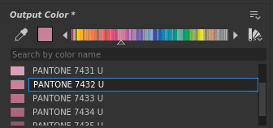

# Versión 2021.1 (11.1)

**Substance Designer 2021.1** incluye un conjunto de nuevas características que admiten los colores de Pantone, la capacidad de deshabilitar un nodo en un gráfico y la exportación de mallas teseladas, además de varias mejoras en la calidad de vida.

Fecha de publicación: *28 de enero de 2021*

## Funciones principales

### Nueva compatibilidad con Pantone Colors

Esta versión es compatible con las tintas planas de Pantone. Pantone es conocida por su gran conjunto de colores utilizados en una gran variedad de industrias como diseño gráfico, diseño de moda, fabricación y mucho más. Con esta nueva funcionalidad, ahora es mucho más fácil hacer coincidir el color de un material con su valor real. Para obtener más información, consulte la [página de documentación](../../color-management/spot-colors-pantone/spot-colors-pantone.md) dedicada.

>[!NOTE]
>
> Para usar estos nuevos colores de Pantone, la configuración de administración de color debe establecerse en **Adobe ACE** en las preferencias de la aplicación.

* **Elegir entre colores de RGB y Pantone**\
  El selector de color ahora tiene una opción para seleccionar en qué modo se puede editar un color. De forma predeterminada, se establece en RGB, pero también es posible cambiar a un libro de Pantone (una biblioteca de colores). Varios libros se incluyen de forma predeterminada.

  

  Una vez cambiado el modo del selector de color, el libro seleccionado definirá los colores disponibles.

  

* **Buscar colores en el libro actual**\
  El campo de texto en la parte superior de la lista permite buscar colores específicos en todo el libro de Pantone. No se verá en los otros libros, así que recuerde cambiar entre ellos cuando busque algo.

  

* **Elige y encuentra los colores adecuados**\
  El selector de color puede seleccionar cualquier color de la pantalla y encontrar la coincidencia más cercana en el libro actual.

  

### Nuevo Desactivar nodos en un gráfico

Esta versión añade la capacidad de deshabilitar un nodo, haciéndolo pasar dentro de un gráfico. Esto resulta útil cuando se desea comparar e iterar en un material para ver qué efectos agrega un nodo específico al resultado final, por ejemplo.

Para deshabilitar un nodo, simplemente haz clic con el botón derecho en él y elige **Deshabilitar selección** o presiona el método abreviado **Mayús+D**. No todos los nodos se pueden deshabilitar, depende de varios criterios. Para obtener más información, consulte la sección dedicada en la siguiente [página de documentación](../../interface/the-graph-view/the-graph-view.md).

### Nueva malla teselada de exportación desde la ventana gráfica

La malla teselada en la Vista 3D ahora se puede exportar en varios formatos de archivo.

Para ello, solo tienes que usar la acción de escena **Archivo > Exportar** en el **Vista 3D**. Para obtener más información, consulte la [página de documentación](../../interface/3d-view/3d-view.md) dedicada.

{width="700px"}

### Mejoras generales

En esta versión se han añadido varias mejoras pequeñas pero útiles y nuevas funcionalidades para ayudar en el trabajo diario:

* **Asignación de presupuesto de memoria automática para el motor**\
  La administración de Ram y Vram de la aplicación se ha mejorado y ahora se ajusta mejor a la memoria del sistema disponible. Las GPU con una gran cantidad de Vram ahora pueden aprovechar aún más su memoria integrada.

* **La Vista 3D ahora admite la nueva semántica &quot;PhysicalSize&quot;.**\
  Los sombreadores personalizados ahora pueden tener en cuenta el tamaño físico de un material para ajustar su comportamiento. Para obtener más información, consulte los sombreadores proporcionados con la aplicación.

* **Nueva configuración para excluir contenido de la biblioteca**\
  La biblioteca ahora puede excluir extensiones de archivo específicas o patrones de nombre específicos (con la compatibilidad de comodines). Esto permite omitir el contenido no deseado dentro de la ventana [Biblioteca](../../interface/the-library/the-library.md).

* **Crear carpetas al exportar mapas de bits**\
  Al exportar mapas de bits desde un gráfico, ahora es posible especificar barras para crear carpetas y subcarpetas cuando no existen. Esto ayuda a organizar los mapas de bits por gráfico en su propia carpeta, por ejemplo, mediante: **project/$(graph)/$(identificador)**.

* **SBSRender ahora admite ACE de Adobe y perfiles ICC**\
  El proceso SBSRender (parte del conjunto de herramientas de automatización) ahora puede procesar salidas de Substance con una gestión de color adecuada al utilizar el motor de ACE de Adobe.

&#x200B;>> 

Créditos de la imagen: [perro con flor](https://unsplash.com/photos/2s6ORaJY6gI) y [perro con gafas](https://unsplash.com/photos/siNDDi9RpVY) de &#42;&#42;Unsplash&#42;&#42;.

## Tutoriales

A continuación, se muestran nuestros tutoriales en vídeo sobre las nuevas funciones:

## Notas de la versión

### 2021.1.0

*(Publicado El 28 De Enero De 2021)*

**Agregado:**

* [Manchas de color] Compatibilidad con colores de Pantone en Designer
* [Graph] Deshabilitar nodos
* [Vista 3D] Exportar mallas teseladas desde la ventana gráfica
* [Internationalization] Actualizar versión japonesa
* [Vista 3D] Optimice el consumo de memoria cuando no utilice Iray
* [API de Python] Añadir el método SDResource.delete() para eliminar un SDResource
* [API de Python] Añadir compatibilidad con tintas planas a la API de Python
* [API de Python] Nueva devolución de llamada que se activa cuando se cierra un paquete
* [vista 2D] Convertir la base de datos de pinceles de SQLite a formato Json
* [vista 2D] Mejora del rendimiento y la fiabilidad del procesamiento (cálculo de CPU)
* [Biblioteca] Añadir la opción &quot;Excluir patrón&quot; en la configuración del proyecto
* [Biblioteca] Cambiar el nombre &quot;Excluir patrón&quot; a Excluir extensiones de archivo&quot; en la configuración del proyecto
* [UX] Quitar &#39;?&#39; en las barras de título de la ventana de Windows
* [UX] Mueva el método abreviado Ctrl+E a &#39;Abrir referencia&#39; cuando la edición en contexto esté desactivada
* [Bakeres] Eliminar la caché de previsualización al eliminar un baker de la lista hacer un bake
* [Rendimiento] Mejora el presupuesto de caché de imágenes en el hardware con GPU con memoria compartida
* [Preferencias] Adaptar el valor &quot;Límite de caché de GPU&quot; al grupo de memoria disponible
* [Propiedades] Mostrar atributo de Tamaño físico en instancia de nodo
* [Scripting] Marcar el sistema de scripts externo como obsoleto
* [Compartir] Quitar funciones de &quot;Exportar a Substance share&quot;

**Agregado:**

* [Contenido] Orden de E/S incoherente en nodos de material
* [Contenido] La entrada principal en los nodos de deformación es incoherente
* [Contenido] Resolver advertencias de cocina del nodo Desenfoque radial
* [Exportar] La exportación por lotes con el motor de CPU utiliza VRAM para determinar el presupuesto de memoria
* [Exportar] Al exportar a una ruta que no existe, se crean las carpetas
* [Exportar] El presupuesto de memoria es demasiado bajo al utilizar la exportación por lotes
* [vista 2D] Artefactos / bandas al copiar imágenes HDR. al portapapeles
* [vista 2D] Al exportar imágenes de recursos, siempre se exportan 8 bits
* [Vista 3D] Irak: cambiar el valor normal con el editor produce un resultado extraño
* [Vista 3D] Irak: la desactivación del canal normal no produce el resultado correcto
* [Biblioteca] El filtrado por URL no funciona correctamente
* [Biblioteca] Los recursos que coinciden con un patrón excluido de la biblioteca no se pueden importar manualmente
* [Bakeres] Cambiar el nombre de un baker no afecta a su entrada en la lista de vista previa de vista 2D
* [Explorer] Pérdida de sincronización entre el Explorador y los datos del gráfico
* [Gráfico de funciones] Bloqueo al establecer el nodo de funciones con un tipo de salida no coincidente como salida
* [MDL] SBS nodos de instancia no tienen vista previa, salida 0 y no activan el cálculo de gráficos
* [API de Python] La propiedad &#39;editor&#39; del parámetro de entrada no se puede modificar
* [Python] El restablecimiento del diseño no restablece correctamente los muelles creados por Python
* [Recursos] No se puede vincular o importar el documento del PSD de 32 bits
