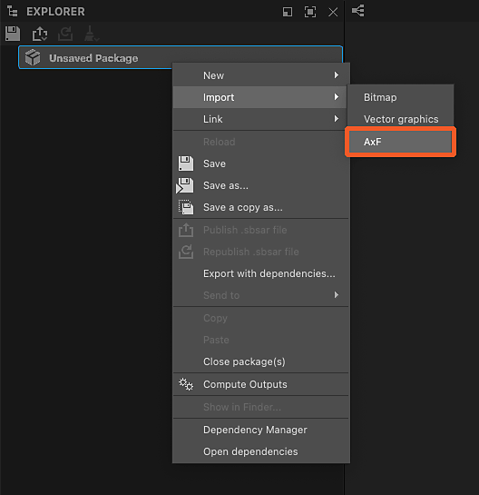
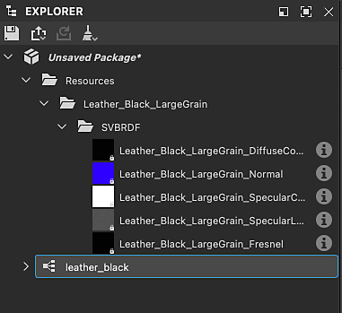
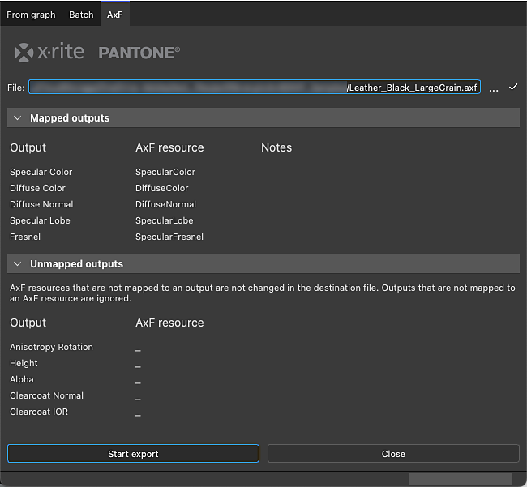

# AxF (Appearance eXchange Format)

<table>
<tr style="border: 0;">
<td width="25.00%" style="border: 0;" valign="top">

</td>
<td width="100.00%" style="border: 0;" valign="top">

Substance 3D Designer admite el formato de intercambio de apariencia de [X-Rite.](https://www.xrite.com/axf) Los creadores del formato lo describen de la siguiente manera:

Los archivos AxF se utilizan para capturar, almacenar, editar y comunicar características complejas de materiales a lo largo del flujo de trabajo de diseño digital. AxF proporciona una forma estándar de almacenar y compartir todos los datos de apariencia relevantes (color, textura, brillo, refracción, translucidez, efectos especiales (destellos) y propiedades de reflexión) en las aplicaciones de administración del ciclo de vida del producto (PLM), diseño asistido por ordenador (CAD) y renderizado de última generación.

</td>
</tr>
</table>

En términos simples, los archivos AxF alojan una serie de texturas extraídas por el hardware de escáner TAC7 de X-Rite, junto con metadatos que describen propiedades adicionales del material. Eso significa que un AxF es más que solo datos de textura: también lleva propiedades de sombreado.

Los archivos AxF *no* se importan como un paquete [recurso](../../resources/resources.md). Más bien, el [proceso de importación](#import) implica extraer texturas y metadatos del archivo AxF y luego usarlos para preparar gráficos creados a partir de [plantillas dedicadas](#graph-templates).

Las plantillas disponibles están dirigidas a dos flujos de trabajo AxF:

* <b>Convertir</b> un material SVBRDF de un archivo AxF en un material PBR;
* <b>Editando</b> un material SVBRDF en contexto y [exportándolo](#export) a un archivo AxF existente como una nueva capa.

>[!NOTE]
>
> Modelos de material compatibles
> 
> Solo los materiales que utilicen un modelo <b>SVBRDF</b> (Spatially Varying BRDF) pueden *cargarse y editarse por completo* en Designer.
> 
> Los materiales que utilizan el modelo <b>EP-SVBRDF</b> (Energy Preserving SVBRDF) se pueden cargar, pero solo las características existentes en el modelo SVBRDF se pueden editar y visualizar. Las funciones exclusivas de EP-SVBRDF no son compatibles.
> 
> No se admiten otros modelos.

## Importación de archivos AxF

El flujo de trabajo de importación de archivos AxF se puede iniciar mediante uno de los dos métodos siguientes:

+++Pantalla de inicio

Haga clic en <b>Importar AxF...Botón </b> en la sección izquierda de la [pantalla de inicio](../../interface/home-screen/home-screen.md).

{width="600px"}

+++

+++Explorer

Haga clic en RMB en un paquete en el [Explorador](../../interface/the-explorer-window/the-explorer-window.md) y vaya a <b>Importar > AxF</b> en el menú contextual del paquete.

{width="600px"}

+++

### Cuadro de diálogo Importar

El cuadro de diálogo <b>Importación de AxF</b> le permite revisar los datos cargados del archivo AxF seleccionado y configurar las plantillas de gráficos necesarias para realizar las ediciones o conversiones previstas.

Cuenta con cuatro secciones:

<b>Header</b> muestra el nombre del material detectado en el archivo AxF, así como su representación (actualmente, siempre SVBRDF). También se muestra la miniatura de vista previa incrustada en el archivo.

La sección <b>Templates</b> le permite configurar la plantilla [Substance graph](../../compositing-graphs/substance-compositing-graphs.md) para comenzar a trabajar en el material. Consulta la sección [Plantillas de gráficos](#graph-templates) a continuación para obtener más información sobre estas plantillas y su configuración.

<b>Texturas</b> muestra todas las texturas extraídas del archivo AxF involucrado en el material detectado. Para cada textura, se muestra su nombre, resolución nativa, formato de datos y tamaño físico.

<b>Metadatos</b> y <b>Propiedades</b> muestran los datos extraídos del material en el archivo AxF. Esto afecta a la configuración de algunas propiedades de plantillas de gráficos de Substance (consulte la sección [Plantillas de gráficos](#graph-templates) que aparece a continuación).

### Resultado

Después de hacer clic en el botón <b>Aceptar</b>, se crea un paquete en el [Explorador](../../interface/the-explorer-window/the-explorer-window.md). El paquete incluye los siguientes recursos:

<table>
<tr style="border: 0;">
<td style="border: 0;" valign="top">

Una carpeta <b>Resources</b> aloja una *subcarpeta* para cada material importado desde el archivo AxF.

Cada subcarpeta incluye otra subcarpeta que contiene las *texturas* extraídas del archivo AxF para ese material. Esta última subcarpeta recibe el nombre del material *presentation* utilizado por las texturas (actualmente solo <b>SVBRDF</b>).

Un gráfico para cada plantilla configurada en la sección <b>Templates</b> del cuadro de diálogo de importación.\
En el caso de los [gráficos de Substance](../../compositing-graphs/substance-compositing-graphs.md), estos están preconfigurados con las texturas y los datos extraídos del archivo AxF, así como la configuración de plantilla seleccionada (consulte la sección Plantillas de gráficos a continuación).

</td>
<td style="border: 0;" valign="top">

</td>
</tr>
</table>

## Plantillas de gráficos

<table>
<tr style="border: 0;">
<td style="border: 0;" valign="top">

Hay plantillas de gráficos dedicadas a los flujos de trabajo de AxF para [gráficos de Substance](../../compositing-graphs/substance-compositing-graphs.md).

Haga clic en el botón <b>Agregar plantilla</b> y seleccione el tipo de gráfico deseado en el menú desplegable.

</td>
<td style="border: 0;" valign="top">

</td>
</tr>
</table>

### Plantillas de gráficos de Substance

<table>
<tr style="border: 0;">
<td style="border: 0;" valign="top">

Hay dos tipos de plantillas de gráficos de Substance disponibles:

Las plantillas <b>AxF to Metallic Roughness</b> y <b>AxF to Specular Glossiness</b> son plantillas de *conversión* que te permiten asignar materiales AxF a modelos PBR estándar.\
Estos se pueden usar con los sombreadores de vista 3D predeterminados y combinarse con otros materiales PBR producidos en Designer, [Sampler](https://www.adobe.com/products/substance3d-sampler.html) o adquiridos de nuestra biblioteca [3D Assets](https://substance3d.adobe.com/assets/).

<b>AxF a AxF</b> es una plantilla *passthrough* que te permite editar materiales AxF in situ y exportar estos cambios como nuevas capas en archivos AxF existentes. Consulte Exportar archivos AxF a continuación para obtener más información.

</td>
<td style="border: 0;" valign="top">

</td>
</tr>
</table>

<table>
<tr style="border: 0;">
<td style="border: 0;" valign="top">

Para todas las plantillas de gráficos de Substance agregadas en la lista <b>Templates</b>, se realizan las siguientes operaciones adicionales:

Para cualquier nodo [Input](../../compositing-graphs/nodes-reference-for-com/atomic-nodes/input-color/input-color.md) cuyo *usage* coincida con el *identificador* de una textura extraída del archivo AxF, ese nodo Input se reemplaza por un nodo [Bitmap](../../compositing-graphs/nodes-reference-for-com/atomic-nodes/bitmap/bitmap.md) que haga referencia a esa textura;

La propiedad <b>Resolution</b> del gráfico (es decir, el tamaño de salida) se establece automáticamente en la potencia de dos, igual o superior a la resolución de la textura extraída *más grande*;

La propiedad <b>Resolución</b> de los nodos [Bitmap](../../compositing-graphs/nodes-reference-for-com/atomic-nodes/bitmap/bitmap.md) (es decir, el tamaño de salida) se establece automáticamente para que coincida con el del gráfico, una vez aplicada la operación anterior;

La propiedad <b>Tamaño físico</b> del gráfico se establece en el tamaño físico de la textura extraída *first*;

Los *valores predeterminados* de los parámetros del gráfico están configurados para que coincidan con los datos del archivo AxF.

Los *metadatos* extraídos del material en el archivo AxF se copian en la propiedad <b>Description</b> del gráfico.

>[!IMPORTANT]
>
> Los valores por defecto de los parámetros del gráfico no deben modificarse después de esta configuración inicial.
> 
> Especifican propiedades de sombreado esenciales para interpretar correctamente los valores de las texturas.
> 
> Por lo tanto, si se cambian estos ajustes, se producirá un procesamiento incorrecto al visualizar el material en la [vista 3D](../../interface/3d-view/3d-view.md).

</td>
<td style="border: 0;" valign="top">

</td>
</tr>
</table>

## Exportación de archivos AxF

Los archivos AxF existentes se pueden editar desde Designer, sus recursos se actualizan usando las [salidas](../../compositing-graphs/nodes-reference-for-com/atomic-nodes/output/output.md) de un [gráfico de Substance](../../compositing-graphs/substance-compositing-graphs.md).

Con la capacidad de exportar salidas de gráficos a archivos AxF, un flujo de trabajo AxF típico en Designer puede tener este aspecto:

1. Importar archivo AxF
1. Usar plantilla de gráfico de Substance &#39;AxF a AxF&#39;
1. Edite las texturas extraídas mediante las funciones y los nodos disponibles en los gráficos de Substance
1. Exporte las salidas del gráfico al mismo archivo AxF

La propiedad <b>Tamaño físico</b> del gráfico se usa para establecer el atributo <b>Tamaño físico</b> de las texturas actualizadas en el archivo AxF editado.

>[!NOTE]
>
> Los cambios en los recursos del archivo se agregan como *nueva capa*. Esto significa que cada exportación realizada desde Designer al mismo archivo AxF se sumará al tamaño del archivo.

<table>
<tr style="border: 0;">
<td width="33.33%" style="border: 0;" valign="top">

### Cuadro de diálogo Exportar

El cuadro de diálogo de exportación <b>AxF</b> está disponible en el cuadro de diálogo <b>Exportar salidas</b> como una pestaña dedicada.

En la barra de herramientas [Graph View](../../interface/the-graph-view/the-graph-view.md), abre el menú  <b>Tools</b> y selecciona <b>Exportar resultados...Opción </b> para mostrar el cuadro de diálogo y, a continuación, seleccione la pestaña <b>AxF</b>.

</td>
<td width="100.00%" style="border: 0;" valign="top">

</td>
</tr>
</table>

El diálogo presenta tres secciones principales:

El campo de entrada <b>Archivo</b> le permite seleccionar el archivo AxF de destino que se debe editar. Ese archivo se carga y se comprueba, entonces si es válido sus datos se utilizan para rellenar las columnas de &#39;recurso AxF&#39; a continuación.

<b>Salidas asignadas</b> muestra las salidas de gráficos en la columna Salida y hace coincidir su *uso* con un recurso AxF en el archivo de destino que comparte el mismo *identificador*. Si se detecta algún problema, se muestra como una advertencia (amarillo) o un error (ref) en la columna Notas.

<b>Salidas no asignadas</b> muestra las salidas de gráficos y los recursos AxF en el archivo de destino que no se pudieron asignar. Estos resultados se omiten y estos recursos AxF no se modifican.

>[!NOTE]
>
> Un gráfico de salida debe tener su propiedad <b>Group</b> establecida en &#39;AxF&#39; para que se muestre en este cuadro de diálogo.

Haga clic en <b>Iniciar exportación </b> para editar el archivo AxF de destino con la nueva capa que contiene los cambios en las salidas asignadas.

El resultado se muestra como un mensaje junto a la barra de progreso en la barra de estado del cuadro de diálogo.

>[!TIP]
>
> Cada vez que se realiza una exportación, se crea una nueva capa en el archivo de destino. Por lo tanto, tenga en cuenta la necesidad de realizar exportaciones deliberadas y útiles para administrar el tamaño y la complejidad del archivo.

### Asignación de salidas a recursos AxF

Al exportar a un archivo AxF existente, sus recursos se actualizan utilizando las salidas de gráficos. Designer hace coincidir el identificador de recurso con los nodos [Output](../../compositing-graphs/nodes-reference-for-com/atomic-nodes/output/output.md) que tienen el mismo identificador que <b>Usage</b>.

Además, la propiedad <b>Group</b> *de Output* debe estar establecida en &#39;AxF&#39; para que se muestre en el cuadro de diálogo de exportación de AxF (ver arriba).

Los recursos pueden ser texturas (es decir, mapas de bits) o uniformes (es decir, valores) con un número específico de canales. Es obligatorio que la salida del gráfico coincida exactamente con ese número de canales. Si no es así, se generará un error para ese recurso durante la exportación y el recurso no se modificará.

El número de canales se especifica de forma diferente en función del tipo de datos proporcionados al nodo Salida:

* <b>Mapa de bits (textura):</b> La propiedad [Components](../../compositing-graphs/nodes-reference-for-com/atomic-nodes/output/output.md) se usa para especificar el número de canales, donde R es un canal, RG son dos canales, etc. La propiedad se utiliza para indicar a Designer qué canales RGBA del mapa de bits de color se deben codificar en el recurso.
* <b>Valor (uniforme):</b> El número de componentes del valor vectorial se usa para especificar el número de canales, donde [Float](../../function-graphs/nodes-reference-for-fun/atomic-function-nodes/constant-nodes/constant-nodes.md) es un canal, [Float2](../../function-graphs/nodes-reference-for-fun/atomic-function-nodes/constant-nodes/constant-nodes.md) son dos canales, etc.

>[!IMPORTANT]
>
> En la plantilla gráfica de Substance <b>AxF to AxF</b>, el nodo [Output](../../compositing-graphs/nodes-reference-for-com/atomic-nodes/output/output.md) para la aportación de <b>Specular Lobe</b> está configurado de forma predeterminada en un *canal único* (es decir, su propiedad Components está establecida en &#39;R&#39;).\
> Si el archivo AxF importado utiliza más de un canal en su recurso Lóbulo de Specular, establezca la propiedad <b>Components</b> de salida en consecuencia.
> 
> Por ejemplo, para un recurso de lóbulo de Specular que utilice dos canales (rojo para la rugosidad del Specular y verde para la Anisotropía del Specular), establezca la propiedad Components en &#39;RG&#39;.

## Visualización de archivos AxF en la vista 3D

El método para procesar materiales AxF SVBRDF en [Vista 3D](../../interface/3d-view/3d-view.md) depende de la [configuración de importación](#import).

+++Convertir en PBR

Si deseas convertir un material SVBRDF de un archivo AxF en un material PBR estándar, es probable que la configuración de importación implique una [plantilla de conversión de gráficos de Substance](#graph-templates).

En ese caso, debe usar el **procesador OpenGL** en la vista 3D y seleccionar el <code>AxF SVBRF</code> sombreador.\
A continuación, puede arrastrar y soltar el gráfico del Substance que haya configurado en el cuadro de diálogo de importación para conectar sus salidas al sombreado.

+++

+++Editar en contexto

Si tu objetivo es realizar *ediciones* en un archivo AxF existente, sigue las instrucciones siguientes para visualizar su material SVBRDF según el procesador seleccionado:

Hay disponible un sombreador GLSLFX dedicado para visualizar materiales mediante una representación SVBRDF desde un archivo AxF: <b>AxF SVBRDF</b>.

El sombreado está disponible en el menú <b>Materiales</b> : abra el submenú del material de la escena (&quot;Predeterminado&quot; de forma predeterminada) y seleccione cualquier técnica en la entrada <b>AxF SVBRDF</b>.

Use la opción <b>Editar</b> en el mismo submenú para mostrar las propiedades del sombreado en el conjunto acoplado [Propiedades](../../interface/properties/properties.md).\
En concreto, la propiedad <b>Tiling</b> te permite ajustar el mosaico de las texturas en el modelo, para que puedas visualizar el material a una escala adecuada.

Después de seleccionar el sombreado, haga clic en RMB en el espacio vacío del gráfico y seleccione la opción <b>Ver salidas en vista 3D</b> para visualizar sus salidas en la [vista 3D](../../interface/3d-view/3d-view.md).

{width="600px"}

Este sombreador es un *trabajo en curso* y algunas características aún no son compatibles. Por lo tanto, aunque puede proporcionar una visión general de las características de los materiales, no debe utilizarse para realizar ajustes precisos.

Use la opción <b>Editar</b> en el mismo submenú para mostrar las propiedades del sombreado en el conjunto acoplado [Propiedades](../../interface/properties/properties.md).\
En concreto, la propiedad <b>Tiling</b> te permite ajustar el mosaico de las texturas en el modelo, para que puedas visualizar el material a una escala adecuada.

Después de seleccionar el sombreado, haga clic en RMB en el espacio vacío del gráfico y seleccione la opción <b>Ver salidas en vista 3D</b> para visualizar sus salidas en la [vista 3D](../../interface/3d-view/3d-view.md).

<i>Nota:</i> Omita la parte del vídeo desde el cambio al procesador de Iray hasta el final, ya que el procesador de Iray y la compatibilidad con MDL se <i>quitaron</i> de Designer en la versión 16.0.0.

+++

### Variantes de modelo admitidas

Los sombreadores utilizados en la vista 3D admiten las siguientes variantes para los modelos de transmisión de specular, Fresnel y capa clara:

<table>
<tr style="border: 0;">
<td style="border: 0;" valign="top">
<b>variantes de Specular</b>

* Ward / Geisler-Moroder 2010
* GGX / Walter2007
* GGX / Ross 2005

</td>
<td style="border: 0;" valign="top">
<b>Variantes de Fresnel</b>

* Schlick 1994
* Schlick 1994 de color
* Fresnel simple

</td>
<td style="border: 0;" valign="top">
<b>Variantes de transmisión de capa transparente</b>

* Dirección refractiva *(solo OpenGL)*
* Dirac refractivo / Sin compresión de ángulo sólido *(solo OpenGL)*
* Dirac no refractivo
* Dirac no refractivo / DSPBR 2020x
* GGX

</td>
</tr>
</table>
