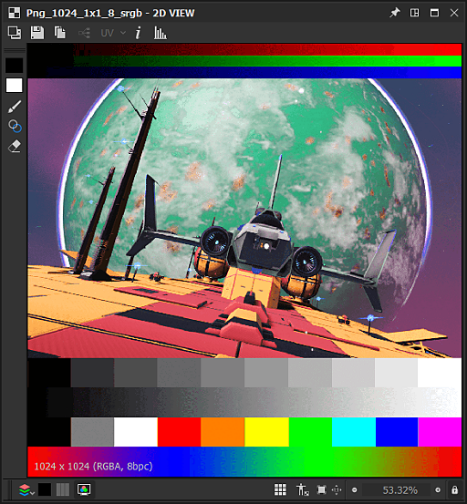
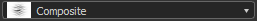
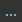
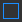
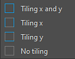

# Herramientas de pintura de mapa de bits

Esta página describe las herramientas de pintura disponibles en el panel [Vista 2D](../../../interface/2d-view/2d-view.md) para los mapas de bits compatibles.

{width="512px"}

## Información general

El panel [2D View](../../../interface/2d-view/2d-view.md) ofrece herramientas básicas de pintura de mapas de bits que te permiten crear o editar imágenes *manualmente* directamente dentro de la aplicación. Estas herramientas son especialmente útiles, por ejemplo, para pintar rápidamente *máscaras*.

Las herramientas admiten la entrada de lápiz, incluida la *presión del lápiz*. Para aprovechar las pantallas de lápiz, puedes [desacoplar](../../../interface/customizing-your-wor/customizing-your-workspace.md) el panel de la [vista en 2D](../../../interface/2d-view/2d-view.md) y, a continuación, colocarlo y redimensionarlo en cualquier configuración que te resulte más cómoda para pintar.

Las ediciones se pueden *deshacer individualmente* y todas las demás características del panel Vista 2D están *disponibles* mientras edita la imagen, como el panel [Histograma](../../../interface/2d-view/2d-view.md), la [pantalla en mosaico](../../../interface/2d-view/2d-view.md) y la [imagen de fondo](../../../interface/2d-view/2d-view.md).

>[!IMPORTANT]
>
> Puede pintar *solo* en *recursos de mapa de bits*[de 8 bits](../../../resources/bitmap-resource/bitmap-resource.md) que son [nuevos o importados](../../../resources/importing-linking-and-new/importing-linking-and-new-resources.md).

>[!WARNING]
>
> **Solo Windows**
> 
> Los usuarios de tabletas deben aplicar la configuración descrita en la página siguiente para obtener la experiencia más fiable: [Configuración de plumas y tabletas](https://docs.substance3d.com/display/SPDOC/Configuring+Pens+and+Tablets)

{width="512px"}

## Activación de las herramientas de pintura

Las herramientas de pintura se habilitarán automáticamente en el panel [Vista 2D](../../../interface/2d-view/2d-view.md) cuando se cumplan los siguientes criterios con respecto a un mapa de bits:

* El mapa de bits es un recurso [nuevo o importado](../../../resources/importing-linking-and-new/importing-linking-and-new-resources.md)
* El mapa de bits tiene una precisión de *8 bits*
* El mapa de bits se muestra en el panel [vista 2D](../../../interface/2d-view/2d-view.md)

*Se pueden crear nuevos mapas de bits de* de las siguientes maneras:

* En el panel [Explorer](../../../interface/the-explorer-window/the-explorer-window.md), haz clic en RMB en un *paquete SBS* o en una *carpeta* dentro de un paquete para abrir su menú contextual, luego abre el submenú <b>New</b> y selecciona la opción <b>Bitmap</b>
* En un [gráfico](../../../interface/the-graph-view/the-graph-view.md), cree un [nodo de mapa de bits](../../../compositing-graphs/nodes-reference-for-com/atomic-nodes/bitmap/bitmap.md) y seleccione el nuevo recurso <b>De...Opción </b> en el menú contextual

Se abrirá la ventana <b>Nuevo mapa de bits</b>, que te permitirá establecer el *nombre*, *resolución* y *color de fondo* del nuevo recurso de mapa de bits.

>[!NOTE]
>
> Los *nuevos* recursos de mapa de bits *always* tienen colores *RGBA* y precisión *de 8 bits*.

>[!WARNING]
>
> Para obtener el mejor rendimiento con las herramientas de pintura, se recomienda utilizar mapas de bits con resoluciones que sean *potencias de dos*: 128, 256, 512, 1024, ...

## Barras de herramientas

Las herramientas y opciones de pintura están organizadas en *barras de herramientas* dentro del panel [Vista en 2D](../../../interface/2d-view/2d-view.md). Estas barras de herramientas se pueden reubicar en *cualquier lado* del panel o como *barra de herramientas flotante*, haciendo clic y manteniendo presionada la tecla <b>LMB</b> en su *controlador*, que se muestra como una línea triple, y luego liberando <b>LMB</b> en la ubicación deseada.

Se muestran dos barras de herramientas cuando las herramientas de pintura están activadas: la [barra de herramientas de selección de herramientas](#bitmappaintingtools-toolselectiontoolbar) y la barra de herramientas de opciones de herramientas, que se describen a continuación.

## Barra de herramientas de selección

Las herramientas de pintura se encuentran en la **barra de herramientas de selección de herramientas**, que está ubicada en el *lado izquierdo* del panel [vista 2D](../../../interface/2d-view/2d-view.md) de forma predeterminada. Los métodos abreviados de teclado le permiten acceder a estas herramientas rápidamente y se marcan entre paréntesis después del nombre de la herramienta o función:

 <b>Selección de color</b> <b>miniaturas:</b> Permite definir un color *principal* y *secundario*. Haga clic en cualquiera de estas miniaturas para mostrar la ventana <b>Editor de color</b> y definir un color. Las herramientas usarán el color *primary*. Los colores primarios y secundarios se pueden *intercambiar* (<b>X</b>) en cualquier momento

 <b>Herramienta Pincel (B):</b> Aplica el color *primario* en la ubicación del cursor, cuando se presiona el botón de punta de lápiz o <b>LMB</b>, utilizando las opciones definidas en la barra de herramientas Opciones de herramienta

 <b>Herramienta Sello (T):</b> Permite estampar una parte de la imagen en otra. Para definir el *origen* que debe sellarse, mantenga presionada la tecla <b>Alt</b> y haga clic en <b>LMB</b>. Esta área de la imagen se grabará en el área *target* de la imagen en la ubicación del cursor, cuando se presione la punta del lápiz o el botón <b>LMB</b>, utilizando las opciones definidas en la barra de herramientas Opciones de herramienta. Ten en cuenta que el origen *hará un seguimiento* de los movimientos del destino y que el tamaño del área de *origen* *coincidirá* con el tamaño del *pincel*

 <b>Habilitar alineación (opción Herramienta de sello):</b> Permite definir si el origen debe *permanecer en su lugar* cuando comience un nuevo sello o si debe *reubicarse relativamente en la nueva ubicación del sello*

<b> Borrador (E):</b> Reemplaza el color actual de la imagen por el valor (0, 0, 0, 0) en la ubicación del cursor, cuando se presiona la punta del lápiz o el botón <b>LMB</b>, utilizando las opciones definidas en la barra de herramientas Opciones de herramienta. Asegúrate de que la [Pantalla de transparencia](../../../interface/2d-view/2d-view.md) está habilitada para realizar un seguimiento del impacto de esta herramienta en el canal <b>Alpha</b>.

## Barra de herramientas de opciones

Las opciones de las herramientas disponibles en la [barra de herramientas de selección de herramientas](#bitmappaintingtools-toolselectiontoolbar) se encuentran en la barra de herramientas de opciones de herramientas, que está ubicada en la *parte superior* del panel [vista 2D](../../../interface/2d-view/2d-view.md) de forma predeterminada.

<table>
<tr style="border: 0;">
<td style="border: 0;" valign="top">

### SELECCIÓN DE PINCEL

La  <b>selección de pincel</b> te permite seleccionar un pincel *preconfigurado* de los *ajustes preestablecidos* disponibles, establecer su <b>tamaño</b> y su <b>dureza</b> *(* consulte la sección <b>Forma</b> del editor de pinceles) y muestra una *vista previa* de un trazo de pincel.

Los ajustes preestablecidos de pincel se pueden crear y editar en el editor de pinceles y organizar en *bibliotecas*. Los ajustes preestablecidos de pincel que aparecerán en este panel son la *suma* de todas las bibliotecas de ajustes preestablecidos de pincel cargadas. Estas bibliotecas se pueden administrar obteniendo acceso al menú  <b>Biblioteca de pinceles</b> (consulte la sección <b>Ajustes preestablecidos</b> del Editor de pinceles)

El botón  <b>Seleccionar color de fondo</b> te permite cambiar el color de fondo de la *vista previa de los trazos de pincel*.

</td>
<td style="border: 0;" valign="top">

</td>
</tr>
</table>

<table>
<tr style="border: 0;">
<td style="border: 0;" valign="top">

### EDITOR DE PINCELES

El  <b>editor de pinceles</b> proporciona acceso a opciones granulares para definir el comportamiento del pincel:

<b>Ajustes preestablecidos</b>

Los pinceles se pueden personalizar y guardar como <b>ajuste preestablecido de pincel</b>, que estará disponible en la  <b>lista de ajustes preestablecidos de pincel</b> y en el panel  <b>Selección de pincel</b>.

Para crear un ajuste preestablecido, establece las propiedades siguientes como gustes y, a continuación, haz clic en el botón  <b>Agregar ajuste preestablecido de pincel </b> y establece un nombre de pincel en la ventana <b>Nombre del ajuste preestablecido</b>. El nuevo ajuste preestablecido ahora se selecciona automáticamente en la <b>lista de ajustes preestablecidos de pincel</b> y, en cualquier momento, puedes  <b>actualizarlo</b> con la nueva configuración actual o  <b>eliminarlo</b>.

Los ajustes preestablecidos se organizan y se guardan en *bibliotecas*, que se pueden administrar en el menú  <b>Biblioteca de pinceles</b>:

<b>Exportar biblioteca:</b> *guardar* los ajustes preestablecidos actuales y toda su configuración en un archivo de biblioteca

<b>Importar biblioteca:</b> *cargar* ajustes preestablecidos de un archivo de biblioteca existente y *agregarlos* a la lista actual: los ajustes preestablecidos con *mismo nombre se reemplazan* por los del archivo de biblioteca

<b>Restablecer biblioteca:</b> restablece los ajustes preestablecidos actuales de la biblioteca predeterminada

<b>Reemplazar biblioteca:</b> *cargar* ajustes preestablecidos de un archivo de biblioteca existente y *descartar* la lista actual

</td>
<td style="border: 0;" valign="top">

</td>
</tr>
</table>

#### Configuración del pincel

La configuración de un pincel se agrupa en las siguientes secciones:

+++Forma
El parámetro <b>Tipo de forma</b> controla la forma básica del pincel. Las formas disponibles son:

* *Elipse*: una forma redonda establecida como *círculo* de forma predeterminada

* *Rectángulo*: una forma recta establecida como *cuadrado* de forma predeterminada

* *Polígono*: una forma recta que tiene un número *personalizable* de bordes y ángulos

<b>Recuento de bordes </b>(solo forma *Polígono*): permite elegir el número de *caras* del polígono

<b>Radio interior </b>(*Solo forma Polígono*): proporciona control sobre la distancia entre un punto medio de la cara *y el centro de la forma, creando de manera efectiva un patrón de* estrella **

<b>Dureza</b>: define el *radio de transición* de la forma

+++

+++Transformar
Al aplicar un trazo de pincel a la imagen, el trazo es en realidad un estampado repetido del patrón de pincel, siguiendo el comportamiento definido por los controles de esta sección.

<b>Tamaño</b>: establece el *diámetro* de la forma del pincel en píxeles

<b>Variación del tamaño</b>: permite *aleatorizar* el tamaño de pincel por sello, se expresa como un *porcentaje* del valor <b>Tamaño</b> y controla el *intervalo* de valores aleatorios de <b>0</b> al valor <b>Tamaño</b>

<b>Control de tamaño</b>: si usas una entrada de lápiz compatible con *presión de lápiz*, puedes usar este parámetro para que controle el tamaño del pincel

<b>Espaciado</b>: controla el espaciado *entre cada sello individual* a lo largo de un trazo de pincel. Esto ayuda a separar y definir los patrones de forma más claramente

<b>Redondez</b>: de forma predeterminada, el <b>tipo de forma</b> seleccionado en la sección <b>Forma</b> tiene una proporción de ancho por height de *1:1*. Este parámetro te permite cambiar esta proporción *reduciendo el ancho* como porcentaje del height

<b>Variación de redondez</b>: permite *aleatorizar* el redondeo por sello, se expresa como un *porcentaje* del valor <b>Redondez</b> y controla el *intervalo* de valores aleatorios de <b>0</b> al valor <b>Redondez</b>

<b>Ángulo</b>: controla la *rotación* del patrón de pincel en *grados*

<b>Variación del ángulo</b>: permite *aleatorizar* la rotación por sello, se expresa como *porcentaje* del valor <b>Ángulo</b> y controla el *intervalo* de valores aleatorios de <b>0</b> a <b>360 </b>grados

+++

+++Dispersión
De forma predeterminada, el patrón de forma se estampa estrictamente a lo largo del trazo. Es posible que desee interrumpir esta acción aplicando un desplazamiento al patrón de forma que se pueda dispersar alrededor del trazo para lograr un efecto más orgánico o caótico.

<b>Dispersión</b>: la *distancia* máxima que se debe desplazar cada sello individual del trazo, expresada como porcentaje del *tamaño de pincel*. Tenga en cuenta que esta distancia es *aleatoria de forma predeterminada* desde <b>0</b> hasta el *porcentaje establecido* del tamaño del pincel, y que la *dirección* del desplazamiento también es aleatoria

<b>Recuento</b>: el número de copias dispersas de un sello individual

+++

+++Color
El color aplicado por el pincel está definido por el *color principal seleccionado* y la <b>textura del pincel</b>, si hay alguno aplicado actualmente. Este color se puede cambiar dinámicamente mediante los controles de esta sección.

<b>Variación del flujo</b>: permite *aleatorizar* el flujo por sello, expresado como *porcentaje* del flujo máximo

<b>Control de flujo</b>: si usas una entrada de lápiz compatible con *presión de pluma*, puedes usar este parámetro para que controle el flujo

<b>Variación del tono</b>: permite *aleatorizar* el tono de color *offset* por sello, expresado como *porcentaje* de todo el grupo de tonos

<b>Variación de saturación</b>: te permite *aleatorizar* la saturación de color *offset* por sello, se expresa como un *porcentaje* de todo el rango de saturación

<b>Variación del brillo</b>: permite *aleatorizar* el brillo de color *offset* por sello, expresado como *porcentaje* de todo el rango de brillo

+++

+++Textura
Puede aplicar un *archivo de mapa de bits* al pincel y usarlo para *marcar* ese mapa de bits en lugar de un color plano. La textura del pincel se comporta de la siguiente manera:

<b>Archivo de textura: </b>define la *ruta* del mapa de bits que se debe usar como textura de pincel. Puede seleccionar el mapa de bits a través del explorador de archivos del sistema utilizando el botón  situado junto al campo de entrada

La textura *only* reemplaza el color plano básico del pincel, lo que significa que *todas las propiedades de pincel enumeradas anteriormente se pueden seguir utilizando* y funcionar como se describe

Los colores de la textura se *cambiaron de tono* hacia el *color principal establecido*, lo que significa que si el color principal establecido es blanco, los colores de la textura se pueden usar tal cual. Cuanto más saturado esté el color principal establecido, más colores de textura se desplazarán hacia él

+++

### OPACIDAD/FLUJO

Las herramientas Pincel, Sello y Borrador ofrecen controles para <b>Opacidad</b> y <b>Flujo</b>:

<b>Opacidad</b> controla la *opacidad máxima* del sello. Es *aditivo en trazos separados*, lo que significa que la opacidad de un área se puede agregar de nuevo a su máximo de 100 % realizando varios *trazos separados* en ese área

<b>Flujo</b> controla la *cantidad del efecto de la herramienta* que se aplica en cualquier momento. Es *aditivo en el mismo trazo*, lo que significa que la opacidad de un área se puede volver a agregar a su máximo del 100 % realizando varias pasadas del *mismo trazo* en ese área o varios trazos independientes.

<table>
<tr style="border: 0;">
<td width="100.00%" style="border: 0;" valign="top">

### MODO DE MOSAICO

Las herramientas Pincel, Sello y Borrador también te permiten establecer sus  <b>modos de Mosaico</b>, que definen su capacidad para *volver a recorrer* el lado opuesto de la imagen cuando un trazo afecta a un área fuera de los límites de la imagen:

<b>Mosaico X e Y</b>: los trazos de pincel presentan el mosaico *horizontal y verticalmente*

<b>Mosaico X</b>: el mosaico de trazos de pincel *solo horizontal*

<b>Mosaico Y</b>: mosaico de trazos de pincel *solo verticalmente*

<b>No hay mosaico</b>: los trazos de pincel *no presentan mosaico*

</td>
<td width="25.00%" style="border: 0;" valign="top">

</td>
</tr>
</table>
