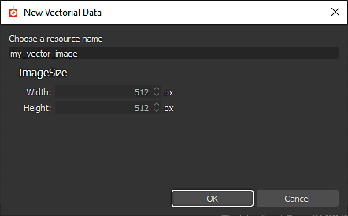
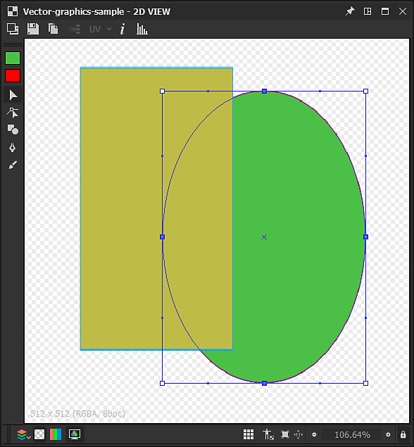
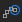

# Herramientas de edición de vectores

Esta página describe las herramientas de edición disponibles en el panel [vista 2D](https://docs.substance3d.com/display/SDDOC/2D+view) para los gráficos vectoriales compatibles.

## Información general

<table>
<tr style="border: 0;">
<td style="border: 0;" valign="top">

El panel [vista 2D](https://docs.substance3d.com/display/SDDOC/2D+view) ofrece herramientas básicas de edición de vectores que te permiten crear o editar gráficos vectoriales *manualmente* directamente en [Substance 3D Designer](https://www.adobe.com/es/products/substance3d-designer.html). Estas herramientas son especialmente útiles, por ejemplo, para crear rápidamente *máscaras* o *patrones*.

Las herramientas admiten la entrada de lápiz. Para aprovechar las pantallas de lápiz, puedes [desacoplar](https://docs.substance3d.com/display/SDDOC/Customizing+your+workspace) el panel de la [vista en 2D](https://docs.substance3d.com/display/SDDOC/2D+view) y, a continuación, colocarlo y redimensionarlo en cualquier configuración que te resulte más cómoda para pintar.

Las ediciones se pueden *deshacer individualmente* y todas las demás características del panel vista 2D están *disponibles* mientras editas la imagen vectorial, como el panel [Histograma](https://docs.substance3d.com/display/SDDOC/2D+view#id-2Dview-Histogram), la [visualización en mosaico](https://docs.substance3d.com/display/SDDOC/2D+view#id-2Dview-Viewport) y la [imagen de fondo](https://docs.substance3d.com/display/SDDOC/2D+view#id-2Dview-Backgroundimage).

</td>
<td style="border: 0;" valign="top">

{width="512px"}

</td>
</tr>
</table>

>[!TIP]
>
> **Solo Windows**
> 
> Los usuarios de tabletas deben aplicar la configuración que se describe en la página siguiente para obtener la experiencia más fiable en Designer: [Configuración de plumas y tabletas](https://docs.substance3d.com/display/SPDOC/Configuring+Pens+and+Tablets)

>[!IMPORTANT]
>
> Puede pintar *solo* en *recursos de gráficos vectoriales](../../../resources/vector-graphics-svg-res/vector-graphics-svg-resource.md) de* 8 bits[ que son [nuevos o importados](https://docs.substance3d.com/display/SDDOC/Importing%2C+Linking+and+New+Resources).

{width="512px"}

## Activación de las herramientas de edición de vectores

Las herramientas de edición vectorial se habilitarán automáticamente en el panel [Vista 2D](https://docs.substance3d.com/display/SDDOC/2D+view) cuando se cumplan los siguientes criterios con respecto a una imagen de gráficos vectoriales:

* La imagen de gráficos vectoriales es un recurso [nuevo o importado](https://docs.substance3d.com/display/SDDOC/Importing%2C+Linking+and+New+Resources)
* El mapa de bits se muestra en el panel [vista 2D](https://docs.substance3d.com/display/SDDOC/2D+view)

Las imágenes de gráficos vectoriales *New* se pueden crear de las siguientes maneras:

* En el panel [Explorer](https://docs.substance3d.com/display/SDDOC/The+Explorer+Window), haz clic en RMB en un *paquete SBS* o en una *carpeta* dentro de un paquete para abrir su menú contextual, luego abre el submenú **New** y selecciona la opción **SVG**
* En un [gráfico](https://docs.substance3d.com/display/SDDOC/The+Graph+view), cree un [nodo SVG](../../../compositing-graphs/nodes-reference-for-com/atomic-nodes/svg/svg.md) y seleccione el nuevo recurso **De...Opción** en el menú contextual

Se abrirá la ventana **Nuevos datos vectoriales**, que te permitirá establecer el *nombre* y la *resolución* del nuevo recurso de gráficos vectoriales.

>[!TIP]
>
> Para obtener el mejor rendimiento con las herramientas de edición vectorial, se recomienda utilizar imágenes de gráficos vectoriales con resoluciones que sean *potencias de dos*, por ejemplo 128, 256, 512, 1024, ...

### Exportación de gráficos vectoriales desde otro software

Designer *solo* admite gráficos vectoriales con el formato de archivo **SVG**.

Para obtener la mejor compatibilidad y confiabilidad en Designer y sus herramientas de edición, asegúrese de que todos los objetos se convierten en *contornos* y se desagrupan en *objetos independientes* mediante *colores planos*, de modo que *no quede ninguno de los siguientes*:

* **Texto**
* **Degradados**
* **Patrones** (para rellenos y contornos de trazo)
* **Estilos**

Los usuarios de **Adobe Illustrator** pueden consultar la imagen adjunta para ver la configuración de exportación del SVG *recomendada.*

+++Opciones de exportación de Adobe Illustrator

+++

>[!NOTE]
>
> Para obtener más información sobre las limitaciones de los SVG, la exportación desde otras propiedades de software y SVG en Designer, consulta la sección [Recursos de gráficos vectoriales (SVG)](../../../resources/vector-graphics-svg-res/vector-graphics-svg-resource.md).

## Herramientas

Las herramientas y opciones de pintura están organizadas en *barras de herramientas* dentro del panel [Vista en 2D](https://docs.substance3d.com/display/SDDOC/2D+view). Estas barras de herramientas se pueden reubicar en *cualquier lado* del panel o como *barra de herramientas flotante*, haciendo clic y manteniendo presionada la tecla **LMB** en su *controlador*, que se muestra como una línea triple, y luego liberando **LMB** en la ubicación deseada.

Se muestran dos barras de herramientas cuando las herramientas de edición vectorial están activadas:

* **Selección de herramientas** **toolbar**: permite *seleccionar una herramienta*, así como los *colores de relleno/contorno*, y se coloca en el lado *izquierdo* del panel Vista 2D de forma predeterminada
* **Barra de herramientas de opciones**: le permite establecer las *opciones* de la *herramienta seleccionada actualmente*, y se coloca en la parte *superior* del panel Vista 2D de forma predeterminada

Los métodos abreviados de teclado le permiten acceder a las herramientas rápidamente y se marcan entre paréntesis después del nombre de la herramienta o función:

+++Selección de color
La **selección de color** de  *miniaturas* te permite definir un color de *relleno* y *contorno* para las formas vectoriales. Puede abrir el **Editor de color** para cada uno de estos colores de las siguientes maneras:

* **Color de relleno:** Haz clic en la miniatura de color de *relleno* (superior) o haz doble clic en LMB en el lienzo

* **Color del contorno:** Haz clic en la miniatura de color del *contorno* (abajo) o *mantén pulsado Ctrl* y haz doble clic en LMB en el lienzo

Los colores establecidos se aplicarán a las *formas seleccionadas*.

Si el color actual del *contorno* es *negro*, es decir, luminancia 0 o RGB (0, 0, 0), *no* se aplicará a las formas seleccionadas hasta que *hagas clic en la miniatura del color del contorno*.

+++

+++Transformación
{width="512px"}

La herramienta  <b>Transformation</b> (<b>V</b>) puede seleccionar formas que se incluirán en un gizmo de transformación. Este gizmo le permite realizar las siguientes acciones:

<b>Mover</b>: Mantén pulsado LMB *dentro* del gizmo

<b>Escala</b>: Mantén pulsado LMB en cualquiera de los *controles cuadrados* del gizmo para *escalar* el objeto horizontal, verticalmente o ambas cosas. De forma predeterminada, la escala se realiza en relación con el identificador en el lado *opuesto* del gizmo. Mantén pulsada la tecla <b>Alt</b> para aplicar la escala relativa al *centro* del gizmo y mantén pulsada la tecla <b>Mayús</b> para *bloquear* la anchura/height del gizmo *Proporción*

<b>Rotar: </b>Haga clic y mantenga presionado LMB junto a cualquiera de los *controladores cuadrados* del gizmo, *fuera* del gizmo.

+++

+++Nodo
{width="512px"}

La herramienta  <b>Node</b> (<b>A</b>) le permite seleccionar vértices individuales (es decir, nodos) de la forma seleccionada y editar su posición y sus controles, así como agregar y quitar vértices. Una vez seleccionada una forma, se pueden realizar las siguientes acciones:

<b>Agregar vértice:</b> Ctrl+LMB en el contorno de la forma

<b>Quitar vértice</b>: Ctrl+LMB en el vértice

<b>Mover vértice</b>: Mantener LMB en el vértice

<b>Mover controladores de vértices</b>: Mantener LMB en el mango

<b>Mover el identificador de vértice independientemente</b>: Mantenga presionado Alt+LMB en el controlador. Tenga en cuenta que los identificadores se *desvincularán* después de este punto hasta que se *restablezcan*

<b>Restablecer identificadores</b>: Haga clic en Alt+LMB en el vértice. Los identificadores se restablecerán a la *posición de vértice*

<b>Mover controladores de vértices restablecidos</b>: Mantenga presionado Alt+LMB en el vértice. Aparecerán *identificadores vinculados*

+++

+++Forma
{width="512px"}

La herramienta  <b>Formas</b> (<b>M</b>) ofrece un conjunto de formas primitivas, utilizando el color *fill* actual, que se puede crear y editar:

* <b>Rectángulo;</b>

* <b>Elipse;</b>

* <b>Rectángulo redondeado:</b> Los ángulos redondeados tienen un radio bloqueado;

* <b>Polígono:</b> Crea un octógono.

Para dibujar un objeto primitivo, mantén <b>LMB</b> en cualquier parte del lienzo desde cualquiera de sus *esquinas*. Mantenga presionada la tecla <b>Alt+LMB</b> para dibujar la forma desde su *centro*.

+++

+++Pluma
{width="512px"}

La herramienta  <b>Pluma</b> (<b>P</b>) te permite dibujar una nueva forma personalizada, usando el color *de relleno* actual. Hay dos modos disponibles:

En el modo <b>Ruta </b>, la forma se dibuja *un vértice cada vez*. Están disponibles los siguientes controles:

Agregar <b>vértice </b>recto de entrada/salida: Haga clic en LMB

Agregar el vértice <b>curva de entrada/salida</b> (*tangentes alineadas*): Mantener presionado LMB y arrastrar

Agregar <b>curva de entrada/salida </b>vértice (*tangentes no alineadas*)\*: Mantener presionado LMB y arrastrar, y mantener presionado Alt+LMB

Agregar vértice <b>curva de entrada/salida</b>\*: igual que el vértice de entrada/salida de curva (tangentes sin alinear), pero la línea de salida debe colocarse* encima del nuevo vértice*

Agregar <b>vértice recto de entrada/salida de curva</b>\*: Mantener presionado Alt+LMB y arrastrar

<b>Cerrar forma</b> en el *siguiente* vértice: Mantener presionado Ctrl

<b>Cerrar forma</b> en el vértice *actual*: Pulsa Intro o haz clic en LMB en el *primer vértice* de la forma actual

El modo <b>Freehand </b> te permite dibujar formas directamente arrastrando el lápiz por el lienzo mientras mantienes pulsada la LMB.

Los vértices se *colocan automáticamente* a lo largo del trazo para que la ruta resultante coincida lo más posible con el trazo. La forma se *cierra automáticamente* cuando finaliza el trazo, lo que conecta el primer vértice con el último del trazo.

+++

+++Extrusión
{width="512px"}

La herramienta  **Extruir** (E) *agrega* una forma de *diámetro de conjunto*, dibujada a lo largo de una ruta usando el *modo de dibujo* seleccionado, y aplica el resultado en el lienzo siguiendo el *modo de combinación* establecido en la barra de herramientas de opciones.

Están disponibles los siguientes *modos de dibujo*:

 **Forma libre**: dibuja la forma *directamente arrastrando* el lápiz por el lienzo mientras sujeta LMB. La forma se agrega cuando finaliza el trazo.

 **Poligonal**: dibuja la forma *una cara cada vez* haciendo clic en LMB para agregar un ángulo. La forma se agrega al presionar la tecla Intro.

La forma dibujada se puede controlar mediante estos parámetros:

<b>Tamaño</b>: Controla el diámetro de la forma radial dibujada en la ubicación del cursor.

<b>Smoothness</b>: Controla la cantidad en que la forma dibujada debe *suavizarse y simplificarse* cuando se agrega al final del trazo.

Una vez completado el dibujo, la forma se agrega y se combina con la forma seleccionada actualmente mediante uno de estos *modos de combinación* disponibles:

 **No se combina**: La forma se dibuja *encima* de la forma seleccionada como *objeto independiente*.

 **Unión**: La forma se *agregó* a la forma seleccionada.

 **Resta**: La forma está *recortada* de la forma seleccionada.

 **Intersección**: Solo quedan las *partes superpuestas* de la forma nueva y la seleccionada.

+++

## Operaciones de forma

{width="512px"}

Además de las herramientas enumeradas anteriormente, se pueden realizar varias operaciones en *formas seleccionadas*, utilizando el menú contextual disponible al hacer clic en RMB. Estas operaciones casi todas tienen un método abreviado de teclado (entre paréntesis a continuación) y se organizan en las siguientes categorías:

+++Adición y eliminación de formas
<b>Copiar selección</b> (Ctrl+C): *Copiar* las formas seleccionadas en el portapapeles

<b>Cortar selección</b> (Ctrl+X): *Copiar* las formas seleccionadas en el portapapeles y *quitarlas*

<b>Pegar</b> (Ctrl+V): Cree la forma copiada actualmente en el portapapeles, en la *ubicación del cursor*

<b>Pegar en contexto</b> (Ctrl+Mayús+V): Cree la forma copiada actualmente en el portapapeles, en la *ubicación de la forma copiada*

<b>Eliminar selección</b> (Supr): *Quitar* las formas seleccionadas

+++

+++Organización de formas
Las formas se organizan en una *pila*, que establece el *orden* de las formas en el lienzo, es decir, que está encima de ellas. De forma predeterminada, se crean nuevas formas *en la parte superior* del lienzo, y los siguientes controles le permiten cambiar esta disposición:

<b>Traer al frente</b> (Inicio): *eleva* las formas seleccionadas al *top* de la pila de formas

<b>Avanzar</b> (RePág): *eleva* las formas seleccionadas *un nivel* en la pila de formas

<b>Enviar hacia atrás</b> (RePág): *disminuye* las formas seleccionadas en *un nivel* en la pila de formas

<b>Enviar al fondo</b> (fin): *baja* las formas seleccionadas al *fondo* de la pila de formas

+++

+++Enviar a nueva imagen de SVG
Puedes usar formas en la imagen actual para crear un *nuevo [recurso de SVG](../../../resources/vector-graphics-svg-res/vector-graphics-svg-resource.md)* en el [paquete SBS](../../../getting-started/overview/overview.md) actual. A ese respecto, se dispone de las siguientes medidas:

<b>Copiar selección en nuevo SVG</b>: Crea un nuevo recurso de SVG y copia las formas seleccionadas *en el lugar* de esta nueva imagen.

<b>Cortar selección a nuevo SVG</b>: Crea un nuevo recurso de SVG, copia las formas seleccionadas *en el lugar* de esta nueva imagen y *las quita* de la *imagen actual*.

+++
