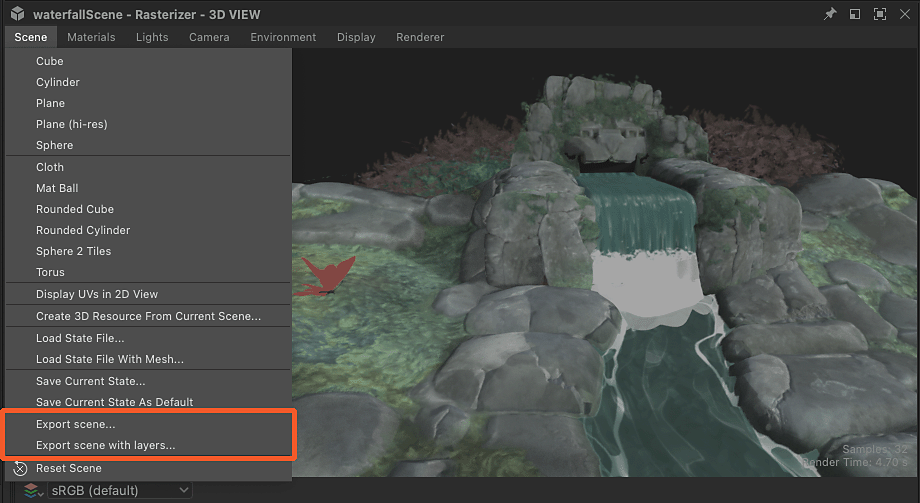

# Exportar escenas

Cuando necesite exportar la escena con todas las ediciones realizadas en Designer, utilice el comando Exportar escena... acciones en el menú &quot;Escena&quot; de [Vista 3D](../../interface/3d-view/3d-view.md).

Para las exportaciones a USD formatos, el contenido de la escena coincidirá con el árbol mostrado en el [Explorador de escenas](../../interface/3d-view/scene-browser/scene-browser.md).

Para otros formatos, el contenido de la escena y su estructura interna dependerán de las funciones admitidas por el formato de archivo seleccionado.

>[!NOTE]
>
> Todos los elementos añadidos a la escena por Designer se incluirán en la escena exportada: En la cámara predeterminada, el entorno predeterminado, todo el material copia las luces adicionales.

{zoomable="yes"}

<table>
<tr style="border: 0;">
<td style="border: 0;" valign="top">

## Exportar escena

</td>
<td style="border: 0;" valign="top">

### Exportar escena como capas

</td>
<td style="border: 0;" valign="top">

### Texturas

</td>
</tr>
</table>

## Exportar escena

<table>
<tr style="border: 0;">
<td style="border: 0;" valign="top">

La acción &quot;Exportar escena...&quot; del menú &quot;Escena&quot; exporta las escenas 3D editadas de forma destructiva: la escena está *aplanada* y se pierde cualquier referencia al original.

Esto significa que las ediciones en la escena original no afectan en absoluto a la escena exportada.

</td>
<td style="border: 0;" valign="top">

{zoomable="yes"}

</td>
</tr>
</table>

## Exportar escena como capas

<table>
<tr style="border: 0;">
<td style="border: 0;" valign="top">

La acción &quot;Exportar escena como capas...&quot; se exporta a los formatos <b>USD</b> (.usd, .usda, .usdc, .usdz) y es *no destructiva*: el archivo principal exportado contiene una *cadena de referencias* en la que todos los aspectos editados de la nueva escena se almacenan en archivos USD independientes.

Esto significa que las ediciones de la escena original se transfieren a la escena exportada.

</td>
<td style="border: 0;" valign="top">

{zoomable="yes"}

</td>
</tr>
</table>

Los archivos exportados siguen esta estructura:

* <b>Archivo principal</b>
  * <b>.layers</b>: Hace referencia a las subcapas siguientes y declara las modificaciones de material, que enlazan la geometría a las copias de material creadas por Designer.
    * <b>.ensamblado</b>: Hace referencia al archivo .scene# y declara las modificaciones geométricas, que traen los datos calculados de nuevo por Designer de la geometría afectada por los materiales modificados.
      * <b>.scene#</b>: Hace referencia a la escena original.
    * <b>.camera</b>: Declara la cámara añadida por Designer a la escena.
    * <b>.light</b>: Declara las luces añadidas por Designer a la escena.
    * <b>.material</b>: Declara los materiales y las copias añadidas por Designer a la escena, que utilizan las texturas exportadas.

## Texturas

Las texturas se exportan en un directorio junto al archivo exportado y se les asigna su nombre, con un sufijo ‘<b>\_texturas</b>’.

Utilizan el formato <b>PNG</b>, excepto texturas HDR (coma flotante) que usan el formato <b>EXR</b>.
