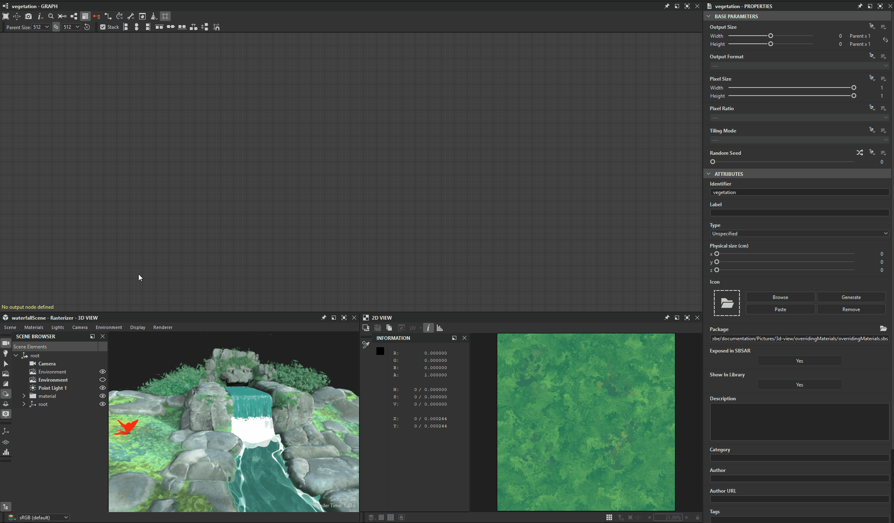
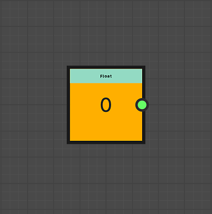
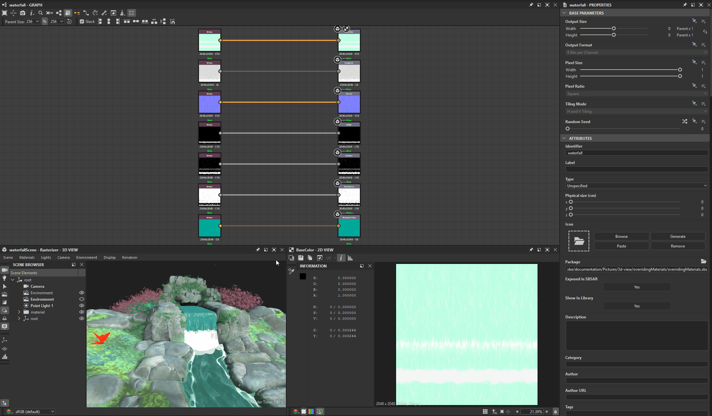

# Extracción de valores y texturas de materiales

Las propiedades de los materiales se pueden extraer para utilizarlas en Substance gráficos.

<table>
<tr style="border: 0;">
<td style="border: 0;" valign="top">

## Nuevo gráfico a partir de texturas

</td>
<td style="border: 0;" valign="top">

### Extraer textura

</td>
<td style="border: 0;" valign="top">

### Extraer valor

</td>
</tr>
</table>

## Nuevo gráfico a partir de texturas

La acción Crear gráfico a partir de entradas de textura crea un nuevo gráfico de Substance con todas las texturas utilizadas por un material

Al utilizar esta acción, ocurren algunas cosas:

* En la ubicación seleccionada se crea un gráfico de Substance con el nombre del material.
* Se crea un [recurso de mapa de bits](../../resources/bitmap-resource/bitmap-resource.md) para cada textura utilizada por el material, y se coloca en una carpeta con el nombre del material, bajo una carpeta &quot;Resources&quot;.
* En el gráfico, se crean [nodos Bitmap](../../compositing-graphs/nodes-reference-for-com/atomic-nodes/bitmap/bitmap.md) para cada uno de estos recursos de mapa de bits y se conectan automáticamente a los nodos [Output](../../compositing-graphs/nodes-reference-for-com/atomic-nodes/output/output.md) configurados después de las propiedades de material mediante texturas.
* Si se usa cada canal de una misma textura para controlar diferentes propiedades de materiales (la técnica se denomina [empaquetado de canal](../../glossary/glossary.md)), se agregan automáticamente nodos [de conversión en escala de grises](../../compositing-graphs/nodes-reference-for-com/atomic-nodes/grayscale-conversion/grayscale-conversion.md) para seleccionar los canales apropiados.
* El gráfico se conecta automáticamente al material y su aspecto no debe cambiar hasta que no realice modificaciones en el gráfico.

<table>
<tr style="border: 0;">
<td style="border: 0;" valign="top">

{zoomable="yes"}

*Acción en la ventana gráfica de la vista 3D*

</td>
<td style="border: 0;" valign="top">

{zoomable="yes"}

*Acción en el menú Materiales*

</td>
<td style="border: 0;" valign="top">

{zoomable="yes"}

*Acción en el conjunto acoplado de propiedades*

</td>
</tr>
</table>

{zoomable="yes"}

*Resultado de la creación de gráficos a partir de texturas de materiales*

+++Demostración
{zoomable="yes"}

+++

>[!TIP]
>
> Puedes acceder a la acción de forma rápida y directa en la ventana gráfica de la vista 3D, colocando el cursor sobre el objeto y presionando <b>Mayús+LMB</b> para seleccionarlo. a continuación, haga clic en RMB para acceder a un menú contextual que aloje la acción.

>[!NOTE]
>
> Para formatos que usan *texturas incrustadas* (p. ej.: USDZ), las texturas deben extraerse y copiarse en el disco. Esto da como resultado un paso adicional para seleccionar la ubicación en la que se deben extraer las texturas.

## Extraer textura

La acción &quot;Extraer textura a gráfico&quot; crea un nuevo nodo de mapa de bits en un gráfico existente para una textura utilizada por un material.

Al utilizar esta acción, ocurren algunas cosas:

* Se crea un [recurso de mapa de bits](../../resources/bitmap-resource/bitmap-resource.md) para la textura utilizada por el material y se coloca en una carpeta con el nombre del material, en una carpeta &quot;Resources&quot;.
* En el gráfico seleccionado, se crea un nodo [Bitmap](../../compositing-graphs/nodes-reference-for-com/atomic-nodes/bitmap/bitmap.md) para ese recurso de mapa de bits y se conecta automáticamente a un nodo [Output](../../compositing-graphs/nodes-reference-for-com/atomic-nodes/output/output.md) configurado después de la propiedad de material mediante esas texturas.

Si ya existe una salida configurada para la propiedad de material ** en el gráfico, *no se crean nodos* y solo se crea el recurso de mapa de bits.

Por ejemplo: Si se extrae una textura para la propiedad &quot;Color base&quot; a un gráfico que ya alberga un nodo de salida configurado para &quot;Color base&quot;, no se creará ningún nodo en el gráfico.

<table>
<tr style="border: 0;">
<td style="border: 0;" valign="top">

{zoomable="yes"}

Acción para la propiedad de material en el conjunto acoplado Propiedades

</td>
<td style="border: 0;" valign="top">

{zoomable="yes"}

Cuadro de diálogo &quot;Seleccionar gráfico de destino&quot;

</td>
<td style="border: 0;" valign="top">

</td>
</tr>
</table>

{zoomable="yes"}

Resultado de la extracción de la textura

+++Demostración
{zoomable="yes"}

+++

La acción &quot;Extraer textura como recurso&quot; solo crea un recurso de mapa de bits para la textura utilizada por el material y lo coloca en una carpeta con el nombre del material, en una carpeta &quot;Recursos&quot;.

>[!NOTE]
>
> Para formatos que usan *texturas incrustadas* (p. ej.: USDZ), la textura debe extraerse y copiarse en el disco. Esto da como resultado un paso adicional para seleccionar la ubicación en la que se debe extraer la textura.

## Extraer valor

La acción &quot;Extraer valor a gráfico&quot; crea un nuevo nodo [Value processor](../../compositing-graphs/nodes-reference-for-com/atomic-nodes/value-processor/value-processor.md) en un gráfico existente para un valor de propiedad de material.

Al utilizar esta acción, ocurren algunas cosas:

* En el gráfico seleccionado, se crea un nodo [Value processor](../../compositing-graphs/nodes-reference-for-com/atomic-nodes/value-processor/value-processor.md) para ese valor de propiedad y se conecta automáticamente a un nodo [Output](../../compositing-graphs/nodes-reference-for-com/atomic-nodes/output/output.md) configurado después de esa propiedad de material.
* En el gráfico de funciones [Substance](../../function-graphs/function-graphs.md) del nodo de procesador de valores, se crea un [nodo constante](../../function-graphs/nodes-reference-for-fun/atomic-function-nodes/constant-nodes/constant-nodes.md) que coincide con el tipo de valor, se establece el valor extraído como se establece en el resultado del gráfico.

Si ya existe una salida configurada para la propiedad de material ** en el gráfico, *no se crean nodos*.

Por ejemplo: Si se extrae un valor para la propiedad &quot;Nivel de Anisotropía&quot; a un gráfico que ya alberga un nodo de salida configurado para &quot;Nivel de Anisotropía&quot;, no se creará ningún nodo en el gráfico.

<table>
<tr style="border: 0;">
<td style="border: 0;" valign="top">

{zoomable="yes"}

Acción para la propiedad de material en el conjunto acoplado Propiedades

</td>
<td style="border: 0;" valign="top">

{zoomable="yes"}

Cuadro de diálogo &quot;Seleccionar gráfico de destino&quot;

</td>
<td style="border: 0;" valign="top">

{zoomable="yes"}

Nodo constante en la función del nodo del procesador de valores

</td>
</tr>
</table>

{zoomable="yes"}

Resultado de la extracción del valor

+++Demostración
{zoomable="yes"}

+++
