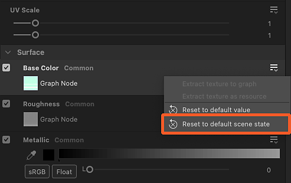

# Reemplazo de materiales de escena

Cuando se trabaja con escenas 3D con materiales existentes, es necesario anular estos materiales para sustituirlos por los tuyos propios.

Tu material se puede crear desde cero o una versión ajustada del material de una escena que se ha [extraído en un gráfico de Substance](../../working-with-3d-scenes/extracting-materials-val/extracting-materials-values-and-textures.md).

{zoomable="yes"}

<table>
<tr style="border: 0;">
<td style="border: 0;" valign="top">

## Omitir material de escena

</td>
<td style="border: 0;" valign="top">

### Restablecer al estado de escena

</td>
<td style="border: 0;" valign="top">

### Material conectado

</td>
</tr>
</table>

## Omitir material de escena

Cualquier material utilizado en una escena se puede reemplazar con su propia versión, que es un material nuevo o una versión editada del material existente.

La acción &quot;Anular material&quot; se puede encontrar en dos lugares:

* Abra el menú &quot;Materiales&quot; y vaya al submenú del material deseado
* Pulse Mayús+LMB en un objeto de escena para seleccionarlo y, a continuación, haga clic en RMB para abrir su menú contextual

<table>
<tr style="border: 0;">
<td style="border: 0;" valign="top">

{zoomable="yes"}

*Acción en la ventana gráfica de la vista 3D*

</td>
<td style="border: 0;" valign="top">

{zoomable="yes"}

*Acción en el menú Materiales*

</td>
</tr>
</table>

En el contexto de Designer, que usa USD para su descripción interna de la escena, reemplazar significa *crear una copia* del material que coincida lo más posible con el original y cambiar la *unión de materiales* de las mallas de la escena del original a la copia.

>[!NOTE]
>
> Las copias se crean en la escena en una carpeta ‘<b>material</b>’ (‘Ámbito’ en USD) bajo la raíz y utilizan el mismo identificador que el original más un sufijo numérico (p. ej.: ‘oxidadoMetal\_0’)

Eso significa dos cosas importantes:

1. El material original nunca se cambia de ninguna manera.
1. Cualquier trabajo realizado en Designer se aplicará a la copia.

Puede activar y desactivar cualquier modificación en cualquier momento mediante la misma acción &quot;Anular material&quot;, si desea restaurar el material de la escena original o realizar una comprobación rápida de antes y después sobre la marcha

Teniendo en cuenta que la copia se crea para que coincida con el original, la modificación de un material no debería cambiar su aspecto en la mayoría de los casos (consulte la nota siguiente), hasta que le conecte un gráfico de Substance o edite sus propiedades.

>[!NOTE]
>
> Cuando se aplica una modificación, Designer calcula las tangentes y los valores binormales de las mallas afectadas, lo que puede tardar algún tiempo y cambiar el aspecto de dichas mallas, especialmente si dichas mallas no tienen una escala y un sesgo normales definidos, o utilizan otros diferentes.

>[!IMPORTANT]
>
> El modelo de sombreado <b>AdobeStandardMaterial</b> es compatible con todo el ecosistema de Substance 3D, pero no es un estándar del sector y, por lo tanto, *puede no ser compatible* con aplicaciones de terceros, como Blender.
> 
> Para obtener la mejor interoperabilidad fuera de las aplicaciones de Substance 3D, se recomienda utilizar el modelo de sombreado <b>UsdPreviewSurface</b>, aunque ese modelo admita muchas menos propiedades y efectos de materiales.

## Restablecer al estado de escena

Si necesita volver al estado inicial de un material, mientras lo mantiene anulado y sigue pudiendo editarlo, cualquier copia de material se puede restablecer a sus valores iniciales.

Si se ha modificado un valor de propiedad de material o se le ha aplicado una textura de un gráfico, la propiedad se revierte a su valor o textura inicial.

Un material se puede restablecer por completo o por propiedad.

Utilice la acción &quot;Restablecer el material al estado de la escena&quot; en el submenú del material o en el menú contextual de una malla para restablecer el material por completo.

La acción se puede encontrar en tres lugares:

* Abra el menú &quot;Materiales&quot; y vaya al submenú del material deseado
* Pulse Mayús+LMB en un objeto de escena para seleccionarlo y, a continuación, haga clic en RMB para abrir su menú contextual
* El menú de hamburguesas en la parte superior de las propiedades de ese material

<table>
<tr style="border: 0;">
<td style="border: 0;" valign="top">

{zoomable="yes"}

*Acción en la ventana gráfica de la vista 3D*

</td>
<td style="border: 0;" valign="top">

{zoomable="yes"}

*Acción en el menú Materiales*

</td>
<td style="border: 0;" valign="top">

{zoomable="yes"}

*Acción en las propiedades del material*

</td>
</tr>
</table>

<table>
<tr style="border: 0;">
<td style="border: 0;" valign="top">

La acción también está disponible *por propiedad* en las propiedades de material, en caso de que desee restablecer solo algunos aspectos de un material.

Abra el menú hamburguesa de la propiedad de material para buscar la acción &quot;Restablecer el estado de escena predeterminado&quot;.

</td>
<td style="border: 0;" valign="top">

{zoomable="yes"}

</td>
</tr>
</table>

## Material conectado

De nuevo: Designer no modifica directamente el material de una escena, sino que crea una copia en la escena y enlaza las mallas a esa copia en lugar del original.

Por otro lado, Designer tiene *su propia* lista de materiales por separado en su menú &quot;Materiales&quot;, que coincide con la lista de materiales de la escena de forma predeterminada. Puedes añadir nuevos materiales a esa lista en cualquier momento.

Este es un conjunto de datos *diferente* que solo se crea y administra en Designer. Estos materiales están entonces *conectados a las copias*, que anulan los materiales originales de la escena.

{zoomable="yes"}

Puede conectar cualquiera de los materiales enumerados en el menú &quot;Materiales&quot; a las copias creadas por Designer en la escena: Haga clic en RMB en una copia en el navegador de escenas y vaya al submenú &quot;Conectar material&quot;.

El submenú enumera todos los materiales de la escena y cualquier material que haya creado manualmente desde el menú &quot;Materiales&quot;.

{zoomable="yes"}
